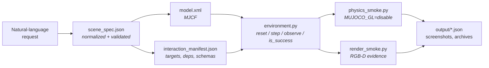

<h1 align="center">Text2MuJoCo</h1>

<p align="center">
  <strong>Turn one natural-language request into a runnable, verified MuJoCo environment.</strong><br>
  Validated MJCF &middot; executable interaction points &middot; real RGB-D evidence
</p>

<p align="center">
  
  
  
  
  
  <a href="LICENSE"></a>
</p>

<p align="center">
  <a href="#showcase">Showcase</a> &middot;
  <a href="#how-it-works">How it works</a> &middot;
  <a href="#validation-layers">Validation</a> &middot;
  <a href="#usage">Usage</a> &middot;
  <a href="text2mujoco_codex/README.md">Codex skill</a> &middot;
  <a href="text2mujoco_claude/README.md">Claude Code skill</a>
</p>

<p align="center">
  
</p>

<p align="center">
  <sub>The final verified frame of each showcase, composed from the committed captures by <a href="showcase/build_readme_figures.py">build_readme_figures.py</a>.</sub>
</p>

---

Text2MuJoCo is an **agent skill package**, not a standalone natural-language compiler. Paired with Codex or Claude Code, it turns a scene or task description into a loadable MuJoCo 3 package: it resolves objects, physics, sensors, action order, success conditions, and visible interaction points, then backs the result with machine-readable reports instead of prose. A set of ready-to-run [sample queries](showcase/sample_queries.json) shows the expected input format.

## What you get

- **A normalized request** — `scene_spec.json` keeps the original prompt as `source_prompt`, records assumptions explicitly, and is schema-validated before any XML is written.
- **Physically seated geometry** — full metric dimensions are converted to MJCF half-sizes, `orientation_xyzw` is converted to `quat="w x y z"`, and resting bodies are seated by half-size arithmetic so nothing interpenetrates at `t=0`.
- **Bodies that actually collide** — every moving body carries a real collider, including the robot's own links, forks, and fingers. Visual-only geometry (`contype="0" conaffinity="0"`) renders and carries mass while passing through everything, so the skill forbids it on anything that moves and the audit fails a scene that ships it.
- **Executable interaction points** — every affordance is a real handler with a typed payload schema and declared dependencies, mirrored in the canonical `interaction_manifest.json`. Out-of-order or malformed actions are rejected, not silently accepted.
- **Evidence, not claims** — each package ships `physics_smoke.py` and `render_smoke.py`, and each showcase commits the resulting JSON reports, RGB-D screenshots, and frame archives.
- **Two adapters, one behavior** — [`text2mujoco_codex`](text2mujoco_codex) and [`text2mujoco_claude`](text2mujoco_claude) carry identical validation scripts and reference guides; CI diffs the scripts on every push so the two cannot drift.

## How it works



The spec is the canonical input, but handlers are code: when a pose, condition, target, or success predicate changes, the matching runtime handler is patched and the affected validation layers are re-run. Condition strings are never assumed to execute on their own.

## Validation layers

| Layer | Runs | Rejects |
| --- | --- | --- |
| Manifest | `validate_manifests.py` | spec/manifest drift: differing interaction IDs, dependency order, poses, or marker sites |
| Static | `physics_smoke.py` | MJCF that will not compile, manifest/spec drift, bad quaternion or half-size conversion, invisible markers |
| Collision geometry | `sequence_contact_test.py` | a moving body with no collider — a link, fork, or button that renders and passes through everything |
| Initial contact | `physics_smoke.py` | a start pose whose geoms already overlap at `t=0` |
| Sequence contact | `physics_smoke.py`, `sequence_contact_test.py` | an overlap deeper than 1 mm at any step of the documented sequence, not just at its endpoints |
| Physics | `physics_smoke.py` | non-finite state, dead actuators, unmet task predicates, non-deterministic reset |
| Render | `render_smoke.py` | blank RGB, non-finite depth, no visible change across the interaction |
| Archive | `dense_archive_test.py` | GIF/TIFF frame counts or timing that disagree with the dense report |
| Paths | `artifact_path_test.py` | artifacts escaping the package root, symlink traversal |

### The initial-contact audit

A start pose whose geoms already interpenetrate is the failure mode that hides from every other check: the solver pushes the overlap out during warmup, so physics, rendering, and task assertions all pass afterwards. The audit runs after the first `mj_forward` and before any `mj_step`, for the compiled `qpos0` **and** again for the post-`reset()` state — a reset that assigns positions from constants can reintroduce overlap the MJCF does not have.

```python
for label, data in (("model_qpos0", mujoco.MjData(env.model)), ("post_reset", env.data)):
    mujoco.mj_forward(env.model, data)
    for index in range(data.ncon):
        if data.contact[index].dist < -1e-4:
            raise AssertionError(f"{label}: geoms interpenetrate before the first step")
```

All eight showcases report `initial_contact: "PASS"`. The requirement is part of the skill's output contract, so generated packages carry it too — see [validation_checklist.md](text2mujoco_codex/references/validation_checklist.md) and the resting-pose rules in [mujoco_patterns.md](text2mujoco_codex/references/mujoco_patterns.md).

### The collision and sequence-contact audit

A clean start pose is not enough. Two failure modes survive it, and both look perfect on camera:

1. **A body that renders but does not collide.** A geom with `contype="0" conaffinity="0"` still draws and still carries mass; it simply never generates a contact. An arm link, a fork tine, or a button face declared that way slides through the payload it is supposed to move, and no endpoint assertion notices.
2. **An overlap that only exists mid-sequence.** Auditing `t=0` and the final state leaves the interesting part unchecked — the instant a gripper closes, a servo overshoots, or a load is set down.

[`sequence_contact_test.py`](showcase/sequence_contact_test.py) closes both. It enumerates every body with a degree of freedom and fails the scene if any of them has no collidable geom, then replays the documented interaction sequence while wrapping the module-level `mj_step` — settle loops and controllers call it directly, so wrapping the environment's own step would miss most of the simulation.

```python
RUN_LIMIT = -1e-3                        # contact.dist is a signed gap, so 1 mm of overlap is -1e-3

def watched(model, data, *args, **kwargs):
    genuine(model, data, *args, **kwargs)          # the real mujoco.mj_step
    dist, pair = deepest_contact(model, data)      # most negative gap in this state
    if dist < worst["dist"]:
        worst.update(dist=dist, pair=pair, time_s=float(data.time))

mujoco.mj_step = watched                 # settle loops call the module function, not env.step
```

Two thresholds, because a contact solver is not a hard constraint: **0.1 mm** for the static poses (`qpos0` and post-`reset()`), where any measurable overlap is a modeling error, and **1.0 mm** across the sequence, where sub-millimetre penetration under load is the solver's documented softness. When a scene breaches it, the fix is the model or the controller — never the threshold. The forklift's `fork_lift` servo was the clearest case: a stiff position actuator handed a `0.18 m` step accelerated the tines to `~1.7 m/s` and drove them `4.49 mm` into the pallet deck, so the command is now ramped at roughly `0.25 m/s` instead.

Collision classes are declared once, as nested defaults, so the filter is readable rather than a table of magic integers:

```xml
<default>
  <joint damping="1.0" armature="0.02"/>
  <geom friction="0.78 0.01 0.002" condim="6" solref="0.008 1" solimp="0.9 0.95 0.001"/>
  <default class="world_part">   <geom contype="1" conaffinity="6"/></default>
  <default class="robot_part">   <geom contype="2" conaffinity="5"/></default>
  <default class="payload_part"> <geom contype="4" conaffinity="7"/></default>
</default>
```

Bodies pick a class with `childclass="robot_part"`, individual geoms with `class="world_part"`, and the shared friction, `condim`, and `solref` still apply because the classes are nested inside the existing default rather than replacing it.

MuJoCo tests a pair when `(contype1 & conaffinity2) || (contype2 & conaffinity1)`, so world↔robot, world↔payload, robot↔payload, and payload↔payload all collide while the robot's own links are filtered against each other — a self-collision set a kinematic chain does not need, expressed without per-pair bookkeeping. Only two `<contact><exclude>` entries survive in the whole showcase set, each for a genuinely coincident mount, and both are commented in place.

| # | Scene | Moving bodies without a collider | `qpos0` | post-`reset()` | Sequence | Deepest overlap |
| --- | --- | --- | --- | --- | --- | --- |
| 01 | Button, Cube, and Box | 0 | `0.0000 mm` | `0.0000 mm` | 1,500 steps / `1.500 s` | `0.4332 mm` |
| 02 | Smart Tool Cabinet | 0 | `0.0000 mm` | `0.0000 mm` | 358 steps / `0.716 s` | `0.0000 mm` |
| 03 | Warehouse Navigation | 0 | `0.0000 mm` | `0.0000 mm` | 3,375 steps / `13.500 s` | `0.0000 mm` |
| 04 | Lever and Ramp Ball | 0 | `0.0000 mm` | `0.0000 mm` | 1,519 steps / `1.519 s` | `0.3121 mm` |
| 05 | Robotic Arm Sorting Cell | 0 | `0.0000 mm` | `0.0000 mm` | 3,988 steps / `7.976 s` | `0.4052 mm` |
| 06 | Forklift Pallet Delivery | 0 | `0.0000 mm` | `0.0000 mm` | 5,497 steps / `10.994 s` | `0.1454 mm` |
| 07 | Robot Peg Assembly | 0 | `0.0000 mm` | `0.0000 mm` | 2,420 steps / `4.840 s` | `0.1494 mm` |
| 08 | Conveyor-to-Arm Handoff | 0 | `0.0000 mm` | `0.0000 mm` | 2,960 steps / `5.920 s` | `0.0175 mm` |

**8/8 scenes pass**, `21,617` audited steps in total, deepest overlap anywhere `0.4332 mm` against the `1.0 mm` bound. The full record is [sequence_contact_report.json](showcase/output/sequence_contact_report.json), and each scene's own `physics_smoke.py` carries the same audit so a generated package is self-checking.

## Showcase

Eight packages generated by the skill, each committed with its reports and captures. Every row below is read from the JSON in that scene's `output/` directory.

| # | Scene | Interaction points | Dense pages | Sim span | Headline verified result |
| --- | --- | --- | --- | --- | --- |
| 01 | [Button, Cube, and Box](#01--button-cube-and-box) | 4 | 12 | 1.500 s | cube seated in the open box, `130.52 px` of image motion |
| 02 | [Smart Tool Cabinet](#02--smart-tool-cabinet) | 3 | 7 | 0.716 s | drawer travel `0.218023 m` against a `0.22 m` target |
| 03 | [Warehouse Navigation](#03--warehouse-navigation) | 3 | 71 | 13.500 s | `0` shelf contacts, `0.270 m` minimum clearance |
| 04 | [Lever and Ramp Ball](#04--lever-and-ramp-ball) | 4 | 12 | 1.519 s | gate lift `0.11650 m`, ball settles in the tray |
| 05 | [Robotic Arm Sorting Cell](#05--robotic-arm-sorting-cell) | 5 | 45 | 7.976 s | `0.550 m` of part transport into the blue bin |
| 06 | [Forklift Pallet Delivery](#06--forklift-pallet-delivery) | 6 | 61 | 10.994 s | `2.233 m` drive, pallet set on the delivery stand |
| 07 | [Robot Peg Assembly](#07--robot-peg-assembly) | 6 | 31 | 4.840 s | `0.376 m` tool travel, peg released `0.0038 m` from the socket |
| 08 | [Conveyor-to-Arm Handoff](#08--conveyor-to-arm-handoff) | 6 | 36 | 5.920 s | `1.057 m` tool travel, parcel settled in the green bin |

### Reading the dense captures

Each scene ships a **dense sequence sampled every `0.20 s` of MuJoCo simulation time** — not wall-clock time, not every render tick. The sampler keeps the first post-step state at or beyond each `0.20 s` boundary and adds one event frame at each action boundary, so the cadence stays exact while nothing important is skipped.

<p align="center">
  
</p>

<p align="center">
  <sub>Six pages of <a href="showcase/06-forklift-pallet/output/screenshots/dense_sequence.tif">06's dense TIFF</a>, labelled with the simulation time recorded for each page in the <a href="showcase/06-forklift-pallet/output/dense_sequence_results.json">dense report</a>.</sub>
</p>

The same sampling produces two archives per scene: `dense_sequence.tif`, the full-resolution multi-page TIFF that is the canonical `0.20 s`-interval record, and `dense_sequence.gif`, a browser-viewable animation at `200 ms` per frame (final frame `800 ms`) so it plays back at roughly simulation speed. GitHub cannot preview TIFF, so each section below embeds the GIF and links the TIFF next to it; `dense_archive_test.py` asserts that page count, frame count, and timing all match the report.

### 01 / Button, Cube, and Box

> Place a button, a red cube, and an open box on a table. Press the button, grasp the cube, place it in the box, and inspect the result with an RGB-D camera.

`press_start_button` → `grasp_red_cube` → `place_cube_in_box` → `inspect_rgbd`

<p align="center">
  <a href="showcase/01-button-cube-box/output/screenshots/dense_sequence.tif">
    
  </a>
</p>

**Verified — PASS.** The cube settles inside the five-sided open box, contacts its bottom, comes to rest at `4.9e-14 m/s`, and moves `130.52 px` in the camera image.

**Dense capture** — 12 pages across `1.500 s`: 8 regular frames exactly `0.20 s` apart plus 4 action-boundary event frames.

[Environment](showcase/01-button-cube-box) &middot; [Test report](showcase/01-button-cube-box/TEST_REPORT.md) &middot; [Physics](showcase/01-button-cube-box/output/physics_results.json) &middot; [Render](showcase/01-button-cube-box/output/render_results.json) &middot; [Dense report](showcase/01-button-cube-box/output/dense_sequence_results.json) &middot; [Dense TIFF](showcase/01-button-cube-box/output/screenshots/dense_sequence.tif)

<details>
<summary>Scene and validation details</summary>

- **Scene** — table, actuated button, free rigid cube, five-geom open box, fixed RGB-D camera; 20 named objects, `0.002 s` timestep, `0.2 kg` cube.
- **Validation** — spec, MJCF compile, `t=0` contact, typed targets, 11 invalid-action rejections, dependency order, grasp hold, deterministic reset, `.mjb` reload, RGB-D, task success.
- **Contact audit** — every moving body collides; deepest overlap `0.4332 mm` over 1,500 audited steps.
- **Contract** — [interaction_manifest.json](showcase/01-button-cube-box/interaction_manifest.json)
- **Keyframe archive** — [report](showcase/01-button-cube-box/output/sequence_results.json) &middot; [GIF](showcase/01-button-cube-box/output/screenshots/sequence.gif) &middot; [TIFF](showcase/01-button-cube-box/output/screenshots/sequence.tif)

</details>

---

### 02 / Smart Tool Cabinet

> Generate a desktop tool cabinet. Press the green unlock button, pull the drawer open by 22 cm, and verify the open state with a fixed camera. Keep the unlock point, handle, and camera checkpoint visible.

`press_unlock_button` → `pull_drawer_22cm` → `inspect_open_drawer`

<p align="center">
  <a href="showcase/02-smart-drawer/output/screenshots/dense_sequence.tif">
    
  </a>
</p>

**Verified — PASS.** The slide joint reaches `0.218023 m` against the `0.22 m` target, all three interaction markers stay visible, and depth changes across `13,716` pixels.

**Dense capture** — 7 pages across `0.716 s`: 4 regular frames exactly `0.20 s` apart plus 3 action-boundary event frames.

[Environment](showcase/02-smart-drawer) &middot; [Physics](showcase/02-smart-drawer/output/physics_results.json) &middot; [Render](showcase/02-smart-drawer/output/render_results.json) &middot; [Dense report](showcase/02-smart-drawer/output/dense_sequence_results.json) &middot; [Dense TIFF](showcase/02-smart-drawer/output/screenshots/dense_sequence.tif)

<details>
<summary>Scene and validation details</summary>

- **Scene** — desktop cabinet, unlock button, slide-joint drawer, three marker sites (`unlock_point_marker`, `drawer_handle_marker`, `camera_check_marker`), fixed RGB-D camera.
- **Validation** — both actuators, `t=0` contact, marker visibility, 5 invalid-action rejections, deterministic reset, MJCF and `.mjb` reload, drawer travel, RGB-D, task success.
- **Contact audit** — every moving body collides; no measurable overlap across 358 audited steps.
- **Contract** — [interaction_manifest.json](showcase/02-smart-drawer/interaction_manifest.json)
- **Keyframe archive** — [report](showcase/02-smart-drawer/output/sequence_results.json) &middot; [GIF](showcase/02-smart-drawer/output/screenshots/sequence.gif) &middot; [TIFF](showcase/02-smart-drawer/output/screenshots/sequence.tif)

</details>

---

### 03 / Warehouse Navigation

> Generate a small warehouse where an orange robot reaches checkpoint A, navigates around the shelves to checkpoint B, and confirms completion with a top-view camera.

`reach_checkpoint_a` → `reach_checkpoint_b` → `inspect_top_camera`

<p align="center">
  <a href="showcase/03-warehouse-navigation/output/screenshots/dense_sequence.tif">
    
  </a>
</p>

**Verified — PASS.** The robot takes the south-side bypass with `0` shelf contacts, holds `0.270 m` minimum clearance from `central_shelf_geom` over 330 route samples, moves `282.95 px` in the image, and returns to its start centroid with `0.0 px` error after reset.

**Dense capture** — 71 pages across `13.500 s`: 68 regular frames exactly `0.20 s` apart plus 3 action-boundary event frames.

[Environment](showcase/03-warehouse-navigation) &middot; [Physics](showcase/03-warehouse-navigation/output/physics_results.json) &middot; [Render](showcase/03-warehouse-navigation/output/render_results.json) &middot; [Dense report](showcase/03-warehouse-navigation/output/dense_sequence_results.json) &middot; [Dense TIFF](showcase/03-warehouse-navigation/output/screenshots/dense_sequence.tif)

<details>
<summary>Scene and validation details</summary>

- **Scene** — warehouse floor, collidable shelves, planar mobile robot, two checkpoints, angled overhead RGB-D camera; four required waypoints drive the bypass.
- **Validation** — route dependencies, per-leg clearance sampling, zero shelf contact, `t=0` contact, marker visibility, 7 invalid-action rejections, deterministic reset, reset render, task success.
- **Contact audit** — the robot's turret and heading block are part of its collidable hull, not decoration; no measurable overlap across 3,375 audited steps. Clearance is held by the route, not by geometry that cannot touch anything.
- **Contract** — [interaction_manifest.json](showcase/03-warehouse-navigation/interaction_manifest.json)
- **Keyframe archive** — [report](showcase/03-warehouse-navigation/output/sequence_results.json) &middot; [GIF](showcase/03-warehouse-navigation/output/screenshots/sequence.gif) &middot; [TIFF](showcase/03-warehouse-navigation/output/screenshots/sequence.tif)

</details>

---

### 04 / Lever and Ramp Ball

> Generate a workbench where a blue lever opens a gate, releases a purple ball down a ramp into a target tray, and verifies the result with a camera.

`pull_blue_lever` → `check_release_zone` → `confirm_target_tray` → `inspect_with_camera`

<p align="center">
  <a href="showcase/04-lever-ball-ramp/output/screenshots/dense_sequence.tif">
    
  </a>
</p>

**Verified — PASS.** The lever actuator lifts the gate `0.11650 m`; the ball rolls the ramp under gravity alone and reaches the target tray at `[0.5529, 0.0000, 0.8100]` with `7.0e-10 m/s` residual speed against a `0.15 m/s` bound, in contact with the tray. All four marker colour families stay visible and `7,662` RGB pixels change.

**Dense capture** — 12 pages across `1.519 s`: 8 regular frames exactly `0.20 s` apart plus 4 action-boundary event frames.

[Environment](showcase/04-lever-ball-ramp) &middot; [Physics](showcase/04-lever-ball-ramp/output/physics_results.json) &middot; [Render](showcase/04-lever-ball-ramp/output/render_results.json) &middot; [Dense report](showcase/04-lever-ball-ramp/output/dense_sequence_results.json) &middot; [Dense TIFF](showcase/04-lever-ball-ramp/output/screenshots/dense_sequence.tif)

<details>
<summary>Scene and validation details</summary>

- **Scene** — workbench, actuated lever and gate, guarded ramp, free ball, open target tray, fixed RGB-D camera.
- **Validation** — typed targets, four marker sites, `t=0` contact, 3 invalid-action rejections, `xyzw`→`wxyz` conversion, physical release and settling, tray contact, deterministic reset, RGB-D, task success.
- **Contact audit** — every moving body collides; deepest overlap `0.3121 mm` over 1,519 audited steps, all of it the ball loading the ramp and tray.
- **Contract** — [interaction_manifest.json](showcase/04-lever-ball-ramp/interaction_manifest.json)
- **Keyframe archive** — [report](showcase/04-lever-ball-ramp/output/sequence_results.json) &middot; [GIF](showcase/04-lever-ball-ramp/output/screenshots/sequence.gif) &middot; [TIFF](showcase/04-lever-ball-ramp/output/screenshots/sequence.tif)

</details>

---

### 05 / Robotic Arm Sorting Cell

> Create a tabletop robotic sorting cell. A three-joint arm approaches a blue part on a conveyor, closes its parallel gripper, transfers the part to a blue bin beside a red distractor bin, releases it, and verifies the result with a fixed RGB-D camera.

`approach_blue_part` → `grasp_blue_part` → `transfer_to_blue_bin` → `release_blue_part` → `inspect_sorting_result`

<p align="center">
  <a href="showcase/05-robot-arm-sorting/output/screenshots/dense_sequence.tif">
    
  </a>
</p>

**Verified — PASS.** MuJoCo 3.2.7 physics confirms five articulated joints, five arm and gripper actuators, dependency enforcement, synchronized grasp transport, and release inside the blue bin. Rendering measures `0.550 m` of blue-part motion, finite RGB-D, and all six marker colour families.

**Dense capture** — 45 pages across `7.976 s`: 40 regular frames exactly `0.20 s` apart plus 5 action-boundary event frames.

[Environment](showcase/05-robot-arm-sorting) &middot; [Physics](showcase/05-robot-arm-sorting/output/physics_results.json) &middot; [Render](showcase/05-robot-arm-sorting/output/render_results.json) &middot; [Dense report](showcase/05-robot-arm-sorting/output/dense_sequence_results.json) &middot; [Dense TIFF](showcase/05-robot-arm-sorting/output/screenshots/dense_sequence.tif)

<details>
<summary>Scene and validation details</summary>

- **Scene** — worktable, conveyor, three-link arm, dual-finger gripper, blue and red parts and bins, five visible interaction markers, fixed RGB-D camera.
- **Synchronization** — the blue free body follows `arm_tcp` only during the documented task-level grasp; release drops the hold before contact settling.
- **Seating** — the blue part rests on the conveyor belt at `z = 0.855 m`, clear of both rollers; the red part sits on the worktable at `[0.43, 0.45, 0.75]`. Model, spec, manifest, and the reset constants all agree.
- **Contact audit** — all three arm links, both fingers, and the gripper mount carry colliders; deepest overlap `0.4052 mm` over 3,988 audited steps.
- **Contract** — [interaction_manifest.json](showcase/05-robot-arm-sorting/interaction_manifest.json)
- **Keyframe archive** — [report](showcase/05-robot-arm-sorting/output/sequence_results.json) &middot; [storyboard](showcase/05-robot-arm-sorting/output/screenshots/sequence.png) &middot; [TIFF](showcase/05-robot-arm-sorting/output/screenshots/sequence.tif)

</details>

---

### 06 / Forklift Pallet Delivery

> Create a warehouse forklift task. An orange mobile forklift drives to a loaded pallet, raises its powered forks, engages the pallet, carries it around a storage rack to a green delivery zone, lowers the forks to release the load, and verifies delivery with an RGB-D camera.

`drive_to_pallet` → `raise_forks` → `engage_pallet` → `carry_to_drop_zone` → `lower_forks_release` → `inspect_forklift_delivery`

<p align="center">
  <a href="showcase/06-forklift-pallet/output/screenshots/dense_sequence.tif">
    
  </a>
</p>

**Verified — PASS.** Physics confirms the three mobile base joints, the powered fork lift, `0` rack contacts, synchronized pallet transport, release settling on the delivery stand, and deterministic reset. Rendering measures `2.233 m` of forklift travel, finite RGB-D, and all five marker colour families.

**Dense capture** — 61 pages across `10.994 s`: 55 regular frames exactly `0.20 s` apart plus 6 action-boundary event frames. This is the scene shown in the [filmstrip](#reading-the-dense-captures) above.

[Environment](showcase/06-forklift-pallet) &middot; [Physics](showcase/06-forklift-pallet/output/physics_results.json) &middot; [Render](showcase/06-forklift-pallet/output/render_results.json) &middot; [Dense report](showcase/06-forklift-pallet/output/dense_sequence_results.json) &middot; [Dense TIFF](showcase/06-forklift-pallet/output/screenshots/dense_sequence.tif)

<details>
<summary>Scene and validation details</summary>

- **Scene** — legged loading and delivery stands, mobile forklift on wheels that reach the floor, two-rail mast with a lifting carriage, three-runner pallet and crate, storage rack obstacle, six markers, fixed three-quarter overhead RGB-D camera.
- **Synchronization** — the pallet follows the fork anchor while engaged; the anchor height is derived from the pallet's seated height rather than a literal, so reseating the pallet moves the anchor with it.
- **Fork channel** — the tines sweep `0.715..0.785 m` at zero lift and enter a real `150 mm` channel between the stand deck at `0.66 m` and the pallet deck bottom at `0.81 m`. The runners lie *along* the fork axis; across it, the tines would ram the near runner head-on and the lift would only work because the pallet was pinned.
- **Ordering** — `lower_forks_release` sets the pallet down on the delivery stand *before* lowering the empty forks, then withdraws at `0.045 m` of lift — mid-channel, `40 mm` clear of the stand deck below and the pallet deck above. The delivery target is a stand with locating blocks rather than a walled bin, because a fork truck has to reverse its tines out at deck height and a `0.24 m` wall on the approach side is geometry the documented sequence cannot clear.
- **Contact audit** — deepest overlap `0.1454 mm` over 5,497 audited steps. Getting there took two real fixes, not a looser bound: `fork_carriage_geom` carried no `mass` attribute and therefore weighed `28.7 kg` from MuJoCo's default density, which no `kp=300` servo can hold — the tines dropped to the joint limit the instant the engagement pin released. With explicit masses and `kp=6000 kv=300`, a step command then hammered the tines `4.49 mm` into the pallet deck, so `_set_lift` now ramps at roughly `0.25 m/s`.
- **Contract** — [interaction_manifest.json](showcase/06-forklift-pallet/interaction_manifest.json)
- **Keyframe archive** — [report](showcase/06-forklift-pallet/output/sequence_results.json) &middot; [storyboard](showcase/06-forklift-pallet/output/screenshots/sequence.png) &middot; [TIFF](showcase/06-forklift-pallet/output/screenshots/sequence.tif)

</details>

---

### 07 / Robot Peg Assembly

> Build a robot assembly station. An orange arm moves to a red locating peg, closes its gripper to pick it up, transports it to a blue fixture, inserts it vertically, releases it, and verifies the assembly with a fixed RGB-D camera.

`move_arm_to_peg` → `grasp_peg_with_arm` → `move_arm_to_socket` → `insert_peg_into_socket` → `release_assembled_peg` → `inspect_assembly`

<p align="center">
  <a href="showcase/07-robot-assembly/output/screenshots/dense_sequence.tif">
    
  </a>
</p>

**Verified — PASS.** Physics confirms three arm hinges, five explicit actuators, six visible markers, synchronized held-peg transport, finite state, and a peg released `0.0038 m` from the socket axis. Rendering measures `0.376 m` of tool motion and finite RGB-D.

**Dense capture** — 31 pages across `4.840 s`: 25 regular frames exactly `0.20 s` apart plus 6 action-boundary event frames.

[Environment](showcase/07-robot-assembly) &middot; [Physics](showcase/07-robot-assembly/output/physics_results.json) &middot; [Render](showcase/07-robot-assembly/output/render_results.json) &middot; [Dense report](showcase/07-robot-assembly/output/dense_sequence_results.json) &middot; [Dense TIFF](showcase/07-robot-assembly/output/screenshots/dense_sequence.tif)

<details>
<summary>Scene and validation details</summary>

- **Scene** — workbench, three-link arm, vertical tool lift, gripper, free red peg, blue insertion fixture, six visible markers, fixed RGB-D camera.
- **Synchronization** — the peg follows the tool during the documented grasp; insertion and release are separate dependency-checked actions.
- **Contact audit** — arm links, tool lift, and both gripper fingers collide; deepest overlap `0.1494 mm` over 2,420 audited steps, including the insertion.
- **Contract** — [interaction_manifest.json](showcase/07-robot-assembly/interaction_manifest.json)
- **Keyframe archive** — [report](showcase/07-robot-assembly/output/sequence_results.json) &middot; [storyboard](showcase/07-robot-assembly/output/screenshots/sequence.png) &middot; [TIFF](showcase/07-robot-assembly/output/screenshots/sequence.tif)

</details>

---

### 08 / Conveyor-to-Arm Handoff

> Create a synchronized conveyor-to-arm handoff cell. A conveyor moves a blue parcel to a pickup point, a three-joint arm closes its parallel gripper around it, carries it to a green target bin, releases it, and verifies the handoff with a fixed RGB-D camera.

`start_conveyor_to_pickup` → `move_arm_to_parcel` → `grasp_parcel_with_arm` → `move_arm_to_target_bin` → `release_parcel_in_target_bin` → `inspect_handoff`

<p align="center">
  <a href="showcase/08-conveyor-arm/output/screenshots/dense_sequence.tif">
    
  </a>
</p>

**Verified — PASS.** Physics confirms a powered conveyor hinge, three arm hinges, tool lift, dual gripper slides, parcel delivery to the pickup point, synchronized held transport, and target-bin settling. Rendering measures `1.057 m` of tool motion and all five marker colour families.

**Dense capture** — 36 pages across `5.920 s`: 30 regular frames exactly `0.20 s` apart plus 6 action-boundary event frames.

[Environment](showcase/08-conveyor-arm) &middot; [Physics](showcase/08-conveyor-arm/output/physics_results.json) &middot; [Render](showcase/08-conveyor-arm/output/render_results.json) &middot; [Dense report](showcase/08-conveyor-arm/output/dense_sequence_results.json) &middot; [Dense TIFF](showcase/08-conveyor-arm/output/screenshots/dense_sequence.tif)

<details>
<summary>Scene and validation details</summary>

- **Scene** — powered conveyor, three-link arm, vertical tool lift, dual-finger gripper, blue parcel, green and red bins, six visible markers, fixed RGB-D camera.
- **Synchronization** — the parcel advances under the conveyor controller, follows `arm_tcp` while grasped, and is released before physical settling.
- **Contact audit** — the belt, arm links, and fingers all collide; deepest overlap `0.0175 mm` over 2,960 audited steps, the cleanest run in the set.
- **Contract** — [interaction_manifest.json](showcase/08-conveyor-arm/interaction_manifest.json)
- **Keyframe archive** — [report](showcase/08-conveyor-arm/output/sequence_results.json) &middot; [storyboard](showcase/08-conveyor-arm/output/screenshots/sequence.png) &middot; [TIFF](showcase/08-conveyor-arm/output/screenshots/sequence.tif)

</details>

---

## Usage

### Codex

Install the [`text2mujoco_codex`](text2mujoco_codex) adapter with the Codex skill installer. The `--name` value keeps the installed skill name consistent with the `SKILL.md` front matter:

```bash
python3 /path/to/skill-installer/scripts/install-skill-from-github.py \
  --repo ShawnJoeng/Text2Mujoco \
  --path text2mujoco_codex \
  --name text2mujoco
```

Then describe the environment directly, or invoke the skill explicitly:

```text
$text2mujoco
Generate a desktop tool cabinet, unlock it, pull the drawer open by 22 cm, and inspect it with a camera.
```

### Claude Code

Install [`text2mujoco_claude`](text2mujoco_claude) at `~/.claude/skills/text2mujoco/` or `.claude/skills/text2mujoco/`, then use a natural-language request or invoke it:

```text
/text2mujoco Generate a warehouse navigation task with visible checkpoints and a top-view camera.
```

See the [Claude Code installation guide](text2mujoco_claude/README.md).

### Run a generated environment

Requirements: Python `>=3.9`, MuJoCo `3.2.7`, NumPy, and Pillow.

```bash
python -m pip install "mujoco==3.2.7" numpy pillow
cd showcase/02-smart-drawer
python3 ../../text2mujoco_codex/scripts/validate_scene_spec.py scene_spec.json --json
MUJOCO_GL=disable python3 physics_smoke.py     # spec, static, t=0 contact, physics
MUJOCO_GL=glfw mjpython render_smoke.py        # RGB-D evidence
```

**Rendering backends.** Physics needs no GPU and no GL context at all — `MUJOCO_GL=disable` is the correct setting for `physics_smoke.py`. For rendering, macOS uses `mjpython` with `MUJOCO_GL=glfw`, which gives MuJoCo the native CGL context — every committed showcase report records its `renderer_context` as CGL through the glfw backend, not a software rasterizer. On headless Linux, prefer `MUJOCO_GL=egl` and fall back to `MUJOCO_GL=osmesa` in a *separate process*, because the backend is chosen when MuJoCo first imports OpenGL. Do not label an OSMesa image as GPU-rendered.

### Reproduce the captures and figures

From the repository root:

```bash
# Paced keyframe storyboards: one frame per verified interaction
MUJOCO_GL=glfw mjpython showcase/capture_sequences.py --scene all

# Dense sequences sampled every 0.20 s of simulation time
MUJOCO_GL=glfw mjpython showcase/capture_sequences.py --dense --scene all

# Archive and path regressions
python3 showcase/dense_archive_test.py
python3 showcase/artifact_path_test.py
python3 showcase/validate_manifests.py

# Collision geometry and sequence-wide contact, all eight scenes
# (--report is resolved inside showcase/, and must stay there)
MUJOCO_GL=disable python3 showcase/sequence_contact_test.py \
  --report output/sequence_contact_report.json

# Recompose the two README figures from the committed captures
python3 showcase/build_readme_figures.py
```

Pass `--dense-interval <seconds>` to change the sampling interval. The collector writes only under the repository `showcase/` tree so sensor and artifact paths stay portable; its `--output-root` option accepts that tree only.

The two GIF families answer different questions. Keyframe GIFs are readable storyboards of discrete, physically verified interactions — each frame holds `1.6 s`, the final state holds `2.6 s` — and the keyframe sequence retains RGB-D arrays. Dense GIFs are RGB-only and play the `0.20 s` simulation sampling at `200 ms` per frame. Both TIFFs are full-resolution archives; TIFF playback timing is viewer-dependent, which is why the GIF carries the timing contract.

<details>
<summary>Generated package structure and interaction API</summary>

```text
scene_spec.json                  # Normalized natural-language request
model.xml                        # Loadable MuJoCo MJCF
environment.py                   # Interaction, observation, reset, and success logic
interaction_manifest.json        # Targets, dependencies, and action schemas
physics_smoke.py                 # Static, t=0 contact, physics, and state-machine validation
render_smoke.py                  # RGB-D and visual-change validation
output/                          # Reports, screenshots, depth arrays, keyframe and dense archives

showcase/validate_manifests.py   # Cross-scene manifest/spec parity
showcase/sequence_contact_test.py # Collision geometry + sequence-wide contact audit
showcase/dense_archive_test.py   # 0.20 s GIF/TIFF archive regressions
showcase/artifact_path_test.py   # Artifact containment and symlink rejection
showcase/build_readme_figures.py # README gallery and filmstrip composition
```

```python
list_interaction_points()
get_action_schema()              # interaction id -> payload schema
reset(seed=None)                 # returns the initial observation
step({"id": "<interaction_id>", "payload": {}})
observe()
is_success()
```

</details>

## License

[MIT](LICENSE)


