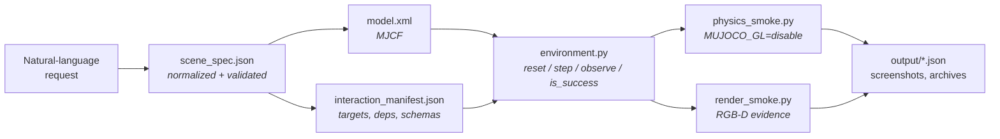

<h1 align="center">Text2MuJoCo</h1>

<p align="center">
  <strong>Turn one natural-language request into a runnable, verified MuJoCo environment.</strong><br>
  Validated MJCF &middot; executable interaction points &middot; real RGB-D evidence
</p>

<p align="center">
  
  
  
  
  
  
  <a href="LICENSE"></a>
</p>

<p align="center">
  <a href="#showcase">Showcase</a> &middot;
  <a href="#how-it-works">How it works</a> &middot;
  <a href="#validation-layers">Validation</a> &middot;
  <a href="#usage">Usage</a> &middot;
  <a href="text2mujoco_codex/README.md">Codex skill</a> &middot;
  <a href="text2mujoco_claude/README.md">Claude Code skill</a> &middot;
  <a href="README.zh-CN.md">中文</a>
</p>

<p align="center">
  
</p>

<p align="center">
  <sub>The final verified frame of each showcase, composed from the committed captures by <a href="showcase/build_readme_figures.py">build_readme_figures.py</a>.</sub>
</p>

---

Text2MuJoCo is an **agent skill package**, not a standalone natural-language compiler. Paired with Codex or Claude Code, it turns a scene or task description into a loadable MuJoCo 3 package: it resolves objects, physics, sensors, action order, success conditions, and visible interaction points, then backs the result with machine-readable reports instead of prose. A set of ready-to-run [sample queries](showcase/sample_queries.json) shows the expected input format.

## What you get

- **A normalized request** — `scene_spec.json` keeps the original prompt as `source_prompt`, records assumptions explicitly, and is schema-validated before any XML is written.
- **Physically seated geometry** — full metric dimensions are converted to MJCF half-sizes, `orientation_xyzw` is converted to `quat="w x y z"`, and resting bodies are seated by half-size arithmetic so nothing interpenetrates at `t=0`.
- **Bodies that actually collide, including against themselves** — every moving body carries a real collider, and every collision class carries `conaffinity="7"` so the arm has a boundary against its own links. Visual-only geometry (`contype="0" conaffinity="0"`) and a narrowed mask (`contype="2" conaffinity="5"`) both render and carry mass while passing through everything, so the skill forbids both and the audit fails a scene that ships either. The pairs that are *meant* to nest are named in `<contact><exclude>`, where a reader can check them.
- **A hand that stays on the arm** — every prismatic axis is drawn as a sleeve and a ram, every geom on a jointed body states its `mass`, and every position servo holds `qpos0` within 2 mm, so the tool column does not open a visible gap under the forearm or droop away from where the model says it is.
- **Grasps that can fail** — a payload is carried by an `<equality><weld>` toggled at runtime, not by overwriting its `qpos`. Released in mid-air it falls, which is what makes a part in the hand distinguishable from a part on the bench.
- **Markers you cannot walk through** — task markers are thin discs painted flush onto the surface they annotate, over real geometry, because a `<site>` never generates a contact and an emissive sphere hovering in mid-air is something every object visibly passes through.
- **Executable interaction points** — every affordance is a real handler with a typed payload schema and declared dependencies, mirrored in the canonical `interaction_manifest.json`. Out-of-order or malformed actions are rejected, not silently accepted.
- **Evidence, not claims** — each package ships `physics_smoke.py` and `render_smoke.py`, and each showcase commits the resulting JSON reports, RGB-D screenshots, and frame archives.
- **Two adapters, one behavior** — [`text2mujoco_codex`](text2mujoco_codex) and [`text2mujoco_claude`](text2mujoco_claude) carry identical validation scripts and reference guides; CI diffs the scripts on every push so the two cannot drift.

## How it works



The spec is the canonical input, but handlers are code: when a pose, condition, target, or success predicate changes, the matching runtime handler is patched and the affected validation layers are re-run. Condition strings are never assumed to execute on their own.

## Validation layers

| Layer | Runs | Rejects |
| --- | --- | --- |
| Manifest | `validate_manifests.py` | spec/manifest drift: differing interaction IDs, dependency order, poses, or marker sites |
| Static | `physics_smoke.py` | MJCF that will not compile, manifest/spec drift, bad quaternion or half-size conversion, invisible markers |
| Model audit | `model_audit.py` | all eight defects below: no collider, undeclared mass, a drooping servo, a torn link seam, a floating marker, a penetrating start pose, a mid-sequence overlap, an overlap hidden behind a collision mask |
| Initial contact | `physics_smoke.py`, `model_audit.py` | a start pose whose geoms already overlap at `t=0` |
| Sequence contact | `physics_smoke.py`, `model_audit.py`, `sequence_contact_test.py` | an overlap deeper than 1 mm at any step of the documented sequence, not just at its endpoints |
| Grasp honesty | `physics_smoke.py` | a payload that does not fall when its weld is released in mid-air — a carry faked by writing `qpos` |
| Physics | `physics_smoke.py` | non-finite state, dead actuators, unmet task predicates, non-deterministic reset |
| Render | `render_smoke.py` | blank RGB, non-finite depth, no visible change across the interaction |
| Archive | `dense_archive_test.py` | GIF/TIFF frame counts or timing that disagree with the dense report |
| Paths | `artifact_path_test.py` | artifacts escaping the package root, symlink traversal |

### The initial-contact audit

A start pose whose geoms already interpenetrate is the failure mode that hides from every other check: the solver pushes the overlap out during warmup, so physics, rendering, and task assertions all pass afterwards. The audit runs after the first `mj_forward` and before any `mj_step`, for the compiled `qpos0` **and** again for the post-`reset()` state — a reset that assigns positions from constants can reintroduce overlap the MJCF does not have.

```python
for label, data in (("model_qpos0", mujoco.MjData(env.model)), ("post_reset", env.data)):
    mujoco.mj_forward(env.model, data)
    for index in range(data.ncon):
        if data.contact[index].dist < -1e-4:
            raise AssertionError(f"{label}: geoms interpenetrate before the first step")
```

All eight showcases report `initial_contact: "PASS"`. The requirement is part of the skill's output contract, so generated packages carry it too — see [validation_checklist.md](text2mujoco_codex/references/validation_checklist.md) and the resting-pose rules in [mujoco_patterns.md](text2mujoco_codex/references/mujoco_patterns.md).

### The eight-check model audit

A clean start pose is not enough, and neither is a clean sequence. Eight distinct defects survive an endpoint check, and every one of them looks correct on camera. [`model_audit.py`](showcase/model_audit.py) compiles each scene, holds every servo, replays the documented sequence, and reports all eight as numbers:

| Check | Rejects | Limit |
| --- | --- | --- |
| Collision geometry | a moving geom in no live collision pair — a link, fork, or button that renders and passes through everything | any |
| Declared mass | a geom on a jointed body with neither `mass` nor `density`, silently compiled at density 1000 | any |
| Servo hold | a position servo that cannot hold `qpos0` — the `weight / kp` droop, visible in a render | 2 mm / 1° |
| Link continuity | the widest gap from a jointed body to its nearest *drawn* ancestor, over the whole replay | 5 mm |
| Marker grounding | a marker site floating above the surface it annotates, or buried inside another geom | 3 mm / 1 mm |
| Start pose | geoms already overlapping at the compiled `qpos0` or after `reset()` | 0.1 mm |
| Sequence contact | an overlap at any step of the documented sequence, not just at its endpoints | 1 mm |
| Undeclared self-overlap | geoms that interpenetrate only because a `contype`/`conaffinity` mask filtered the pair | any |

The last one is the check that changed the architecture. Everything else measures a quantity; this one measures whether the model is *telling the truth about* a quantity.

#### The robot needs a boundary against itself

The showcases used to declare `robot_part` as `contype="2" conaffinity="5"`. A pair collides when `(contype1 & conaffinity2) || (contype2 & conaffinity1)`, and `2 & 5 == 0`, so no two robot geoms were ever tested. That reads as an optimization — a short kinematic chain does not need self-collision — but it means the arm has no boundary against itself, it can fold through its own forearm, and **no audit can see it**, because a filtered pair generates no contact to report. Every class now carries `conaffinity="7"`:

```xml
<default>
  <geom friction="0.72 0.01 0.002" condim="6" solref="0.008 1" solimp="0.90 0.95 0.001"/>
  <default class="world_part">   <geom contype="1" conaffinity="7"/></default>
  <default class="robot_part">   <geom contype="2" conaffinity="7"/></default>
  <default class="payload_part"> <geom contype="4" conaffinity="7"/></default>
</default>
```

Bodies pick a class with `childclass="robot_part"`, individual geoms with `class="world_part"`, and the shared friction, `condim`, and `solref` still apply because the classes are nested inside the existing default rather than replacing it.

Switching `robot↔robot` on turns invisible self-penetration into real contacts, and the links that nest at a joint immediately fight each other. Those pairs — a hinge hub drawn inside the link it turns, a ram inside its sleeve — are now named one at a time, so an intentional overlap is a design decision a reader can check instead of a side effect of a bitmask:

```xml
<contact>
  <exclude name="elbow_wrist_nest" body1="arm_link2" body2="arm_link3"/>
  <exclude name="lift_sleeve_nest" body1="arm_link3" body2="arm_lift"/>
</contact>
```

The audit measures with `mujoco.mj_geomDistance`, which returns a signed distance whether or not the pair is filtered, and accepts an overlap only when the bodies are welded neighbours or appear in `model.exclude_signature`. Anything else fails. Turning the mask off found a real defect the mask had been hiding: in scene 07 the closed jaw clipped into the forearm capsule above it, which was fixed by tightening the lift's upper end stop, not by adding an exclusion.

```python
RUN_LIMIT = -1e-3                        # contact.dist is a signed gap, so 1 mm of overlap is -1e-3

def watched(model, data, *args, **kwargs):
    genuine(model, data, *args, **kwargs)          # the real mujoco.mj_step
    dist, pair = deepest_contact(model, data)      # most negative gap in this state
    if dist < worst["dist"]:
        worst.update(dist=dist, pair=pair, time_s=float(data.time))

mujoco.mj_step = watched                 # settle loops call the module function, not env.step
```

The module-level `mj_step` is wrapped rather than an environment method, because settle loops and generated controllers call the module function directly; wrapping `env.step` would miss most of the simulation. Two thresholds, because a contact solver is not a hard constraint: **0.1 mm** for the static poses, where any measurable overlap is a modeling error, and **1.0 mm** across the sequence, where sub-millimetre penetration under load is the solver's documented softness. When a scene breaches a limit, the fix is the model or the controller — never the threshold. The forklift's `fork_lift` servo was the clearest case: a stiff position actuator handed a `0.18 m` step accelerated the tines to `~1.7 m/s` and drove them `4.49 mm` into the pallet deck, so the command is now ramped at roughly `0.25 m/s` instead.

#### A joint is a coordinate, not a shape

Three separate defects render identically — the hand has fallen off the arm — and none of them is a topology error. The worst is an undrawn prismatic axis: a slide joint whose moving body carries geometry but whose *travel* carries none opens a gap under the parent link that grows with the joint value. At full extension scene 07's tool hung 165 mm below the forearm with nothing in between, and no contact, pose, or task assertion saw it, because the kinematic chain was intact the whole time. The axis is now a body of its own with two geoms that always overlap:

```xml
<geom name="lift_sleeve" class="robot_part" type="cylinder" pos="0.16 0 0.012" size="0.048 0.052" mass="0.22"/>
<body name="arm_lift" pos="0.16 0 -0.075" gravcomp="1">
  <joint name="tool_z" type="slide" axis="0 0 1" range="-0.17 0.045" damping="3.0" armature="0.008"/>
  <geom name="lift_ram" class="robot_part" type="cylinder" pos="0 0 0.125" size="0.026 0.125" mass="0.20"/>
```

The other two are quieter. A geom with neither `mass` nor `density` compiles at density 1000, so a 58 mm decorative hinge hub weighs 1.1 kg and can outweigh the arm it decorates. And a position servo holding a load settles at `weight / kp` below its target — a 0.08 kg fingertip on `kp="420"` sags exactly 1.87 mm, which is why `gravcomp="1"` has to be on *every* body the axis carries, leaves included. The link-continuity check covers all three at once: the widest gap from each jointed body to its nearest drawn ancestor, over the whole replay.

#### Markers are decals, not floating balls

The colourful spheres hovering over the benches were `<site>` elements. A site never generates a contact — that is by design and cannot be changed — so every payload and every robot link visibly passed straight through them. Modelling a marker as a shape a viewer expects to be solid is the bug; the fix is to stop doing that. Each viewer-facing marker is now a thin cylinder painted onto the surface it annotates, with half-height equal to its height above that surface so the underside is flush:

```xml
<site name="insertion_marker" type="cylinder" pos="0.17 0.21 0.906" size="0.050 0.006" material="marker_magenta" group="2"/>
```

The audit ray-casts downward to confirm real geometry underneath, so a decal over open floor the robot never reaches fails, and it rejects a centre buried inside another geom, so a decal has to stay off the footprint of the payload it marks. Sites the code reads as kinematic references — a tool centre, a fork tip — moved to `group="4"` and are not drawn at all. Sites nothing referenced were deleted. Across the eight scenes that reclassified 51 sites: 31 were floating or buried, several were duplicates of a camera position, and three in scene 03 were spheres sunk 15 mm into the floor.

#### A grasp is a constraint, not a coordinate write

Every showcase used to carry its payload by overwriting the free joint's `qpos` on each step. Nothing could make the payload slip, releasing it was a teleport to a hard-coded constant, and — this is the reported defect — a part lying on the bench was **indistinguishable in state** from a part in the hand, so a dropped part kept being treated as the object under manipulation. The carry is now an equality constraint, declared inactive and toggled at runtime:

```xml
<equality>
  <weld name="peg_grasp" body1="arm_tool" body2="red_peg" relpose="0 0 -0.125 1 0 0 0"
        active="false" solref="0.01 1" solimp="0.96 0.99 0.001"/>
</equality>
```

A weld's `eq_data` row is `[anchor(3), relpose_pos(3), relpose_quat(4), torquescale(1)]`. The offset written into it is measured at the instant the jaws close, so the constraint engages already satisfied — no jolt, no snap into place — and the jaws close *onto* the payload, 1.5 mm inside its radius, rather than around a gap the constraint spanned invisibly. Release deactivates the weld and lets gravity and contact settle the part. The regression that proves it is a mid-air release: drop the constraint with the payload still in the air and require it to fall. A welded payload falls; a `qpos`-driven one hangs there. Scene 07's peg falls `71.2 mm`, scene 08's parcel `153.6 mm`, scene 05's part `239.1 mm`, and scene 01's cube `225 mm`. Scene 06 is the same test in the form a fork truck allows: the pallet slips `0.303 mm` while welded and `73.3 mm` once released, against a `20 mm` minimum.

Setting a part down also needs somewhere for the hand to go. An arm whose only vertical freedom is one lift axis has to retract back along the path it came down, which drags the tool through the part it just placed — so the hand gained a wrist pitch hinge with its own position servo, tipping forward on approach and back to withdraw. An extra joint no interaction commands is decoration, so the scripted sequence exercises it.

| # | Scene | Moving bodies without a collider | `qpos0` | post-`reset()` | Sequence | Deepest overlap |
| --- | --- | --- | --- | --- | --- | --- |
| 01 | Button, Cube, and Box | 0 | `0.0000 mm` | `0.0000 mm` | 2,660 steps / `2.660 s` | `0.4332 mm` |
| 02 | Smart Tool Cabinet | 0 | `0.0000 mm` | `0.0000 mm` | 358 steps / `0.716 s` | `0.0000 mm` |
| 03 | Warehouse Navigation | 0 | `0.0000 mm` | `0.0000 mm` | 3,375 steps / `13.500 s` | `0.0000 mm` |
| 04 | Lever and Ramp Ball | 0 | `0.0000 mm` | `0.0000 mm` | 1,519 steps / `1.519 s` | `0.3121 mm` |
| 05 | Robotic Arm Sorting Cell | 0 | `0.0000 mm` | `0.0000 mm` | 5,661 steps / `11.322 s` | `0.6833 mm` |
| 06 | Forklift Pallet Delivery | 0 | `0.0000 mm` | `0.0000 mm` | 5,386 steps / `10.772 s` | `0.4821 mm` |
| 07 | Robot Peg Assembly | 0 | `0.0000 mm` | `0.0000 mm` | 3,400 steps / `6.800 s` | `0.5034 mm` |
| 08 | Conveyor-to-Arm Handoff | 0 | `0.0000 mm` | `0.0000 mm` | 5,078 steps / `10.156 s` | `0.7728 mm` |

**8/8 scenes pass**, `27,437` audited steps in total, deepest overlap anywhere `0.7728 mm` against the `1.0 mm` bound. The full record is [sequence_contact_report.json](showcase/output/sequence_contact_report.json), the eight-check audit is [model_audit_report.json](showcase/output/model_audit_report.json), and each scene's own `physics_smoke.py` carries the same audit so a generated package is self-checking.

## Showcase

Eight packages generated by the skill, each committed with its reports and captures. Every row below is read from the JSON in that scene's `output/` directory.

| # | Scene | Interaction points | Dense pages | Sim span | Headline verified result |
| --- | --- | --- | --- | --- | --- |
| 01 | [Button, Cube, and Box](#01--button-cube-and-box) | 4 | 18 | 2.660 s | cube seated in the open box, `130.36 px` of image motion |
| 02 | [Smart Tool Cabinet](#02--smart-tool-cabinet) | 3 | 7 | 0.716 s | drawer travel `0.218023 m` against a `0.22 m` target |
| 03 | [Warehouse Navigation](#03--warehouse-navigation) | 3 | 71 | 13.500 s | `0` shelf contacts, `0.270 m` minimum clearance |
| 04 | [Lever and Ramp Ball](#04--lever-and-ramp-ball) | 4 | 12 | 1.519 s | gate lift `0.11650 m`, ball settles in the tray |
| 05 | [Robotic Arm Sorting Cell](#05--robotic-arm-sorting-cell) | 5 | 62 | 11.322 s | `0.546 m` of part transport into the blue bin |
| 06 | [Forklift Pallet Delivery](#06--forklift-pallet-delivery) | 6 | 60 | 10.772 s | `2.236 m` drive, pallet set on the delivery stand |
| 07 | [Robot Peg Assembly](#07--robot-peg-assembly) | 6 | 41 | 6.800 s | `0.362 m` tool travel, peg released `0.0050 m` from the socket |
| 08 | [Conveyor-to-Arm Handoff](#08--conveyor-to-arm-handoff) | 6 | 57 | 10.156 s | `1.243 m` tool travel, parcel settled in the green bin |

### Reading the dense captures

Each scene ships a **dense sequence sampled every `0.20 s` of MuJoCo simulation time** — not wall-clock time, not every render tick. The sampler keeps the first post-step state at or beyond each `0.20 s` boundary and adds one event frame at each action boundary, so the cadence stays exact while nothing important is skipped.

<p align="center">
  
</p>

<p align="center">
  <sub>Six pages of <a href="showcase/06-forklift-pallet/output/screenshots/dense_sequence.tif">06's dense TIFF</a>, labelled with the simulation time recorded for each page in the <a href="showcase/06-forklift-pallet/output/dense_sequence_results.json">dense report</a>.</sub>
</p>

The same sampling produces two archives per scene: `dense_sequence.tif`, the full-resolution multi-page TIFF that is the canonical `0.20 s`-interval record, and `dense_sequence.gif`, a browser-viewable animation at `200 ms` per frame (final frame `800 ms`) so it plays back at roughly simulation speed. GitHub cannot preview TIFF, so each section below embeds the GIF and links the TIFF next to it; `dense_archive_test.py` asserts that page count, frame count, and timing all match the report.

### 01 / Button, Cube, and Box

> Place a button, a red cube, and an open box on a table. Press the button, grasp the cube, place it in the box, and inspect the result with an RGB-D camera.

`press_start_button` → `grasp_red_cube` → `place_cube_in_box` → `inspect_rgbd`

<p align="center">
  <a href="showcase/01-button-cube-box/output/screenshots/dense_sequence.tif">
    
  </a>
</p>

**Verified — PASS.** The cube settles inside the five-sided open box, contacts its bottom, comes to rest at `4.9e-14 m/s`, and moves `130.36 px` in the camera image. Released in mid-air the cube falls `225 mm`, so the carry is a constraint and not a `qpos` write.

**Dense capture** — 18 pages across `2.660 s`: 14 regular frames exactly `0.20 s` apart plus 4 action-boundary event frames.

[Environment](showcase/01-button-cube-box) &middot; [Test report](showcase/01-button-cube-box/TEST_REPORT.md) &middot; [Physics](showcase/01-button-cube-box/output/physics_results.json) &middot; [Render](showcase/01-button-cube-box/output/render_results.json) &middot; [Dense report](showcase/01-button-cube-box/output/dense_sequence_results.json) &middot; [Dense TIFF](showcase/01-button-cube-box/output/screenshots/dense_sequence.tif)

<details>
<summary>Scene and validation details</summary>

- **Scene** — table, actuated button, free rigid cube, five-geom open box, fixed RGB-D camera; 20 named objects, `0.002 s` timestep, `0.2 kg` cube.
- **Validation** — spec, MJCF compile, `t=0` contact, typed targets, 11 invalid-action rejections, dependency order, grasp hold, deterministic reset, `.mjb` reload, RGB-D, task success.
- **Contact audit** — every moving body collides; deepest overlap `0.4332 mm` over 2,660 audited steps.
- **Contract** — [interaction_manifest.json](showcase/01-button-cube-box/interaction_manifest.json)
- **Keyframe archive** — [report](showcase/01-button-cube-box/output/sequence_results.json) &middot; [GIF](showcase/01-button-cube-box/output/screenshots/sequence.gif) &middot; [TIFF](showcase/01-button-cube-box/output/screenshots/sequence.tif)

</details>

---

### 02 / Smart Tool Cabinet

> Generate a desktop tool cabinet. Press the green unlock button, pull the drawer open by 22 cm, and verify the open state with a fixed camera. Keep the unlock point, handle, and camera checkpoint visible.

`press_unlock_button` → `pull_drawer_22cm` → `inspect_open_drawer`

<p align="center">
  <a href="showcase/02-smart-drawer/output/screenshots/dense_sequence.tif">
    
  </a>
</p>

**Verified — PASS.** The slide joint reaches `0.218023 m` against the `0.22 m` target, all three interaction markers stay visible, and depth changes across `13,638` pixels.

**Dense capture** — 7 pages across `0.716 s`: 4 regular frames exactly `0.20 s` apart plus 3 action-boundary event frames.

[Environment](showcase/02-smart-drawer) &middot; [Physics](showcase/02-smart-drawer/output/physics_results.json) &middot; [Render](showcase/02-smart-drawer/output/render_results.json) &middot; [Dense report](showcase/02-smart-drawer/output/dense_sequence_results.json) &middot; [Dense TIFF](showcase/02-smart-drawer/output/screenshots/dense_sequence.tif)

<details>
<summary>Scene and validation details</summary>

- **Scene** — desktop cabinet, unlock button, slide-joint drawer, three marker sites (`unlock_point_marker`, `drawer_handle_marker`, `camera_check_marker`), fixed RGB-D camera.
- **Validation** — both actuators, `t=0` contact, marker visibility, 5 invalid-action rejections, deterministic reset, MJCF and `.mjb` reload, drawer travel, RGB-D, task success.
- **Contact audit** — every moving body collides; no measurable overlap across 358 audited steps.
- **Contract** — [interaction_manifest.json](showcase/02-smart-drawer/interaction_manifest.json)
- **Keyframe archive** — [report](showcase/02-smart-drawer/output/sequence_results.json) &middot; [GIF](showcase/02-smart-drawer/output/screenshots/sequence.gif) &middot; [TIFF](showcase/02-smart-drawer/output/screenshots/sequence.tif)

</details>

---

### 03 / Warehouse Navigation

> Generate a small warehouse where an orange robot reaches checkpoint A, navigates around the shelves to checkpoint B, and confirms completion with a top-view camera.

`reach_checkpoint_a` → `reach_checkpoint_b` → `inspect_top_camera`

<p align="center">
  <a href="showcase/03-warehouse-navigation/output/screenshots/dense_sequence.tif">
    
  </a>
</p>

**Verified — PASS.** The robot takes the south-side bypass with `0` shelf contacts, holds `0.270 m` minimum clearance from `central_shelf_geom` over 330 route samples, moves `282.60 px` in the image, and returns to its start centroid with `0.0 px` error after reset.

**Dense capture** — 71 pages across `13.500 s`: 68 regular frames exactly `0.20 s` apart plus 3 action-boundary event frames.

[Environment](showcase/03-warehouse-navigation) &middot; [Physics](showcase/03-warehouse-navigation/output/physics_results.json) &middot; [Render](showcase/03-warehouse-navigation/output/render_results.json) &middot; [Dense report](showcase/03-warehouse-navigation/output/dense_sequence_results.json) &middot; [Dense TIFF](showcase/03-warehouse-navigation/output/screenshots/dense_sequence.tif)

<details>
<summary>Scene and validation details</summary>

- **Scene** — warehouse floor, collidable shelves, planar mobile robot, two checkpoints, angled overhead RGB-D camera; four required waypoints drive the bypass.
- **Validation** — route dependencies, per-leg clearance sampling, zero shelf contact, `t=0` contact, marker visibility, 7 invalid-action rejections, deterministic reset, reset render, task success.
- **Contact audit** — the robot's turret and heading block are part of its collidable hull, not decoration; no measurable overlap across 3,375 audited steps. Clearance is held by the route, not by geometry that cannot touch anything.
- **Contract** — [interaction_manifest.json](showcase/03-warehouse-navigation/interaction_manifest.json)
- **Keyframe archive** — [report](showcase/03-warehouse-navigation/output/sequence_results.json) &middot; [GIF](showcase/03-warehouse-navigation/output/screenshots/sequence.gif) &middot; [TIFF](showcase/03-warehouse-navigation/output/screenshots/sequence.tif)

</details>

---

### 04 / Lever and Ramp Ball

> Generate a workbench where a blue lever opens a gate, releases a purple ball down a ramp into a target tray, and verifies the result with a camera.

`pull_blue_lever` → `check_release_zone` → `confirm_target_tray` → `inspect_with_camera`

<p align="center">
  <a href="showcase/04-lever-ball-ramp/output/screenshots/dense_sequence.tif">
    
  </a>
</p>

**Verified — PASS.** The lever actuator lifts the gate `0.11650 m`; the ball rolls the ramp under gravity alone and reaches the target tray at `[0.5529, 0.0000, 0.8100]` with `7.0e-10 m/s` residual speed against a `0.15 m/s` bound, in contact with the tray. All four marker colour families stay visible and `7,616` RGB pixels change.

**Dense capture** — 12 pages across `1.519 s`: 8 regular frames exactly `0.20 s` apart plus 4 action-boundary event frames.

[Environment](showcase/04-lever-ball-ramp) &middot; [Physics](showcase/04-lever-ball-ramp/output/physics_results.json) &middot; [Render](showcase/04-lever-ball-ramp/output/render_results.json) &middot; [Dense report](showcase/04-lever-ball-ramp/output/dense_sequence_results.json) &middot; [Dense TIFF](showcase/04-lever-ball-ramp/output/screenshots/dense_sequence.tif)

<details>
<summary>Scene and validation details</summary>

- **Scene** — workbench, actuated lever and gate, guarded ramp, free ball, open target tray, fixed RGB-D camera.
- **Validation** — typed targets, four marker sites, `t=0` contact, 3 invalid-action rejections, `xyzw`→`wxyz` conversion, physical release and settling, tray contact, deterministic reset, RGB-D, task success.
- **Contact audit** — every moving body collides; deepest overlap `0.3121 mm` over 1,519 audited steps, all of it the ball loading the ramp and tray.
- **Contract** — [interaction_manifest.json](showcase/04-lever-ball-ramp/interaction_manifest.json)
- **Keyframe archive** — [report](showcase/04-lever-ball-ramp/output/sequence_results.json) &middot; [GIF](showcase/04-lever-ball-ramp/output/screenshots/sequence.gif) &middot; [TIFF](showcase/04-lever-ball-ramp/output/screenshots/sequence.tif)

</details>

---

### 05 / Robotic Arm Sorting Cell

> Create a tabletop robotic sorting cell. A three-joint arm approaches a blue part on a conveyor, closes its parallel gripper, transfers the part to a blue bin beside a red distractor bin, releases it, and verifies the result with a fixed RGB-D camera.

`approach_blue_part` → `grasp_blue_part` → `transfer_to_blue_bin` → `release_blue_part` → `inspect_sorting_result`

<p align="center">
  <a href="showcase/05-robot-arm-sorting/output/screenshots/dense_sequence.tif">
    
  </a>
</p>

**Verified — PASS.** MuJoCo 3.2.7 physics confirms six articulated joints, six arm and gripper actuators, a weld-constraint grasp, dependency enforcement, and release inside the blue bin. Released in mid-air the part falls `239.118 mm`. Rendering measures `0.546 m` of blue-part motion, finite RGB-D, and all six marker colour families.

**Dense capture** — 62 pages across `11.322 s`: 57 regular frames exactly `0.20 s` apart plus 5 action-boundary event frames.

[Environment](showcase/05-robot-arm-sorting) &middot; [Physics](showcase/05-robot-arm-sorting/output/physics_results.json) &middot; [Render](showcase/05-robot-arm-sorting/output/render_results.json) &middot; [Dense report](showcase/05-robot-arm-sorting/output/dense_sequence_results.json) &middot; [Dense TIFF](showcase/05-robot-arm-sorting/output/screenshots/dense_sequence.tif)

<details>
<summary>Scene and validation details</summary>

- **Scene** — worktable, conveyor, three-link arm, dual-finger gripper, blue and red parts and bins, five visible interaction markers, fixed RGB-D camera.
- **Synchronization** — the blue part is carried by the `blue_part_grasp` weld between `tool_turret` and the part, switched on when the jaws close and off when they open; nothing writes the part's `qpos`.
- **Seating** — the blue part rests on the conveyor belt at `z = 0.855 m`, clear of both rollers; the red part sits on the worktable at `[0.43, 0.45, 0.75]`. Model, spec, manifest, and the reset constants all agree.
- **Contact audit** — all three arm links, both fingers, and the gripper mount carry colliders; deepest overlap `0.6833 mm` over 5,661 audited steps.
- **Contract** — [interaction_manifest.json](showcase/05-robot-arm-sorting/interaction_manifest.json)
- **Keyframe archive** — [report](showcase/05-robot-arm-sorting/output/sequence_results.json) &middot; [storyboard](showcase/05-robot-arm-sorting/output/screenshots/sequence.png) &middot; [TIFF](showcase/05-robot-arm-sorting/output/screenshots/sequence.tif)

</details>

---

### 06 / Forklift Pallet Delivery

> Create a warehouse forklift task. An orange mobile forklift drives to a loaded pallet, raises its powered forks, engages the pallet, carries it around a storage rack to a green delivery zone, lowers the forks to release the load, and verifies delivery with an RGB-D camera.

`drive_to_pallet` → `raise_forks` → `engage_pallet` → `carry_to_drop_zone` → `lower_forks_release` → `inspect_forklift_delivery`

<p align="center">
  <a href="showcase/06-forklift-pallet/output/screenshots/dense_sequence.tif">
    
  </a>
</p>

**Verified — PASS.** Physics confirms the three mobile base joints, the powered fork lift, `0` rack contacts, welded pallet transport that slips `0.303 mm`, release settling on the delivery stand, and deterministic reset. Rendering measures `2.236 m` of forklift travel, finite RGB-D, and all five marker colour families.

**Dense capture** — 60 pages across `10.772 s`: 54 regular frames exactly `0.20 s` apart plus 6 action-boundary event frames. This is the scene shown in the [filmstrip](#reading-the-dense-captures) above.

[Environment](showcase/06-forklift-pallet) &middot; [Physics](showcase/06-forklift-pallet/output/physics_results.json) &middot; [Render](showcase/06-forklift-pallet/output/render_results.json) &middot; [Dense report](showcase/06-forklift-pallet/output/dense_sequence_results.json) &middot; [Dense TIFF](showcase/06-forklift-pallet/output/screenshots/dense_sequence.tif)

<details>
<summary>Scene and validation details</summary>

- **Scene** — legged loading and delivery stands, mobile forklift on wheels that reach the floor, two-rail mast with a lifting carriage, three-runner pallet and crate, storage rack obstacle, six markers, fixed three-quarter overhead RGB-D camera.
- **Synchronization** — the pallet is carried by the `pallet_grasp` weld between `fork_carriage` and the pallet, engaged from the offset measured when the tines seat. The right honesty test for a fork truck is slip rather than a mid-air drop: welded, the pallet holds to `0.303 mm`; released, it slips `73.287 mm` against a `20 mm` minimum.
- **Fork channel** — the tines sweep `0.715..0.785 m` at zero lift and enter a real `150 mm` channel between the stand deck at `0.66 m` and the pallet deck bottom at `0.81 m`. The runners lie *along* the fork axis; across it, the tines would ram the near runner head-on and the lift would only work because the pallet was pinned.
- **Ordering** — `lower_forks_release` sets the pallet down on the delivery stand *before* lowering the empty forks, then withdraws at `0.045 m` of lift — mid-channel, `40 mm` clear of the stand deck below and the pallet deck above. The delivery target is a stand with locating blocks rather than a walled bin, because a fork truck has to reverse its tines out at deck height and a `0.24 m` wall on the approach side is geometry the documented sequence cannot clear.
- **Contact audit** — deepest overlap `0.4821 mm` over 5,386 audited steps. Getting there took two real fixes, not a looser bound: `fork_carriage_geom` carried no `mass` attribute and therefore weighed `28.7 kg` from MuJoCo's default density, which no `kp=300` servo can hold — the tines dropped to the joint limit the instant the engagement pin released. With explicit masses and `kp=6000 kv=300`, a step command then hammered the tines `4.49 mm` into the pallet deck, so `_set_lift` now ramps at roughly `0.25 m/s`.
- **Contract** — [interaction_manifest.json](showcase/06-forklift-pallet/interaction_manifest.json)
- **Keyframe archive** — [report](showcase/06-forklift-pallet/output/sequence_results.json) &middot; [storyboard](showcase/06-forklift-pallet/output/screenshots/sequence.png) &middot; [TIFF](showcase/06-forklift-pallet/output/screenshots/sequence.tif)

</details>

---

### 07 / Robot Peg Assembly

> Build a robot assembly station. An orange arm moves to a red locating peg, closes its gripper to pick it up, transports it to a blue fixture, inserts it vertically, releases it, and verifies the assembly with a fixed RGB-D camera.

`move_arm_to_peg` → `grasp_peg_with_arm` → `move_arm_to_socket` → `insert_peg_into_socket` → `release_assembled_peg` → `inspect_assembly`

<p align="center">
  <a href="showcase/07-robot-assembly/output/screenshots/dense_sequence.tif">
    
  </a>
</p>

**Verified — PASS.** Physics confirms four arm hinges, six explicit actuators, six visible markers, welded peg transport, finite state, and a peg released `0.0050 m` from the socket axis. Released in mid-air the peg falls `71.159 mm`. Rendering measures `0.362 m` of tool motion and finite RGB-D.

**Dense capture** — 41 pages across `6.800 s`: 35 regular frames exactly `0.20 s` apart plus 6 action-boundary event frames.

[Environment](showcase/07-robot-assembly) &middot; [Physics](showcase/07-robot-assembly/output/physics_results.json) &middot; [Render](showcase/07-robot-assembly/output/render_results.json) &middot; [Dense report](showcase/07-robot-assembly/output/dense_sequence_results.json) &middot; [Dense TIFF](showcase/07-robot-assembly/output/screenshots/dense_sequence.tif)

<details>
<summary>Scene and validation details</summary>

- **Scene** — workbench, three-link arm, drawn vertical tool lift (sleeve plus ram), wrist pitch hinge, gripper, free red peg, blue insertion fixture, six visible markers, fixed RGB-D camera.
- **Synchronization** — the peg is carried by the `peg_grasp` weld, engaged at jaw close and released as its own dependency-checked action; insertion and release are separate steps.
- **Contact audit** — arm links, tool lift, and both gripper fingers collide; deepest overlap `0.5034 mm` over 3,400 audited steps, including the insertion.
- **Contract** — [interaction_manifest.json](showcase/07-robot-assembly/interaction_manifest.json)
- **Keyframe archive** — [report](showcase/07-robot-assembly/output/sequence_results.json) &middot; [storyboard](showcase/07-robot-assembly/output/screenshots/sequence.png) &middot; [TIFF](showcase/07-robot-assembly/output/screenshots/sequence.tif)

</details>

---

### 08 / Conveyor-to-Arm Handoff

> Create a synchronized conveyor-to-arm handoff cell. A conveyor moves a blue parcel to a pickup point, a three-joint arm closes its parallel gripper around it, carries it to a green target bin, releases it, and verifies the handoff with a fixed RGB-D camera.

`start_conveyor_to_pickup` → `move_arm_to_parcel` → `grasp_parcel_with_arm` → `move_arm_to_target_bin` → `release_parcel_in_target_bin` → `inspect_handoff`

<p align="center">
  <a href="showcase/08-conveyor-arm/output/screenshots/dense_sequence.tif">
    
  </a>
</p>

**Verified — PASS.** Physics confirms a powered conveyor hinge, three arm hinges, tool lift, wrist pitch, dual gripper slides, eight explicit actuators, parcel delivery to the pickup point, welded transport, and target-bin settling. Released in mid-air the parcel falls `153.571 mm`. Rendering measures `1.243 m` of peak tool displacement and all five marker colour families.

**Dense capture** — 57 pages across `10.156 s`: 51 regular frames exactly `0.20 s` apart plus 6 action-boundary event frames.

[Environment](showcase/08-conveyor-arm) &middot; [Physics](showcase/08-conveyor-arm/output/physics_results.json) &middot; [Render](showcase/08-conveyor-arm/output/render_results.json) &middot; [Dense report](showcase/08-conveyor-arm/output/dense_sequence_results.json) &middot; [Dense TIFF](showcase/08-conveyor-arm/output/screenshots/dense_sequence.tif)

<details>
<summary>Scene and validation details</summary>

- **Scene** — powered conveyor, three-link arm, drawn vertical tool lift, wrist pitch hinge, dual-finger gripper, blue parcel, green and red bins, six visible markers, fixed RGB-D camera.
- **Conveying without a belt primitive** — MuJoCo has no belt, and writing the parcel's `qpos` every step is teleporting it: no mass, friction, or obstacle could resist that. The drive is instead a forward-only traction force that has to beat the surface's own static friction, `mu*m*g = 0.76 * 0.22 * 9.81 = 1.64 N`, so the `2.60 N` cap leaves `0.96 N` of net accelerating force. `xfrc_applied` acts at the centre of mass, and a `2.60 N` push `60 mm` above the contact plane tips a `120 mm` cube — the tipping moment passes the restoring `m*g*0.06 = 0.130 N*m` at only `2.16 N` — so the offset torque `r × F` is applied with it, putting the drive where the friction reaction already is. Power cuts out once the coast distance `v²/(2*mu*g)` reaches the pickup point, and friction alone brakes the parcel; anything in its path would stall it.
- **Synchronization** — the parcel is carried by the `parcel_grasp` weld, declared inactive and engaged from the offset measured at jaw close, then deactivated on release so gravity and contact settle it in the bin.
- **Contact audit** — the belt, arm links, and fingers all collide; deepest overlap `0.7728 mm` over 5,078 audited steps, the deepest in the set and still inside the `1 mm` bound.
- **Contract** — [interaction_manifest.json](showcase/08-conveyor-arm/interaction_manifest.json)
- **Keyframe archive** — [report](showcase/08-conveyor-arm/output/sequence_results.json) &middot; [storyboard](showcase/08-conveyor-arm/output/screenshots/sequence.png) &middot; [TIFF](showcase/08-conveyor-arm/output/screenshots/sequence.tif)

</details>

---

## Usage

### Codex

Install the [`text2mujoco_codex`](text2mujoco_codex) adapter with the Codex skill installer. The `--name` value keeps the installed skill name consistent with the `SKILL.md` front matter:

```bash
python3 /path/to/skill-installer/scripts/install-skill-from-github.py \
  --repo ShawnJoeng/Text2Mujoco \
  --path text2mujoco_codex \
  --name text2mujoco
```

Then describe the environment directly, or invoke the skill explicitly:

```text
$text2mujoco
Generate a desktop tool cabinet, unlock it, pull the drawer open by 22 cm, and inspect it with a camera.
```

### Claude Code

Install [`text2mujoco_claude`](text2mujoco_claude) at `~/.claude/skills/text2mujoco/` or `.claude/skills/text2mujoco/`, then use a natural-language request or invoke it:

```text
/text2mujoco Generate a warehouse navigation task with visible checkpoints and a top-view camera.
```

See the [Claude Code installation guide](text2mujoco_claude/README.md).

### Run a generated environment

Requirements: Python `>=3.9`, MuJoCo `3.2.7`, NumPy, and Pillow.

```bash
python -m pip install "mujoco==3.2.7" numpy pillow
cd showcase/02-smart-drawer
python3 ../../text2mujoco_codex/scripts/validate_scene_spec.py scene_spec.json --json
MUJOCO_GL=disable python3 physics_smoke.py     # spec, static, t=0 contact, physics
MUJOCO_GL=glfw mjpython render_smoke.py        # RGB-D evidence
```

**Rendering backends.** Physics needs no GPU and no GL context at all — `MUJOCO_GL=disable` is the correct setting for `physics_smoke.py`. For rendering, macOS uses `mjpython` with `MUJOCO_GL=glfw`, which gives MuJoCo the native CGL context — every committed showcase report records its `renderer_context` as CGL through the glfw backend, not a software rasterizer. On headless Linux, prefer `MUJOCO_GL=egl` and fall back to `MUJOCO_GL=osmesa` in a *separate process*, because the backend is chosen when MuJoCo first imports OpenGL. Do not label an OSMesa image as GPU-rendered.

### Reproduce the captures and figures

From the repository root:

```bash
# Paced keyframe storyboards: one frame per verified interaction
MUJOCO_GL=glfw mjpython showcase/capture_sequences.py --scene all

# Dense sequences sampled every 0.20 s of simulation time
MUJOCO_GL=glfw mjpython showcase/capture_sequences.py --dense --scene all

# Archive and path regressions
python3 showcase/dense_archive_test.py
python3 showcase/artifact_path_test.py
python3 showcase/validate_manifests.py

# The eight-check model audit, all eight scenes
# (--report is resolved inside showcase/, and must stay there)
MUJOCO_GL=disable python3 showcase/model_audit.py \
  --report output/model_audit_report.json

# The narrower predecessor: collision geometry and sequence contact only
MUJOCO_GL=disable python3 showcase/sequence_contact_test.py \
  --report output/sequence_contact_report.json

# Recompose the two README figures from the committed captures
python3 showcase/build_readme_figures.py
```

Pass `--dense-interval <seconds>` to change the sampling interval. The collector writes only under the repository `showcase/` tree so sensor and artifact paths stay portable; its `--output-root` option accepts that tree only.

The two GIF families answer different questions. Keyframe GIFs are readable storyboards of discrete, physically verified interactions — each frame holds `1.6 s`, the final state holds `2.6 s` — and the keyframe sequence retains RGB-D arrays. Dense GIFs are RGB-only and play the `0.20 s` simulation sampling at `200 ms` per frame. Both TIFFs are full-resolution archives; TIFF playback timing is viewer-dependent, which is why the GIF carries the timing contract.

<details>
<summary>Generated package structure and interaction API</summary>

```text
scene_spec.json                  # Normalized natural-language request
model.xml                        # Loadable MuJoCo MJCF
environment.py                   # Interaction, observation, reset, and success logic
interaction_manifest.json        # Targets, dependencies, and action schemas
physics_smoke.py                 # Static, t=0 contact, physics, and state-machine validation
render_smoke.py                  # RGB-D and visual-change validation
output/                          # Reports, screenshots, depth arrays, keyframe and dense archives

showcase/validate_manifests.py   # Cross-scene manifest/spec parity
showcase/model_audit.py          # The eight-check model audit
showcase/sequence_contact_test.py # Collision geometry + sequence-wide contact audit
showcase/dense_archive_test.py   # 0.20 s GIF/TIFF archive regressions
showcase/artifact_path_test.py   # Artifact containment and symlink rejection
showcase/build_readme_figures.py # README gallery and filmstrip composition
```

```python
list_interaction_points()
get_action_schema()              # interaction id -> payload schema
reset(seed=None)                 # returns the initial observation
step({"id": "<interaction_id>", "payload": {}})
observe()
is_success()
```

</details>

## License

[MIT](LICENSE)


