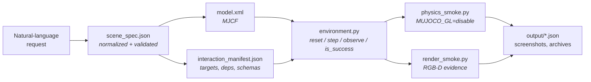

<h1 align="center">Text2MuJoCo</h1>

<p align="center">
  <strong>Turn one natural-language request into a runnable, verified MuJoCo environment.</strong><br>
  Validated MJCF &middot; executable interaction points &middot; real RGB-D evidence
</p>

<p align="center">
  
  
  
  
  
  
  <a href="LICENSE"></a>
</p>

<p align="center">
  <a href="#showcase">Showcase</a> &middot;
  <a href="#how-it-works">How it works</a> &middot;
  <a href="#validation-layers">Validation</a> &middot;
  <a href="#usage">Usage</a> &middot;
  <a href="text2mujoco_codex/README.md">Codex skill</a> &middot;
  <a href="text2mujoco_claude/README.md">Claude Code skill</a> &middot;
  <a href="README.zh-CN.md">中文</a>
</p>

<p align="center">
  
</p>

<p align="center">
  <sub>The final verified frame of each showcase, composed from the committed captures by <a href="showcase/build_readme_figures.py">build_readme_figures.py</a>.</sub>
</p>

---

Text2MuJoCo is an **agent skill package** that runs inside an existing coding agent. Paired with Codex or Claude Code, it turns a scene or task description into a loadable MuJoCo 3 package: it resolves objects, physics, sensors, action order, success conditions, and visible interaction points, then backs the result with machine-readable reports. A set of ready-to-run [sample queries](showcase/sample_queries.json) shows the expected input format.

## What you get

- **A whole package from one request** — `scene_spec.json`, `model.xml`, `environment.py`, `interaction_manifest.json`, and two runnable smoke tests, generated together and kept consistent with one another.
- **A uniform interaction API** — `list_interaction_points()`, `get_action_schema()`, `reset()`, `step()`, `observe()`, and `is_success()` on every generated environment. Each affordance is a real handler with a typed payload schema and declared dependencies, so out-of-order and malformed actions are rejected.
- **Geometry that behaves like geometry** — metric dimensions become MJCF half-sizes, `orientation_xyzw` becomes `quat="w x y z"`, resting bodies are seated by half-size arithmetic, and every collision class carries `conaffinity="7"` so a robot has a boundary against its own links.
- **Grasps as constraints** — a carried payload is held by an `<equality><weld>` engaged from the offset measured at jaw close and toggled at runtime, so releasing it in mid-air drops it.
- **Measured validation** — the checks report collision coverage, declared mass, servo hold, marker grounding, and contact depth as numbers in JSON, down to a tenth of a millimetre.
- **Committed RGB-D evidence** — each showcase carries its own reports, screenshots, depth arrays, keyframe storyboard, and a dense capture sampled every `0.20 s` of simulation time.
- **Two adapters, one behavior** — [`text2mujoco_codex`](text2mujoco_codex) and [`text2mujoco_claude`](text2mujoco_claude) carry identical validation scripts and reference guides; CI diffs the scripts on every push so the two cannot drift.

## How it works



The spec is the canonical input, but handlers are code: when a pose, condition, target, or success predicate changes, the matching runtime handler is patched and the affected validation layers are re-run. Condition strings are never assumed to execute on their own.

## Validation layers

The skill checks four things about every package it produces: that the request, the spec, and the manifest still describe the same scene; that the model is physically buildable and physically honest; that the documented interaction sequence runs to its success condition; and that the committed evidence matches the reports beside it. Each check is a script. `physics_smoke.py` and `render_smoke.py` ship inside every generated package; the rest live in [showcase/](showcase), with the model measurements gathered in [`model_audit.py`](showcase/model_audit.py), which compiles the scene, holds every servo, replays the sequence, and reports each measurement as a number.

| What is checked | Runs in | Rejects |
| --- | --- | --- |
| Spec and contract | `validate_scene_spec.py`, `validate_manifests.py` | a spec that fails its schema; spec/manifest drift in interaction IDs, dependency order, poses, or marker sites |
| Start pose | `physics_smoke.py`, `model_audit.py` | MJCF that will not compile; geoms overlapping by more than `0.1 mm` at the compiled `qpos0` or after `reset()` |
| Collision coverage | `model_audit.py` | a moving geom that belongs to no live collision pair; an overlap that exists only because a `contype`/`conaffinity` mask filtered the pair out of the solver |
| Mechanical honesty | `model_audit.py` | a geom on a jointed body with no declared `mass`; a position servo settling more than `2 mm` or `1°` below the pose it holds; a gap wider than `5 mm` between a jointed body and its nearest drawn ancestor |
| Sequence contact | `physics_smoke.py`, `model_audit.py`, `sequence_contact_test.py` | an overlap deeper than `1 mm` at any step of the documented sequence, endpoints and everything between them |
| Grasp honesty | `physics_smoke.py` | a payload that hangs in place when its weld is released in mid-air — the signature of a carry written into `qpos` |
| Markers | `model_audit.py`, `render_smoke.py` | a marker site more than `3 mm` above the surface it annotates, buried more than `1 mm` inside another geom, or with no visible pixels in the render |
| Behavior | `physics_smoke.py`, `render_smoke.py` | non-finite state, dead actuators, unmet task predicates, a reset whose state differs between runs, blank RGB, no visible change across the interaction |
| Evidence | `dense_archive_test.py`, `artifact_path_test.py` | GIF/TIFF frame counts or timing that disagree with the dense report; artifacts escaping the package root |

Two overlap thresholds run through that table, because a contact solver approximates: **0.1 mm** for the static poses, where any measurable overlap is a modeling error, and **1.0 mm** across the sequence, where sub-millimetre penetration under load is the solver's documented softness. A scene that breaches a limit is repaired in the model or the controller, and the threshold stays where it is.

Across the eight showcases the audit replays `27,437` steps and the deepest overlap anywhere is `0.7728 mm`. The full record is [model_audit_report.json](showcase/output/model_audit_report.json) and [sequence_contact_report.json](showcase/output/sequence_contact_report.json), and each scene's own `physics_smoke.py` carries the same measurements so a generated package is self-checking.

## Showcase

Eight packages generated by the skill, each committed with its reports and captures. Every row below is read from the JSON in that scene's `output/` directory.

| # | Scene | Interaction points | Dense pages | Sim span |
| --- | --- | --- | --- | --- |
| 01 | [Button, Cube, and Box](#01--button-cube-and-box) | 4 | 18 | 2.660 s |
| 02 | [Smart Tool Cabinet](#02--smart-tool-cabinet) | 3 | 7 | 0.716 s |
| 03 | [Warehouse Navigation](#03--warehouse-navigation) | 3 | 71 | 13.500 s |
| 04 | [Lever and Ramp Ball](#04--lever-and-ramp-ball) | 4 | 12 | 1.519 s |
| 05 | [Robotic Arm Sorting Cell](#05--robotic-arm-sorting-cell) | 5 | 62 | 11.322 s |
| 06 | [Forklift Pallet Delivery](#06--forklift-pallet-delivery) | 6 | 60 | 10.772 s |
| 07 | [Robot Peg Assembly](#07--robot-peg-assembly) | 6 | 41 | 6.800 s |
| 08 | [Conveyor-to-Arm Handoff](#08--conveyor-to-arm-handoff) | 6 | 57 | 10.156 s |

### 01 / Button, Cube, and Box

> Place a button, a red cube, and an open box on a table. Press the button, grasp the cube, place it in the box, and inspect the result with an RGB-D camera.

`press_start_button` → `grasp_red_cube` → `place_cube_in_box` → `inspect_rgbd`

<p align="center">
  <a href="showcase/01-button-cube-box/output/screenshots/dense_sequence.tif">
    
  </a>
</p>

[Environment](showcase/01-button-cube-box) &middot; [Test report](showcase/01-button-cube-box/TEST_REPORT.md) &middot; [Physics](showcase/01-button-cube-box/output/physics_results.json) &middot; [Render](showcase/01-button-cube-box/output/render_results.json) &middot; [Dense report](showcase/01-button-cube-box/output/dense_sequence_results.json) &middot; [Dense TIFF](showcase/01-button-cube-box/output/screenshots/dense_sequence.tif)

<details>
<summary>Scene details</summary>

- **Scene** — table, actuated button, free rigid cube, five-geom open box, fixed RGB-D camera; 20 named objects, `0.002 s` timestep, `0.2 kg` cube.
- **Contract** — [interaction_manifest.json](showcase/01-button-cube-box/interaction_manifest.json)
- **Keyframe archive** — [report](showcase/01-button-cube-box/output/sequence_results.json) &middot; [GIF](showcase/01-button-cube-box/output/screenshots/sequence.gif) &middot; [TIFF](showcase/01-button-cube-box/output/screenshots/sequence.tif)

</details>

---

### 02 / Smart Tool Cabinet

> Generate a desktop tool cabinet. Press the green unlock button, pull the drawer open by 22 cm, and verify the open state with a fixed camera. Keep the unlock point, handle, and camera checkpoint visible.

`press_unlock_button` → `pull_drawer_22cm` → `inspect_open_drawer`

<p align="center">
  <a href="showcase/02-smart-drawer/output/screenshots/dense_sequence.tif">
    
  </a>
</p>

[Environment](showcase/02-smart-drawer) &middot; [Physics](showcase/02-smart-drawer/output/physics_results.json) &middot; [Render](showcase/02-smart-drawer/output/render_results.json) &middot; [Dense report](showcase/02-smart-drawer/output/dense_sequence_results.json) &middot; [Dense TIFF](showcase/02-smart-drawer/output/screenshots/dense_sequence.tif)

<details>
<summary>Scene details</summary>

- **Scene** — desktop cabinet, unlock button, slide-joint drawer, three marker sites (`unlock_point_marker`, `drawer_handle_marker`, `camera_check_marker`), fixed RGB-D camera.
- **Contract** — [interaction_manifest.json](showcase/02-smart-drawer/interaction_manifest.json)
- **Keyframe archive** — [report](showcase/02-smart-drawer/output/sequence_results.json) &middot; [GIF](showcase/02-smart-drawer/output/screenshots/sequence.gif) &middot; [TIFF](showcase/02-smart-drawer/output/screenshots/sequence.tif)

</details>

---

### 03 / Warehouse Navigation

> Generate a small warehouse where an orange robot reaches checkpoint A, navigates around the shelves to checkpoint B, and confirms completion with a top-view camera.

`reach_checkpoint_a` → `reach_checkpoint_b` → `inspect_top_camera`

<p align="center">
  <a href="showcase/03-warehouse-navigation/output/screenshots/dense_sequence.tif">
    
  </a>
</p>

[Environment](showcase/03-warehouse-navigation) &middot; [Physics](showcase/03-warehouse-navigation/output/physics_results.json) &middot; [Render](showcase/03-warehouse-navigation/output/render_results.json) &middot; [Dense report](showcase/03-warehouse-navigation/output/dense_sequence_results.json) &middot; [Dense TIFF](showcase/03-warehouse-navigation/output/screenshots/dense_sequence.tif)

<details>
<summary>Scene details</summary>

- **Scene** — warehouse floor, collidable shelves, planar mobile robot, two checkpoints, angled overhead RGB-D camera; four required waypoints drive the bypass.
- **Contract** — [interaction_manifest.json](showcase/03-warehouse-navigation/interaction_manifest.json)
- **Keyframe archive** — [report](showcase/03-warehouse-navigation/output/sequence_results.json) &middot; [GIF](showcase/03-warehouse-navigation/output/screenshots/sequence.gif) &middot; [TIFF](showcase/03-warehouse-navigation/output/screenshots/sequence.tif)

</details>

---

### 04 / Lever and Ramp Ball

> Generate a workbench where a blue lever opens a gate, releases a purple ball down a ramp into a target tray, and verifies the result with a camera.

`pull_blue_lever` → `check_release_zone` → `confirm_target_tray` → `inspect_with_camera`

<p align="center">
  <a href="showcase/04-lever-ball-ramp/output/screenshots/dense_sequence.tif">
    
  </a>
</p>

[Environment](showcase/04-lever-ball-ramp) &middot; [Physics](showcase/04-lever-ball-ramp/output/physics_results.json) &middot; [Render](showcase/04-lever-ball-ramp/output/render_results.json) &middot; [Dense report](showcase/04-lever-ball-ramp/output/dense_sequence_results.json) &middot; [Dense TIFF](showcase/04-lever-ball-ramp/output/screenshots/dense_sequence.tif)

<details>
<summary>Scene details</summary>

- **Scene** — workbench, actuated lever and gate, guarded ramp, free ball, open target tray, fixed RGB-D camera.
- **Contract** — [interaction_manifest.json](showcase/04-lever-ball-ramp/interaction_manifest.json)
- **Keyframe archive** — [report](showcase/04-lever-ball-ramp/output/sequence_results.json) &middot; [GIF](showcase/04-lever-ball-ramp/output/screenshots/sequence.gif) &middot; [TIFF](showcase/04-lever-ball-ramp/output/screenshots/sequence.tif)

</details>

---

### 05 / Robotic Arm Sorting Cell

> Create a tabletop robotic sorting cell. A three-joint arm approaches a blue part on a conveyor, closes its parallel gripper, transfers the part to a blue bin beside a red distractor bin, releases it, and verifies the result with a fixed RGB-D camera.

`approach_blue_part` → `grasp_blue_part` → `transfer_to_blue_bin` → `release_blue_part` → `inspect_sorting_result`

<p align="center">
  <a href="showcase/05-robot-arm-sorting/output/screenshots/dense_sequence.tif">
    
  </a>
</p>

[Environment](showcase/05-robot-arm-sorting) &middot; [Physics](showcase/05-robot-arm-sorting/output/physics_results.json) &middot; [Render](showcase/05-robot-arm-sorting/output/render_results.json) &middot; [Dense report](showcase/05-robot-arm-sorting/output/dense_sequence_results.json) &middot; [Dense TIFF](showcase/05-robot-arm-sorting/output/screenshots/dense_sequence.tif)

<details>
<summary>Scene details</summary>

- **Scene** — worktable, conveyor, three-link arm, dual-finger gripper, blue and red parts and bins, five visible interaction markers, fixed RGB-D camera.
- **Synchronization** — the blue part is carried by the `blue_part_grasp` weld between `tool_turret` and the part, switched on when the jaws close and off when they open; nothing writes the part's `qpos`.
- **Seating** — the blue part rests on the conveyor belt at `z = 0.855 m`, clear of both rollers; the red part sits on the worktable at `[0.43, 0.45, 0.75]`. Model, spec, manifest, and the reset constants all agree.
- **Contract** — [interaction_manifest.json](showcase/05-robot-arm-sorting/interaction_manifest.json)
- **Keyframe archive** — [report](showcase/05-robot-arm-sorting/output/sequence_results.json) &middot; [storyboard](showcase/05-robot-arm-sorting/output/screenshots/sequence.png) &middot; [TIFF](showcase/05-robot-arm-sorting/output/screenshots/sequence.tif)

</details>

---

### 06 / Forklift Pallet Delivery

> Create a warehouse forklift task. An orange mobile forklift drives to a loaded pallet, raises its powered forks, engages the pallet, carries it around a storage rack to a green delivery zone, lowers the forks to release the load, and verifies delivery with an RGB-D camera.

`drive_to_pallet` → `raise_forks` → `engage_pallet` → `carry_to_drop_zone` → `lower_forks_release` → `inspect_forklift_delivery`

<p align="center">
  <a href="showcase/06-forklift-pallet/output/screenshots/dense_sequence.tif">
    
  </a>
</p>

[Environment](showcase/06-forklift-pallet) &middot; [Physics](showcase/06-forklift-pallet/output/physics_results.json) &middot; [Render](showcase/06-forklift-pallet/output/render_results.json) &middot; [Dense report](showcase/06-forklift-pallet/output/dense_sequence_results.json) &middot; [Dense TIFF](showcase/06-forklift-pallet/output/screenshots/dense_sequence.tif)

<details>
<summary>Scene details</summary>

- **Scene** — legged loading and delivery stands, mobile forklift on wheels that reach the floor, two-rail mast with a lifting carriage, three-runner pallet and crate, storage rack obstacle, six markers, fixed three-quarter overhead RGB-D camera.
- **Synchronization** — the pallet is carried by the `pallet_grasp` weld between `fork_carriage` and the pallet, engaged from the offset measured when the tines seat. The honesty test a fork truck allows is slip: welded, the pallet holds to `0.303 mm`; released, it slips `73.287 mm` against a `20 mm` minimum.
- **Fork channel** — the tines sweep `0.715..0.785 m` at zero lift and enter a real `150 mm` channel between the stand deck at `0.66 m` and the pallet deck bottom at `0.81 m`. The runners lie *along* the fork axis; across it, the tines would ram the near runner head-on and the lift would only work because the pallet was pinned.
- **Ordering** — `lower_forks_release` sets the pallet down on the delivery stand *before* lowering the empty forks, then withdraws at `0.045 m` of lift — mid-channel, `40 mm` clear of the stand deck below and the pallet deck above. The delivery target is a stand with locating blocks, because a fork truck has to reverse its tines out at deck height and a `0.24 m` wall on the approach side is geometry the documented sequence cannot clear.
- **Contract** — [interaction_manifest.json](showcase/06-forklift-pallet/interaction_manifest.json)
- **Keyframe archive** — [report](showcase/06-forklift-pallet/output/sequence_results.json) &middot; [storyboard](showcase/06-forklift-pallet/output/screenshots/sequence.png) &middot; [TIFF](showcase/06-forklift-pallet/output/screenshots/sequence.tif)

</details>

---

### 07 / Robot Peg Assembly

> Build a robot assembly station. An orange arm moves to a red locating peg, closes its gripper to pick it up, transports it to a blue fixture, inserts it vertically, releases it, and verifies the assembly with a fixed RGB-D camera.

`move_arm_to_peg` → `grasp_peg_with_arm` → `move_arm_to_socket` → `insert_peg_into_socket` → `release_assembled_peg` → `inspect_assembly`

<p align="center">
  <a href="showcase/07-robot-assembly/output/screenshots/dense_sequence.tif">
    
  </a>
</p>

[Environment](showcase/07-robot-assembly) &middot; [Physics](showcase/07-robot-assembly/output/physics_results.json) &middot; [Render](showcase/07-robot-assembly/output/render_results.json) &middot; [Dense report](showcase/07-robot-assembly/output/dense_sequence_results.json) &middot; [Dense TIFF](showcase/07-robot-assembly/output/screenshots/dense_sequence.tif)

<details>
<summary>Scene details</summary>

- **Scene** — workbench, three-link arm, drawn vertical tool lift (sleeve plus ram), wrist pitch hinge, gripper, free red peg, blue insertion fixture, six visible markers, fixed RGB-D camera.
- **Synchronization** — the peg is carried by the `peg_grasp` weld, engaged at jaw close and released as its own dependency-checked action; insertion and release are separate steps.
- **Contract** — [interaction_manifest.json](showcase/07-robot-assembly/interaction_manifest.json)
- **Keyframe archive** — [report](showcase/07-robot-assembly/output/sequence_results.json) &middot; [storyboard](showcase/07-robot-assembly/output/screenshots/sequence.png) &middot; [TIFF](showcase/07-robot-assembly/output/screenshots/sequence.tif)

</details>

---

### 08 / Conveyor-to-Arm Handoff

> Create a synchronized conveyor-to-arm handoff cell. A conveyor moves a blue parcel to a pickup point, a three-joint arm closes its parallel gripper around it, carries it to a green target bin, releases it, and verifies the handoff with a fixed RGB-D camera.

`start_conveyor_to_pickup` → `move_arm_to_parcel` → `grasp_parcel_with_arm` → `move_arm_to_target_bin` → `release_parcel_in_target_bin` → `inspect_handoff`

<p align="center">
  <a href="showcase/08-conveyor-arm/output/screenshots/dense_sequence.tif">
    
  </a>
</p>

[Environment](showcase/08-conveyor-arm) &middot; [Physics](showcase/08-conveyor-arm/output/physics_results.json) &middot; [Render](showcase/08-conveyor-arm/output/render_results.json) &middot; [Dense report](showcase/08-conveyor-arm/output/dense_sequence_results.json) &middot; [Dense TIFF](showcase/08-conveyor-arm/output/screenshots/dense_sequence.tif)

<details>
<summary>Scene details</summary>

- **Scene** — powered conveyor, three-link arm, drawn vertical tool lift, wrist pitch hinge, dual-finger gripper, blue parcel, green and red bins, six visible markers, fixed RGB-D camera.
- **Conveying without a belt primitive** — MuJoCo has no belt, and writing the parcel's `qpos` every step is teleporting it: no mass, friction, or obstacle could resist that. The drive is a forward-only traction force that has to beat the surface's own static friction, `mu*m*g = 0.76 * 0.22 * 9.81 = 1.64 N`, so the `2.60 N` cap leaves `0.96 N` of net accelerating force. `xfrc_applied` acts at the centre of mass, and a `2.60 N` push `60 mm` above the contact plane tips a `120 mm` cube — the tipping moment passes the restoring `m*g*0.06 = 0.130 N*m` at only `2.16 N` — so the offset torque `r × F` is applied with it, putting the drive where the friction reaction already is. Power cuts out once the coast distance `v²/(2*mu*g)` reaches the pickup point, and friction alone brakes the parcel; anything in its path would stall it.
- **Synchronization** — the parcel is carried by the `parcel_grasp` weld, declared inactive and engaged from the offset measured at jaw close, then deactivated on release so gravity and contact settle it in the bin.
- **Contract** — [interaction_manifest.json](showcase/08-conveyor-arm/interaction_manifest.json)
- **Keyframe archive** — [report](showcase/08-conveyor-arm/output/sequence_results.json) &middot; [storyboard](showcase/08-conveyor-arm/output/screenshots/sequence.png) &middot; [TIFF](showcase/08-conveyor-arm/output/screenshots/sequence.tif)

</details>

---

## Usage

### Codex

Install the [`text2mujoco_codex`](text2mujoco_codex) adapter with the Codex skill installer. The `--name` value keeps the installed skill name consistent with the `SKILL.md` front matter:

```bash
python3 /path/to/skill-installer/scripts/install-skill-from-github.py \
  --repo ShawnJoeng/Text2Mujoco \
  --path text2mujoco_codex \
  --name text2mujoco
```

Then describe the environment directly, or invoke the skill explicitly:

```text
$text2mujoco
Generate a desktop tool cabinet, unlock it, pull the drawer open by 22 cm, and inspect it with a camera.
```

### Claude Code

Install [`text2mujoco_claude`](text2mujoco_claude) at `~/.claude/skills/text2mujoco/` or `.claude/skills/text2mujoco/`, then use a natural-language request or invoke it:

```text
/text2mujoco Generate a warehouse navigation task with visible checkpoints and a top-view camera.
```

See the [Claude Code installation guide](text2mujoco_claude/README.md).

### Run a generated environment

Requirements: Python `>=3.9`, MuJoCo `3.2.7`, NumPy, and Pillow.

```bash
python -m pip install "mujoco==3.2.7" numpy pillow
cd showcase/02-smart-drawer
python3 ../../text2mujoco_codex/scripts/validate_scene_spec.py scene_spec.json --json
MUJOCO_GL=disable python3 physics_smoke.py     # spec, static, t=0 contact, physics
MUJOCO_GL=glfw mjpython render_smoke.py        # RGB-D evidence; headless Linux: MUJOCO_GL=egl python3
```

<details>
<summary>Generated package structure and interaction API</summary>

```text
scene_spec.json                  # Normalized natural-language request
model.xml                        # Loadable MuJoCo MJCF
environment.py                   # Interaction, observation, reset, and success logic
interaction_manifest.json        # Targets, dependencies, and action schemas
physics_smoke.py                 # Static, t=0 contact, physics, and state-machine validation
render_smoke.py                  # RGB-D and visual-change validation
output/                          # Reports, screenshots, depth arrays, keyframe and dense archives

showcase/validate_manifests.py   # Cross-scene manifest/spec parity
showcase/model_audit.py          # The eight-check model audit
showcase/sequence_contact_test.py # Collision geometry + sequence-wide contact audit
showcase/dense_archive_test.py   # 0.20 s GIF/TIFF archive regressions
showcase/artifact_path_test.py   # Artifact containment and symlink rejection
showcase/build_readme_figures.py # README gallery and filmstrip composition
```

```python
list_interaction_points()
get_action_schema()              # interaction id -> payload schema
reset(seed=None)                 # returns the initial observation
step({"id": "<interaction_id>", "payload": {}})
observe()
is_success()
```

</details>

## License

[MIT](LICENSE)


