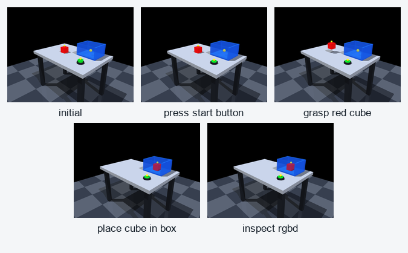
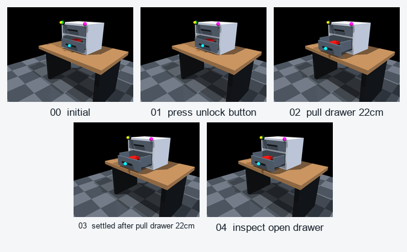
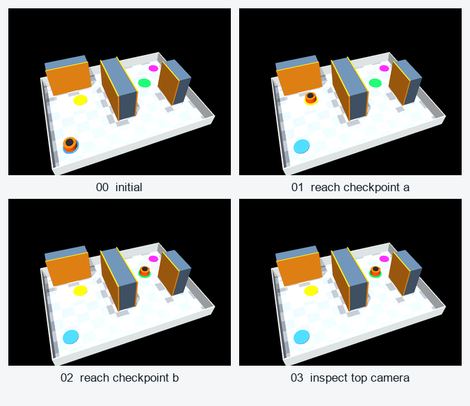
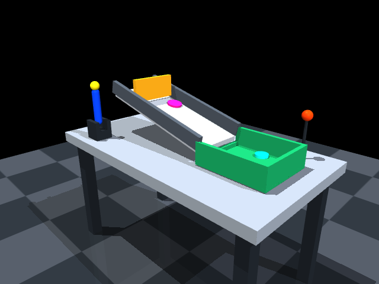
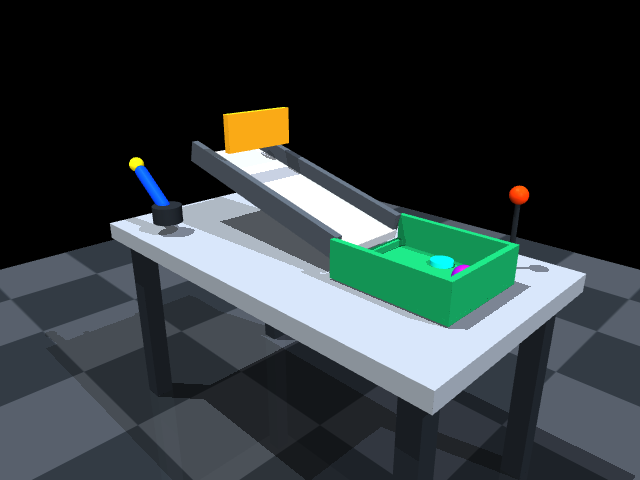
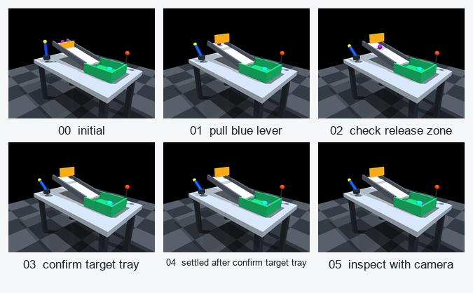

# Text2MuJoCo

`Text2MuJoCo` turns one natural-language scene or task description into a runnable, verifiable MuJoCo environment. It is shipped with two instruction adapters: a Codex skill and a Claude Code skill. When a rendering backend is available, the generated package also produces real RGB-D images and depth data.

Adapters: [Codex skill (`text2mujoco_codex`)](text2mujoco_codex/SKILL.md) · [Claude Code skill (`text2mujoco_claude`)](text2mujoco_claude/SKILL.md)

It is responsible for:

- parsing objects, spatial relationships, dimensions, physical properties, sensors, actions, and success conditions;
- generating `scene_spec.json` and a directly loadable `model.xml` (MJCF);
- generating `environment.py` and `interaction_manifest.json`, turning interaction points into callable programmatic interfaces;
- generating physics, interaction-order, reset, RGB-D, and screenshot validation scripts;
- writing every result as auditable JSON instead of reporting only that something "looks successful".

Unified Interaction Interface:

```python
list_interaction_points()
get_action_schema()
reset(seed=None)
step({"id": "<interaction_id>", "payload": {}})
observe()
is_success()
```

## Showcase

The examples below are deliberately presented as individual case studies. Each one keeps the natural-language query, generated scene, interaction contract, verification evidence, and visual sequence together so the result remains readable on a narrow screen as well as on GitHub's desktop view.

### At a glance

| Example | Interaction path | Verified outcome |
| --- | --- | --- |
| [Button, Cube, and Box](showcase/01-button-cube-box) | Press -> grasp -> place -> inspect | Cube settles inside the open box; RGB-D and movement checks pass |
| [Smart Tool Cabinet](showcase/02-smart-drawer) | Unlock -> pull 22 cm -> inspect | Drawer reaches `0.218023 m`; marker and depth-change checks pass |
| [Warehouse Navigation](showcase/03-warehouse-navigation) | Checkpoint A -> south bypass -> checkpoint B -> inspect | Zero shelf contacts; `0.270 m` minimum clearance; reset passes |
| [Lever and Ramp Ball](showcase/04-lever-ball-ramp) | Pull lever -> release check -> tray check -> inspect | Gate lifts `0.11656 m`; ball settles in the target tray |

The detailed records linked in each case study are the source of truth. `PASS` means the corresponding JSON report was produced by the test command and contains a passing status; an image is treated as simulation evidence only when the render report also says `PASS`.

### 1. Button, Cube, and Box

> **Query**
>
> “Place a button, a red cube, and a box with an interior space on a table. After pressing the button, grasp the cube and place it in the box, then observe the result with an RGB-D camera.”

| | |
| --- | --- |
| **Generated environment** | Table, green button, red free rigid body, five-sided open blue box, and a fixed RGB-D camera. [Open the environment](showcase/01-button-cube-box) |
| **Interaction contract** | `press_start_button` -> `grasp_red_cube` -> `place_cube_in_box` -> `inspect_rgbd`; dependencies reject out-of-order actions. |
| **After interaction** | The button is pressed; the cube settles inside the box and contacts the bottom; the red-cube centroid moves `130.52 px`. |
| **Verification** | Scene spec, MJCF, typed targets, physics, invalid actions, reset, RGB-D, and task success: **PASS**. The five-frame render sequence also completed successfully. [Test report](showcase/01-button-cube-box/TEST_REPORT.md) · [Sequence report](showcase/01-button-cube-box/output/sequence_results.json) |

<table>
<tr>
<td align="center"><a href="showcase/01-button-cube-box/output/screenshots/before.png"></a><br><sub>Before</sub></td>
<td align="center"><a href="showcase/01-button-cube-box/output/screenshots/after.png"></a><br><sub>After</sub></td>
<td align="center"><a href="showcase/01-button-cube-box/output/screenshots/sequence.png"></a><br><sub>Interaction sequence</sub></td>
</tr>
</table>

[Download the full TIFF sequence](showcase/01-button-cube-box/output/screenshots/sequence.tif) · [Render results](showcase/01-button-cube-box/output/render_results.json) · [Interaction manifest](showcase/01-button-cube-box/interaction_manifest.json)

### 2. Smart Tool Cabinet

> **Query**
>
> “Generate a desktop tool cabinet. First press the green unlock button, then pull the drawer open by 22 cm, and finally use a fixed camera to verify that the drawer is open. Mark the unlock point, handle, and camera inspection point as visible interaction points.”

| | |
| --- | --- |
| **Generated environment** | Desktop cabinet, green unlock button, real slide-joint drawer, and fixed RGB-D camera. [Open the environment](showcase/02-smart-drawer) |
| **Interaction contract** | `press_unlock_button` (yellow) -> `pull_drawer_22cm` (cyan) -> `inspect_open_drawer` (magenta). |
| **After interaction** | Unlock succeeds; the drawer measures `0.218023 m` against a `0.22 m` target with `0.002 m` tolerance; inspection completes. |
| **Verification** | Three marker sites, actuators, dependency rejection, reset, RGB-D, and task success: **PASS**. Handle movement is `54.21 px`; depth changes in `13,700` pixels; the five-frame render sequence also passed. [Sequence report](showcase/02-smart-drawer/output/sequence_results.json) |

<table>
<tr>
<td align="center"><a href="showcase/02-smart-drawer/output/screenshots/before.png"></a><br><sub>Before</sub></td>
<td align="center"><a href="showcase/02-smart-drawer/output/screenshots/after.png"></a><br><sub>After</sub></td>
<td align="center"><a href="showcase/02-smart-drawer/output/screenshots/sequence.png"></a><br><sub>Interaction sequence</sub></td>
</tr>
</table>

[Download the full TIFF sequence](showcase/02-smart-drawer/output/screenshots/sequence.tif) · [Render results](showcase/02-smart-drawer/output/render_results.json) · [Interaction manifest](showcase/02-smart-drawer/interaction_manifest.json)

### 3. Warehouse Navigation

> **Query**
>
> “Generate a small warehouse navigation scene: an orange mobile robot starts from a start position, must first reach yellow checkpoint A, then go around the shelves to green checkpoint B, and finally confirm completion with a top-view camera. Both checkpoints and the camera inspection must be visible interaction points.”

| | |
| --- | --- |
| **Generated environment** | Warehouse floor, shelf obstacles, orange planar mobile robot, A/B waypoints, and top-view camera. [Open the environment](showcase/03-warehouse-navigation) |
| **Interaction contract** | `reach_checkpoint_a` (yellow) -> `reach_checkpoint_b` (green, forced south-side bypass) -> `inspect_top_camera` (magenta). |
| **After interaction** | The robot reaches B with zero shelf contacts; minimum clearance is `0.270 m`; image movement is `331.26 px`; reset returns it to the start. |
| **Verification** | Route dependencies, clearance, marker visibility, RGB-D, task success, and reset: **PASS**. Marker pixels are `6048 / 1641 / 1118`; reset centroid error is `0 px`; the four-frame render sequence also passed. [Sequence report](showcase/03-warehouse-navigation/output/sequence_results.json) |

<table>
<tr>
<td align="center"><a href="showcase/03-warehouse-navigation/output/screenshots/before.png"></a><br><sub>Before</sub></td>
<td align="center"><a href="showcase/03-warehouse-navigation/output/screenshots/after.png"></a><br><sub>After</sub></td>
<td align="center"><a href="showcase/03-warehouse-navigation/output/screenshots/sequence.png"></a><br><sub>Interaction sequence</sub></td>
</tr>
</table>

[Download the full TIFF sequence](showcase/03-warehouse-navigation/output/screenshots/sequence.tif) · [Render results](showcase/03-warehouse-navigation/output/render_results.json) · [Interaction manifest](showcase/03-warehouse-navigation/interaction_manifest.json)

### 4. Lever and Ramp Ball

> **Query**
>
> “Generate a workbench: pull down a blue lever to open a gate, let a purple ball roll down a ramp into a target tray, and then inspect the result with a camera. The lever, release zone, target zone, and camera inspection point must all be visible interaction points.”

| | |
| --- | --- |
| **Generated environment** | Workbench, blue lever, liftable gate, ramp rails, purple ball, open target tray, and fixed RGB-D camera. [Open the environment](showcase/04-lever-ball-ramp) |
| **Interaction contract** | `pull_blue_lever` -> `check_release_zone` -> `confirm_target_tray` -> `inspect_with_camera`; all four points map to typed MJCF targets and marker sites. |
| **After interaction** | Lever/gate physics passes; the gate lifts `0.11656 m`; the released ball enters the tray and settles at `0.000277 m/s`. |
| **Verification** | Scene spec, typed targets, four marker sites, dependency rejection, physics, reset, RGB-D rendering, and marker visibility: **PASS**. The complete four-action, six-frame sequence also passed. [Render results](showcase/04-lever-ball-ramp/render_results.json) · [Sequence report](showcase/04-lever-ball-ramp/output/sequence_results.json) |

<table>
<tr>
<td align="center"><a href="showcase/04-lever-ball-ramp/output/screenshots/before.png"></a><br><sub>Before</sub></td>
<td align="center"><a href="showcase/04-lever-ball-ramp/output/screenshots/after.png"></a><br><sub>After</sub></td>
<td align="center"><a href="showcase/04-lever-ball-ramp/output/screenshots/sequence.png"></a><br><sub>Interaction sequence</sub></td>
</tr>
</table>

[Download the full TIFF sequence](showcase/04-lever-ball-ramp/output/screenshots/sequence.tif) · [Render results](showcase/04-lever-ball-ramp/render_results.json) · [Physics results](showcase/04-lever-ball-ramp/physics_results.json) · [Interaction manifest](showcase/04-lever-ball-ramp/interaction_manifest.json)


## Usage

### 1. Choose an Adapter and Enter a Query

For **Codex**, install or expose [`text2mujoco_codex`](text2mujoco_codex) as a skill, then describe the scene directly or invoke it explicitly:

```text
$text2mujoco
Generate a desktop tool cabinet, press the unlock button, pull the drawer open by 22 cm, and inspect the result with a camera.
```

For **Claude Code**, install [`text2mujoco_claude`](text2mujoco_claude) at `~/.claude/skills/text2mujoco/` or `.claude/skills/text2mujoco/`. Start a new session and send the same natural-language query for automatic selection, or invoke `/text2mujoco <request>` explicitly. See the [Claude installation guide](text2mujoco_claude/README.md).

It helps to include the objects, positions, action order, sensors, and success conditions. When critical details are missing, the skill asks only blocking questions that would change the implementation; other details are written to `assumptions`.

### 2. Inspect the Generated Environment

Each environment directory usually contains:

```text
scene_spec.json             # Normalized representation of the query
model.xml                   # MuJoCo MJCF source file
environment.py              # Interaction, observation, reset, and success logic
interaction_manifest.json   # Interaction points, targets, dependencies, and action schemas
physics_smoke.py            # Physics and state-machine validation
render_smoke.py             # RGB-D and before/after image validation
README.md                   # Environment-specific documentation and run commands
output/                     # Models, screenshots, and JSON results
```

### 3. Install and Run

Requirements: Python `>=3.9`, MuJoCo `3.2.7`, NumPy, and Pillow.

```bash
python -m pip install "mujoco==3.2.7" numpy pillow
cd showcase/02-smart-drawer
python3 ../../text2mujoco_codex/scripts/validate_scene_spec.py scene_spec.json --json
MUJOCO_GL=disable python physics_smoke.py
MUJOCO_GL=glfw mjpython render_smoke.py
```

The physics test uses `MUJOCO_GL=disable` and does not require a graphics context. On macOS, use the `mjpython` executable installed by the MuJoCo package so the renderer can access the native CGL session. On a headless Linux server, try `MUJOCO_GL=egl` and then `MUJOCO_GL=osmesa` in separate processes. Treat an image as verified simulation output only when `render_results.json` explicitly reports `PASS`.

To regenerate every interaction frame, the README contact sheets, and the multi-page TIFF files from the repository root:

```bash
MUJOCO_GL=glfw mjpython showcase/capture_sequences.py --scene all
```
