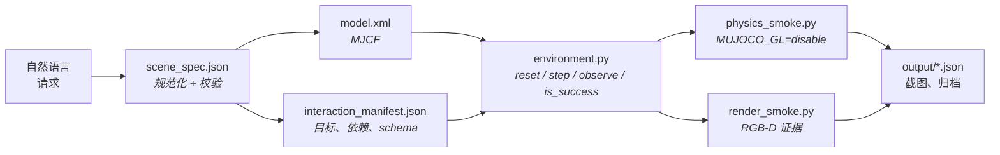
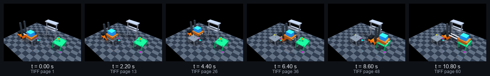

<h1 align="center">Text2MuJoCo</h1>

<p align="center">
  <strong>把一句自然语言请求变成可运行、可验证的 MuJoCo 环境。</strong><br>
  校验过的 MJCF &middot; 可执行的交互点 &middot; 真实的 RGB-D 证据
</p>

<p align="center">
  
  
  
  
  
  
  <a href="LICENSE"></a>
</p>

<p align="center">
  <a href="#展示">展示</a> &middot;
  <a href="#工作原理">工作原理</a> &middot;
  <a href="#校验层">校验</a> &middot;
  <a href="#用法">用法</a> &middot;
  <a href="text2mujoco_codex/README.md">Codex 技能</a> &middot;
  <a href="text2mujoco_claude/README.md">Claude Code 技能</a> &middot;
  <a href="README.md">English</a>
</p>

<p align="center">
  
</p>

<p align="center">
  <sub>八个展示场景各自最后一帧已验证画面，由 <a href="showcase/build_readme_figures.py">build_readme_figures.py</a> 从已提交的截图拼合而成。</sub>
</p>

---

Text2MuJoCo 是一个跑在现有编码 Agent 里的 **Agent 技能包**。它与 Codex 或 Claude Code 配合，把一段场景或任务描述转成可加载的 MuJoCo 3 包：解析物体、物理、传感器、动作顺序、成功条件和可见的交互点，然后用机器可读的报告来支撑结果。[示例请求](showcase/sample_queries.json) 展示了预期的输入格式。

## 你会得到什么

- **规范化后的请求** —— `scene_spec.json` 把原始提示词保留为 `source_prompt`，显式记录所有假设，并在写出任何 XML 之前先通过 schema 校验。
- **在物理上坐实的几何** —— 完整公制尺寸会被换算成 MJCF 半尺寸，`orientation_xyzw` 会被换算成 `quat="w x y z"`，静止物体按半尺寸算术摆放，因此 `t=0` 时没有任何穿模。
- **真会碰撞、也会和自己碰撞的刚体** —— 每个运动刚体都带真实碰撞体，每个碰撞类都带 `conaffinity="7"`，机械臂因此对自己的连杆也有边界。纯视觉几何（`contype="0" conaffinity="0"`）和被收窄的掩码（`contype="2" conaffinity="5"`）都会照常渲染、照常带质量，却穿过一切，所以技能同时禁止这两种写法，任何一处出现都会被审计判失败。**本来就应该嵌套**的配对写在 `<contact><exclude>` 里，读者可以逐条核对。
- **不会从手臂上掉下来的手** —— 每个移动轴都画成套筒加活塞，受关节驱动的刚体上每个 geom 都写明 `mass`，每个位置伺服都把 `qpos0` 保持在 2 mm 以内，于是工具立柱不会在前臂下方裂开一道可见的缝，也不会垂到模型声称的位置之外。
- **能失败的抓取** —— 负载由一个运行时开合的 `<equality><weld>` 携带。在空中松开它就会掉下去，这正是"手里的零件"与"台面上的零件"之所以可区分的原因。
- **穿不过去的标记** —— 任务标记是贴在所标注表面上的薄圆盘，下方一定有真实几何。因为 `<site>` 从不产生接触，一个悬在空中的自发光小球本来就是所有物体都会明显穿过去的东西。
- **可执行的交互点** —— 每个 affordance 都是一个真实 handler，带有类型化的 payload schema 和声明式依赖，并镜像进作为唯一真源的 `interaction_manifest.json`。乱序或格式错误的动作会被拒绝。
- **一并提交的证据** —— 每个包都自带 `physics_smoke.py` 与 `render_smoke.py`，每个展示场景都提交了由此产生的 JSON 报告、RGB-D 截图和帧归档。
- **两个适配器，一种行为** —— [`text2mujoco_codex`](text2mujoco_codex) 与 [`text2mujoco_claude`](text2mujoco_claude) 携带完全相同的校验脚本和参考文档；CI 在每次 push 时对脚本做 diff，两者不可能漂移。

## 工作原理



场景规范是唯一的输入真源，但 handler 是代码：当一个位姿、条件、目标或成功谓词发生变化时，对应的运行时 handler 会被同步修改，受影响的校验层会重跑。条件字符串绝不会被假定自动生效。

## 校验层

从一段请求到一个可以放心用的包，中间有十五项检查。每一项都是一个脚本：`physics_smoke.py` 与 `render_smoke.py` 随每个生成出来的包一起发布，其余的放在 [showcase/](showcase) 里。十五项中有八项属于 [`model_audit.py`](showcase/model_audit.py)：它编译场景、让每个伺服保持不动、重放既定序列，并把每项测量结果报成数字，因此一个在镜头里看着没问题的缺陷照样会落到 JSON 里。

| 检查 | 由谁运行 | 拒绝什么 |
| --- | --- | --- |
| 清单一致性 | `validate_manifests.py` | 规范与清单漂移：交互 ID、依赖顺序、位姿或标记站点不一致 |
| 静态模型 | `physics_smoke.py` | 编译不通过的 MJCF、四元数或半尺寸换算错误 |
| 碰撞几何 | `model_audit.py` | 不属于任何有效碰撞配对的运动 geom —— 会照常渲染、却穿过一切的连杆、货叉或按钮 |
| 未声明的自穿模 | `model_audit.py` | 只因为 `contype`/`conaffinity` 掩码把配对从求解器里过滤掉，才得以互相穿透的 geom |
| 声明质量 | `model_audit.py` | 受关节驱动刚体上既无 `mass` 也无 `density` 的 geom，会被默默按密度 1000 编译 |
| 伺服保持 | `model_audit.py` | 停在受令位姿下方超过 `2 mm` 或 `1°` 的位置伺服 —— 那个 `weight / kp` 的下垂量，在渲染中肉眼可见 |
| 连杆连续性 | `model_audit.py` | 整段重放中任意时刻，受关节驱动的刚体与其最近**已绘制**祖先之间宽于 `5 mm` 的缝隙 |
| 标记贴地 | `model_audit.py` | 高出所标注表面超过 `3 mm`、或埋进另一个 geom 超过 `1 mm` 的标记站点 |
| 初始位姿 | `physics_smoke.py`、`model_audit.py` | 在编译得到的 `qpos0` 或 `reset()` 之后重叠超过 `0.1 mm` 的 geom |
| 序列接触 | `physics_smoke.py`、`model_audit.py`、`sequence_contact_test.py` | 既定序列首尾及其间任意一步深于 `1 mm` 的穿模 |
| 抓取诚实性 | `physics_smoke.py` | 在空中解除焊接约束后仍原地悬着的负载 —— 靠写 `qpos` 搬运留下的痕迹 |
| 物理 | `physics_smoke.py` | 非有限状态、失效的执行器、未满足的任务谓词、每次结果都不同的 reset |
| 渲染 | `render_smoke.py` | 空白 RGB、非有限深度、一个像素都看不见的标记、交互前后画面无变化 |
| 归档 | `dense_archive_test.py` | GIF/TIFF 的帧数或时序与密集报告不一致 |
| 路径 | `artifact_path_test.py` | 逃出包根目录的产物、符号链接穿越 |

表里贯穿着两个穿模阈值，因为接触求解器本身是近似的：静态位姿用 **0.1 mm**，此时任何可测量的重叠都是建模错误；整段序列用 **1.0 mm**，此时受载下的亚毫米穿透属于求解器有文档记载的柔度。某个场景越界时，要动的是模型或控制器，阈值保持原样。叉车的 `fork_lift` 伺服是最清楚的例子：一个刚性位置执行器收到 `0.18 m` 的阶跃指令，把货叉加速到约 `1.7 m/s`，撞进托盘底板 `4.49 mm`，因此该指令现在按大约 `0.25 m/s` 匀速给出。

下面五节挑出真正决定模型怎么建的五项检查 —— 初始位姿、碰撞掩码、关节行程、标记和抓取 —— 并给出每一项要求的 MJCF 写法。

### 一开始就已经穿模的初始位姿

初始位姿本身就已穿模，是最能躲过其他所有检查的失效模式：求解器会在预热阶段把重叠推开，之后物理、渲染和任务断言全都通过。这项测量在第一次 `mj_forward` 之后、任何 `mj_step` 之前执行，对编译得到的 `qpos0` 检查一次，对 `reset()` 之后的状态**再检查一次** —— 从常量赋值位置的 reset 可能重新引入 MJCF 里本来没有的穿模。

```python
for label, data in (("model_qpos0", mujoco.MjData(env.model)), ("post_reset", env.data)):
    mujoco.mj_forward(env.model, data)
    for index in range(data.ncon):
        if data.contact[index].dist < -1e-4:
            raise AssertionError(f"{label}: geoms interpenetrate before the first step")
```

八个展示场景全部报告 `initial_contact: "PASS"`。这条要求属于技能的输出契约，因此生成出来的包也自带它 —— 见 [validation_checklist.md](text2mujoco_codex/references/validation_checklist.md) 以及 [mujoco_patterns.md](text2mujoco_codex/references/mujoco_patterns.md) 里的静止位姿规则。

### 机器人需要一条针对自己的碰撞边界

一对 geom 会碰撞的条件是 `(contype1 & conaffinity2) || (contype2 & conaffinity1)`，所以一个写成 `contype="2" conaffinity="5"` 的 `robot_part` 类算出 `2 & 5 == 0`，任意两个机器人 geom 从来不会被测试。这看起来像一项优化 —— 短运动链不需要自碰撞 —— 换来的是一条对自己没有任何边界的手臂：它可以折叠着穿过自己的前臂，而且**没有任何审计能看见**，因为被过滤掉的配对根本不产生可上报的接触。现在每个类都带 `conaffinity="7"`：

```xml
<default>
  <geom friction="0.72 0.01 0.002" condim="6" solref="0.008 1" solimp="0.90 0.95 0.001"/>
  <default class="world_part">   <geom contype="1" conaffinity="7"/></default>
  <default class="robot_part">   <geom contype="2" conaffinity="7"/></default>
  <default class="payload_part"> <geom contype="4" conaffinity="7"/></default>
</default>
```

刚体用 `childclass="robot_part"` 选类，单个 geom 用 `class="world_part"` 选类；共享的 friction、`condim` 和 `solref` 依然生效，因为这些类嵌在既有 default 内部。

`robot↔robot` 一旦生效，看不见的自穿模就变成真实接触，于是在关节处嵌套的连杆立刻互相顶起来。那些配对 —— 画在自己转动的连杆内部的铰链毂、套筒里的活塞 —— 被逐条列名，于是一处有意的重叠成了读者可以核对的设计决策：

```xml
<contact>
  <exclude name="elbow_wrist_nest" body1="arm_link2" body2="arm_link3"/>
  <exclude name="lift_sleeve_nest" body1="arm_link3" body2="arm_lift"/>
</contact>
```

审计用 `mujoco.mj_geomDistance` 测量，它无论配对是否被过滤都返回带符号距离，并且只在两个刚体是焊接邻居、或出现在 `model.exclude_signature` 里时才接受重叠。其他一律判失败。这样直接穿过掩码去量，暴露出一处此前正被掩码藏起来的真实缺陷：场景 07 里闭合的夹爪切进了它上方的前臂胶囊体，修法是收紧升降轴的上端限位。

```python
RUN_LIMIT = -1e-3                        # contact.dist 是带符号间隙，1 mm 穿模就是 -1e-3

def watched(model, data, *args, **kwargs):
    genuine(model, data, *args, **kwargs)          # 真正的 mujoco.mj_step
    dist, pair = deepest_contact(model, data)      # 该状态下最负的间隙
    if dist < worst["dist"]:
        worst.update(dist=dist, pair=pair, time_s=float(data.time))

mujoco.mj_step = watched                 # 沉降循环绕过 env.step，直接调模块函数
```

挂钩挂在模块级 `mj_step` 上，因为沉降循环和生成出来的控制器都直接调模块函数；包裹 `env.step` 会漏掉大部分仿真。

### 手留在手臂上

有三种彼此独立的缺陷渲染出来一模一样 —— 手从手臂上掉下来了 —— 而且三者的运动链全程都是完整的。最响的一种是没有被画出来的移动轴：一个滑动关节，它的移动刚体带几何，但它的**行程**不带几何，于是在父连杆下方裂开一道随关节量增大的缝。在完全伸出时，场景 07 的工具悬在前臂下方 165 mm，中间什么都没有，而且任何接触、位姿或任务断言都看不见它。现在这条轴是一个自己的刚体，带两个始终重叠的 geom：

```xml
<geom name="lift_sleeve" class="robot_part" type="cylinder" pos="0.16 0 0.012" size="0.048 0.052" mass="0.22"/>
<body name="arm_lift" pos="0.16 0 -0.075" gravcomp="1">
  <joint name="tool_z" type="slide" axis="0 0 1" range="-0.17 0.045" damping="3.0" armature="0.008"/>
  <geom name="lift_ram" class="robot_part" type="cylinder" pos="0 0 0.125" size="0.026 0.125" mass="0.20"/>
```

另外两种更安静。既无 `mass` 也无 `density` 的 geom 会按密度 1000 编译，于是一个 58 mm 的装饰性铰链毂重达 1.1 kg，可以比它所装饰的手臂还重。而一个托着载荷的位置伺服会停在目标下方 `weight / kp` 处 —— 0.08 kg 的指尖在 `kp="420"` 下正好下垂 1.87 mm，这正是 `gravcomp="1"` 必须加在这条轴所承载的**每一个**刚体上、末端也不能漏的原因。连杆连续性这项检查一次覆盖这三种：整段重放过程中，从每个受关节驱动的刚体到其最近的已绘制祖先之间的最大缝隙。

### 标记是贴在真实几何上的贴花

那些悬在工作台上方的彩色小球是 `<site>` 元素。site 从不产生接触 —— 这是设计如此，改不了 —— 所以每个负载、每根机器人连杆都会明显地直接穿过去。每个面向观看者的标记都是一个薄圆柱，贴在它所标注的表面上，半高等于它离该表面的高度，于是底面正好齐平：

```xml
<site name="insertion_marker" type="cylinder" pos="0.17 0.21 0.906" size="0.050 0.006" material="marker_magenta" group="2"/>
```

审计向下投射射线以确认下方有真实几何，因此贴在机器人根本到不了的空地上的贴花会失败；它也拒绝中心被埋进另一个 geom 的情况，因此贴花必须避开它所标注负载的落地范围。代码当作运动学参考读取的 site —— 工具中心、叉尖 —— 放在 `group="4"`，根本不绘制。没有任何东西引用的 site 已被删除。八个场景中这样重新归类了 51 个 site：其中 31 个是悬空或被埋的，若干个只是相机位置的副本，场景 03 里还有三个是沉进地板 15 mm 的小球。

### 抓取是一个相等约束

靠每步改写自由关节 `qpos` 搬运的负载永远不会滑脱，松手是传送到一个硬编码常量，而且 —— 这正是被反馈的那个缺陷 —— 躺在台面上的零件与手里的零件在状态上**无法区分**，于是掉落的零件一直被当成正在被操作的对象。搬运是一个相等约束，声明时不激活，运行时开合：

```xml
<equality>
  <weld name="peg_grasp" body1="arm_tool" body2="red_peg" relpose="0 0 -0.125 1 0 0 0"
        active="false" solref="0.01 1" solimp="0.96 0.99 0.001"/>
</equality>
```

一个 weld 的 `eq_data` 行是 `[anchor(3), relpose_pos(3), relpose_quat(4), torquescale(1)]`。写进去的偏移是在夹爪闭合的那一瞬测得的，因此约束生效时就已经被满足 —— 没有抖动，没有"啪"地对位 —— 而且夹爪是闭合**到**负载上、压进其半径 1.5 mm，中间没有留下任何让约束无形跨过的空隙。松手会取消激活这个 weld，让重力和接触把零件安置下来。证明这一点的回归测试是一次空中释放：在负载还悬空时解除约束，并要求它掉下去。焊接携带的负载会掉；`qpos` 驱动的负载会挂在那里。场景 07 的定位销掉落 `71.2 mm`，场景 08 的包裹掉落 `153.6 mm`，场景 05 的零件掉落 `239.1 mm`，场景 01 的方块掉落 `225 mm`。场景 06 做的是同一个测试在叉车上唯一说得通的形式：托盘在焊接状态下只滑移 `0.303 mm`，一旦释放就滑移 `73.3 mm`，下限是 `20 mm`。

放下零件还需要给手一个可去之处。只有一条竖直自由度的手臂只能沿着自己下来的那条路径退回去，这会把工具从它刚放好的零件里拖过去 —— 因此手多了一个带独立位置伺服的腕部俯仰铰链，接近时前倾、撤离时后仰。没有任何交互会指令的额外关节只是装饰，所以脚本序列会真的使用它。

| # | 场景 | 没有碰撞体的运动刚体 | `qpos0` | `reset()` 之后 | 序列 | 最深穿模 |
| --- | --- | --- | --- | --- | --- | --- |
| 01 | 按钮、方块与开口盒 | 0 | `0.0000 mm` | `0.0000 mm` | 2,660 步 / `2.660 s` | `0.4332 mm` |
| 02 | 智能工具柜 | 0 | `0.0000 mm` | `0.0000 mm` | 358 步 / `0.716 s` | `0.0000 mm` |
| 03 | 仓库导航 | 0 | `0.0000 mm` | `0.0000 mm` | 3,375 步 / `13.500 s` | `0.0000 mm` |
| 04 | 拉杆与斜坡小球 | 0 | `0.0000 mm` | `0.0000 mm` | 1,519 步 / `1.519 s` | `0.3121 mm` |
| 05 | 机械臂分拣单元 | 0 | `0.0000 mm` | `0.0000 mm` | 5,661 步 / `11.322 s` | `0.6833 mm` |
| 06 | 叉车托盘配送 | 0 | `0.0000 mm` | `0.0000 mm` | 5,386 步 / `10.772 s` | `0.4821 mm` |
| 07 | 机器人定位销装配 | 0 | `0.0000 mm` | `0.0000 mm` | 3,400 步 / `6.800 s` | `0.5034 mm` |
| 08 | 输送带到机械臂的交接 | 0 | `0.0000 mm` | `0.0000 mm` | 5,078 步 / `10.156 s` | `0.7728 mm` |

**8/8 场景通过**，累计审计 `27,437` 步，全场最深穿模 `0.7728 mm`，阈值 `1.0 mm`。完整记录见 [sequence_contact_report.json](showcase/output/sequence_contact_report.json)，八项检查的结果见 [model_audit_report.json](showcase/output/model_audit_report.json)；每个场景自己的 `physics_smoke.py` 也带同一套审计，因此生成出来的包是自检的。

## 展示

由该技能生成的八个包，各自连同报告与截图一并提交。下表每一行都是从该场景 `output/` 目录里的 JSON 读出来的。

| # | 场景 | 交互点 | 密集页数 | 仿真时长 | 关键已验证结果 |
| --- | --- | --- | --- | --- | --- |
| 01 | [按钮、方块与开口盒](#01--按钮方块与开口盒) | 4 | 18 | 2.660 s | 方块坐进开口盒，图像位移 `130.36 px` |
| 02 | [智能工具柜](#02--智能工具柜) | 3 | 7 | 0.716 s | 抽屉行程 `0.218023 m`，目标 `0.22 m` |
| 03 | [仓库导航](#03--仓库导航) | 3 | 71 | 13.500 s | 与货架接触 `0` 次，最小间隙 `0.270 m` |
| 04 | [拉杆与斜坡小球](#04--拉杆与斜坡小球) | 4 | 12 | 1.519 s | 闸门抬起 `0.11650 m`，小球停在目标托盘里 |
| 05 | [机械臂分拣单元](#05--机械臂分拣单元) | 5 | 62 | 11.322 s | 零件被搬运 `0.546 m` 进入蓝色料箱 |
| 06 | [叉车托盘配送](#06--叉车托盘配送) | 6 | 60 | 10.772 s | 行驶 `2.236 m`，托盘放上配送台 |
| 07 | [机器人定位销装配](#07--机器人定位销装配) | 6 | 41 | 6.800 s | 工具行程 `0.362 m`，定位销释放时距孔位 `0.0050 m` |
| 08 | [输送带到机械臂的交接](#08--输送带到机械臂的交接) | 6 | 57 | 10.156 s | 工具峰值位移 `1.243 m`，包裹落定在绿色料箱里 |

### 怎么读这些密集截图

每个场景都附带一段**按 MuJoCo 仿真时间每 `0.20 s` 采样**的密集序列，时间读自 `data.time`，因此这个节奏与墙钟快慢、与渲染频率都无关。采样器保留每个 `0.20 s` 边界处（或之后）的第一个步后状态，并在每个动作边界额外加一帧事件帧，因此节奏保持精确，同时不漏掉任何重要瞬间。

<p align="center">
  
</p>

<p align="center">
  <sub>取自 <a href="showcase/06-forklift-pallet/output/screenshots/dense_sequence.tif">场景 06 密集 TIFF</a> 的六页，标注的是 <a href="showcase/06-forklift-pallet/output/dense_sequence_results.json">密集报告</a> 中为每一页记录的仿真时间。</sub>
</p>

同一套采样为每个场景产出两份归档：`dense_sequence.tif`，即作为 `0.20 s` 间隔权威记录的全分辨率多页 TIFF；以及 `dense_sequence.gif`，一个可在浏览器里查看的动画，每帧 `200 ms`（末帧 `800 ms`），因此播放速度大致等于仿真速度。GitHub 无法预览 TIFF，所以下面每一节都嵌入 GIF 并在旁边链接 TIFF；`dense_archive_test.py` 会断言页数、帧数与时序三者都与报告一致。

### 01 / 按钮、方块与开口盒

> Place a button, a red cube, and an open box on a table. Press the button, grasp the cube, place it in the box, and inspect the result with an RGB-D camera.

`press_start_button` → `grasp_red_cube` → `place_cube_in_box` → `inspect_rgbd`

<p align="center">
  <a href="showcase/01-button-cube-box/output/screenshots/dense_sequence.tif">
    
  </a>
</p>

**已验证 —— PASS。** 方块落进五面开口盒内部，与盒底接触，最终静止在 `4.9e-14 m/s`，并在相机图像中移动 `130.36 px`。在空中释放时方块掉落 `225 mm`，这正是焊接携带的负载在重力下该有的表现。

**密集截图** —— 跨 `2.660 s` 共 18 页：14 帧严格间隔 `0.20 s` 的常规帧，加 4 帧动作边界事件帧。

[环境](showcase/01-button-cube-box) &middot; [测试报告](showcase/01-button-cube-box/TEST_REPORT.md) &middot; [物理](showcase/01-button-cube-box/output/physics_results.json) &middot; [渲染](showcase/01-button-cube-box/output/render_results.json) &middot; [密集报告](showcase/01-button-cube-box/output/dense_sequence_results.json) &middot; [密集 TIFF](showcase/01-button-cube-box/output/screenshots/dense_sequence.tif)

<details>
<summary>场景与校验细节</summary>

- **场景** —— 桌面、带执行器的按钮、自由刚体方块、五个 geom 的开口盒、固定 RGB-D 相机；20 个命名对象，`0.002 s` 时间步长，方块 `0.2 kg`。
- **校验** —— 规范、MJCF 编译、`t=0` 接触、类型化目标、11 项非法动作拒绝、依赖顺序、抓取保持、确定性 reset、`.mjb` 重载、RGB-D、任务成功。
- **接触审计** —— 每个运动刚体都会碰撞；2,660 步审计中最深穿模 `0.4332 mm`。
- **契约** —— [interaction_manifest.json](showcase/01-button-cube-box/interaction_manifest.json)
- **关键帧归档** —— [报告](showcase/01-button-cube-box/output/sequence_results.json) &middot; [GIF](showcase/01-button-cube-box/output/screenshots/sequence.gif) &middot; [TIFF](showcase/01-button-cube-box/output/screenshots/sequence.tif)

</details>

---

### 02 / 智能工具柜

> Generate a desktop tool cabinet. Press the green unlock button, pull the drawer open by 22 cm, and verify the open state with a fixed camera. Keep the unlock point, handle, and camera checkpoint visible.

`press_unlock_button` → `pull_drawer_22cm` → `inspect_open_drawer`

<p align="center">
  <a href="showcase/02-smart-drawer/output/screenshots/dense_sequence.tif">
    
  </a>
</p>

**已验证 —— PASS。** 滑动关节达到 `0.218023 m`，目标为 `0.22 m`；三个交互标记全程可见；深度在 `13,638` 个像素上发生变化。

**密集截图** —— 跨 `0.716 s` 共 7 页：4 帧严格间隔 `0.20 s` 的常规帧，加 3 帧动作边界事件帧。

[环境](showcase/02-smart-drawer) &middot; [物理](showcase/02-smart-drawer/output/physics_results.json) &middot; [渲染](showcase/02-smart-drawer/output/render_results.json) &middot; [密集报告](showcase/02-smart-drawer/output/dense_sequence_results.json) &middot; [密集 TIFF](showcase/02-smart-drawer/output/screenshots/dense_sequence.tif)

<details>
<summary>场景与校验细节</summary>

- **场景** —— 桌面工具柜、解锁按钮、滑动关节抽屉、三个标记站点（`unlock_point_marker`、`drawer_handle_marker`、`camera_check_marker`）、固定 RGB-D 相机。
- **校验** —— 两个执行器、`t=0` 接触、标记可见性、5 项非法动作拒绝、确定性 reset、MJCF 与 `.mjb` 重载、抽屉行程、RGB-D、任务成功。
- **接触审计** —— 每个运动刚体都会碰撞；358 步审计中没有可测量的穿模。
- **契约** —— [interaction_manifest.json](showcase/02-smart-drawer/interaction_manifest.json)
- **关键帧归档** —— [报告](showcase/02-smart-drawer/output/sequence_results.json) &middot; [GIF](showcase/02-smart-drawer/output/screenshots/sequence.gif) &middot; [TIFF](showcase/02-smart-drawer/output/screenshots/sequence.tif)

</details>

---

### 03 / 仓库导航

> Generate a small warehouse where an orange robot reaches checkpoint A, navigates around the shelves to checkpoint B, and confirms completion with a top-view camera.

`reach_checkpoint_a` → `reach_checkpoint_b` → `inspect_top_camera`

<p align="center">
  <a href="showcase/03-warehouse-navigation/output/screenshots/dense_sequence.tif">
    
  </a>
</p>

**已验证 —— PASS。** 机器人走南侧绕行路线，与货架接触 `0` 次，在 330 个路径采样点上与 `central_shelf_geom` 保持 `0.270 m` 的最小间隙，在图像中移动 `282.60 px`，并在 reset 之后以 `0.0 px` 误差回到起始质心。

**密集截图** —— 跨 `13.500 s` 共 71 页：68 帧严格间隔 `0.20 s` 的常规帧，加 3 帧动作边界事件帧。

[环境](showcase/03-warehouse-navigation) &middot; [物理](showcase/03-warehouse-navigation/output/physics_results.json) &middot; [渲染](showcase/03-warehouse-navigation/output/render_results.json) &middot; [密集报告](showcase/03-warehouse-navigation/output/dense_sequence_results.json) &middot; [密集 TIFF](showcase/03-warehouse-navigation/output/screenshots/dense_sequence.tif)

<details>
<summary>场景与校验细节</summary>

- **场景** —— 仓库地面、可碰撞货架、平面移动机器人、两个检查点、倾斜俯视 RGB-D 相机；四个必经航点决定了绕行路线。
- **校验** —— 路径依赖、逐段间隙采样、零货架接触、`t=0` 接触、标记可见性、7 项非法动作拒绝、确定性 reset、reset 后渲染、任务成功。
- **接触审计** —— 机器人的转塔和朝向指示块属于它可碰撞的外壳，因此真的碰得到货架；3,375 步审计中没有可测量的穿模。间隙是它走的那条路径挣出来的。
- **契约** —— [interaction_manifest.json](showcase/03-warehouse-navigation/interaction_manifest.json)
- **关键帧归档** —— [报告](showcase/03-warehouse-navigation/output/sequence_results.json) &middot; [GIF](showcase/03-warehouse-navigation/output/screenshots/sequence.gif) &middot; [TIFF](showcase/03-warehouse-navigation/output/screenshots/sequence.tif)

</details>

---

### 04 / 拉杆与斜坡小球

> Generate a workbench where a blue lever opens a gate, releases a purple ball down a ramp into a target tray, and verifies the result with a camera.

`pull_blue_lever` → `check_release_zone` → `confirm_target_tray` → `inspect_with_camera`

<p align="center">
  <a href="showcase/04-lever-ball-ramp/output/screenshots/dense_sequence.tif">
    
  </a>
</p>

**已验证 —— PASS。** 拉杆执行器把闸门抬起 `0.11650 m`；小球仅靠重力滚下斜坡，到达目标托盘 `[0.5529, 0.0000, 0.8100]`，残余速度 `7.0e-10 m/s`，阈值为 `0.15 m/s`，并与托盘保持接触。四个标记色系全程可见，`7,616` 个 RGB 像素发生变化。

**密集截图** —— 跨 `1.519 s` 共 12 页：8 帧严格间隔 `0.20 s` 的常规帧，加 4 帧动作边界事件帧。

[环境](showcase/04-lever-ball-ramp) &middot; [物理](showcase/04-lever-ball-ramp/output/physics_results.json) &middot; [渲染](showcase/04-lever-ball-ramp/output/render_results.json) &middot; [密集报告](showcase/04-lever-ball-ramp/output/dense_sequence_results.json) &middot; [密集 TIFF](showcase/04-lever-ball-ramp/output/screenshots/dense_sequence.tif)

<details>
<summary>场景与校验细节</summary>

- **场景** —— 工作台、带执行器的拉杆与闸门、带护边的斜坡、自由小球、开口目标托盘、固定 RGB-D 相机。
- **校验** —— 类型化目标、四个标记站点、`t=0` 接触、3 项非法动作拒绝、`xyzw`→`wxyz` 换算、物理释放与沉降、托盘接触、确定性 reset、RGB-D、任务成功。
- **接触审计** —— 每个运动刚体都会碰撞；1,519 步审计中最深穿模 `0.3121 mm`，全部来自小球压在斜坡和托盘上。
- **契约** —— [interaction_manifest.json](showcase/04-lever-ball-ramp/interaction_manifest.json)
- **关键帧归档** —— [报告](showcase/04-lever-ball-ramp/output/sequence_results.json) &middot; [GIF](showcase/04-lever-ball-ramp/output/screenshots/sequence.gif) &middot; [TIFF](showcase/04-lever-ball-ramp/output/screenshots/sequence.tif)

</details>

---

### 05 / 机械臂分拣单元

> Create a tabletop robotic sorting cell. A three-joint arm approaches a blue part on a conveyor, closes its parallel gripper, transfers the part to a blue bin beside a red distractor bin, releases it, and verifies the result with a fixed RGB-D camera.

`approach_blue_part` → `grasp_blue_part` → `transfer_to_blue_bin` → `release_blue_part` → `inspect_sorting_result`

<p align="center">
  <a href="showcase/05-robot-arm-sorting/output/screenshots/dense_sequence.tif">
    
  </a>
</p>

**已验证 —— PASS。** MuJoCo 3.2.7 物理确认了六个关节、六个臂与夹爪执行器、焊接约束抓取、依赖强制，以及在蓝色料箱内部释放。在空中释放时零件掉落 `239.118 mm`。渲染测得蓝色零件运动 `0.546 m`、RGB-D 有限，六个标记色系全部可见。

**密集截图** —— 跨 `11.322 s` 共 62 页：57 帧严格间隔 `0.20 s` 的常规帧，加 5 帧动作边界事件帧。

[环境](showcase/05-robot-arm-sorting) &middot; [物理](showcase/05-robot-arm-sorting/output/physics_results.json) &middot; [渲染](showcase/05-robot-arm-sorting/output/render_results.json) &middot; [密集报告](showcase/05-robot-arm-sorting/output/dense_sequence_results.json) &middot; [密集 TIFF](showcase/05-robot-arm-sorting/output/screenshots/dense_sequence.tif)

<details>
<summary>场景与校验细节</summary>

- **场景** —— 工作台、输送带、三连杆机械臂、双指夹爪、蓝色与红色零件及料箱、五个可见交互标记、固定 RGB-D 相机。
- **同步** —— 蓝色零件由 `tool_turret` 与零件之间的 `blue_part_grasp` 焊接携带，夹爪闭合时打开、张开时关闭；没有任何代码写零件的 `qpos`。
- **坐实** —— 蓝色零件停在输送带带面 `z = 0.855 m` 上，避开两个滚筒；红色零件放在工作台 `[0.43, 0.45, 0.75]` 处。模型、规范、清单以及 reset 常量四者一致。
- **接触审计** —— 三根臂连杆、两个手指和夹爪座都带碰撞体；5,661 步审计中最深穿模 `0.6833 mm`。
- **契约** —— [interaction_manifest.json](showcase/05-robot-arm-sorting/interaction_manifest.json)
- **关键帧归档** —— [报告](showcase/05-robot-arm-sorting/output/sequence_results.json) &middot; [故事板](showcase/05-robot-arm-sorting/output/screenshots/sequence.png) &middot; [TIFF](showcase/05-robot-arm-sorting/output/screenshots/sequence.tif)

</details>

---

### 06 / 叉车托盘配送

> Create a warehouse forklift task. An orange mobile forklift drives to a loaded pallet, raises its powered forks, engages the pallet, carries it around a storage rack to a green delivery zone, lowers the forks to release the load, and verifies delivery with an RGB-D camera.

`drive_to_pallet` → `raise_forks` → `engage_pallet` → `carry_to_drop_zone` → `lower_forks_release` → `inspect_forklift_delivery`

<p align="center">
  <a href="showcase/06-forklift-pallet/output/screenshots/dense_sequence.tif">
    
  </a>
</p>

**已验证 —— PASS。** 物理确认了三个底盘移动关节、带动力的货叉升降、与货架接触 `0` 次、焊接搬运时托盘只滑移 `0.303 mm`、在配送台上释放沉降，以及确定性 reset。渲染测得叉车行驶 `2.236 m`、RGB-D 有限，五个标记色系全部可见。

**密集截图** —— 跨 `10.772 s` 共 60 页：54 帧严格间隔 `0.20 s` 的常规帧，加 6 帧动作边界事件帧。上面[胶片图](#怎么读这些密集截图)展示的就是这个场景。

[环境](showcase/06-forklift-pallet) &middot; [物理](showcase/06-forklift-pallet/output/physics_results.json) &middot; [渲染](showcase/06-forklift-pallet/output/render_results.json) &middot; [密集报告](showcase/06-forklift-pallet/output/dense_sequence_results.json) &middot; [密集 TIFF](showcase/06-forklift-pallet/output/screenshots/dense_sequence.tif)

<details>
<summary>场景与校验细节</summary>

- **场景** —— 带腿的装载台与配送台、轮子真正着地的移动叉车、双轨门架加升降滑架、三根纵梁的托盘与货箱、作为障碍的储物货架、六个标记、固定的三分之四俯视 RGB-D 相机。
- **同步** —— 托盘由 `fork_carriage` 与托盘之间的 `pallet_grasp` 焊接携带，偏移取自货叉插入到位时的实测值。叉车能做的诚实性测试是滑移：焊接时托盘保持在 `0.303 mm` 以内，释放后滑移 `73.287 mm`，下限是 `20 mm`。
- **叉道** —— 零升降时叉齿扫过 `0.715..0.785 m`，进入装载台面 `0.66 m` 与托盘底板下沿 `0.81 m` 之间真实存在的 `150 mm` 通道。纵梁是**沿着**叉齿方向布置的；如果横过来，叉齿会正面撞上近侧纵梁，而升降之所以还能"成功"只是因为托盘被钉住了。
- **顺序** —— `lower_forks_release` 先把托盘放到配送台上，**然后**才降下空货叉，并在 `0.045 m` 升降高度处退出 —— 位于通道中部，下方距台面、上方距托盘底板各有 `40 mm` 余量。配送目标是一个带定位块的平台，因为叉车必须在板面高度把叉齿倒着抽出来，而接近侧一道 `0.24 m` 的围墙是既定序列无法越过的几何。
- **接触审计** —— 5,386 步审计中最深穿模 `0.4821 mm`。走到这一步靠的是两处真实修复：`fork_carriage_geom` 没写 `mass` 属性，于是按 MuJoCo 默认密度重达 `28.7 kg`，任何 `kp=300` 的伺服都托不住 —— 插销一松，叉齿立刻掉到关节限位。改成显式质量并用 `kp=6000 kv=300` 之后，一个阶跃指令又把叉齿砸进托盘底板 `4.49 mm`，因此 `_set_lift` 现在按大约 `0.25 m/s` 匀速给出。
- **契约** —— [interaction_manifest.json](showcase/06-forklift-pallet/interaction_manifest.json)
- **关键帧归档** —— [报告](showcase/06-forklift-pallet/output/sequence_results.json) &middot; [故事板](showcase/06-forklift-pallet/output/screenshots/sequence.png) &middot; [TIFF](showcase/06-forklift-pallet/output/screenshots/sequence.tif)

</details>

---

### 07 / 机器人定位销装配

> Build a robot assembly station. An orange arm moves to a red locating peg, closes its gripper to pick it up, transports it to a blue fixture, inserts it vertically, releases it, and verifies the assembly with a fixed RGB-D camera.

`move_arm_to_peg` → `grasp_peg_with_arm` → `move_arm_to_socket` → `insert_peg_into_socket` → `release_assembled_peg` → `inspect_assembly`

<p align="center">
  <a href="showcase/07-robot-assembly/output/screenshots/dense_sequence.tif">
    
  </a>
</p>

**已验证 —— PASS。** 物理确认了四个臂铰链、六个显式执行器、六个可见标记、焊接搬运、状态有限，以及定位销释放时距孔位轴线 `0.0050 m`。在空中释放时定位销掉落 `71.159 mm`。渲染测得工具运动 `0.362 m`，RGB-D 有限。

**密集截图** —— 跨 `6.800 s` 共 41 页：35 帧严格间隔 `0.20 s` 的常规帧，加 6 帧动作边界事件帧。

[环境](showcase/07-robot-assembly) &middot; [物理](showcase/07-robot-assembly/output/physics_results.json) &middot; [渲染](showcase/07-robot-assembly/output/render_results.json) &middot; [密集报告](showcase/07-robot-assembly/output/dense_sequence_results.json) &middot; [密集 TIFF](showcase/07-robot-assembly/output/screenshots/dense_sequence.tif)

<details>
<summary>场景与校验细节</summary>

- **场景** —— 工作台、三连杆机械臂、被画出来的竖直工具升降轴（套筒加活塞）、腕部俯仰铰链、夹爪、自由的红色定位销、蓝色插装夹具、六个可见标记、固定 RGB-D 相机。
- **同步** —— 定位销由 `peg_grasp` 焊接携带，在夹爪闭合时接合，释放本身是一个独立的、受依赖检查的动作；插装与释放是两个分开的步骤。
- **接触审计** —— 臂连杆、工具升降轴和两个夹爪手指都会碰撞；3,400 步审计中最深穿模 `0.5034 mm`，其中包含插装过程。
- **契约** —— [interaction_manifest.json](showcase/07-robot-assembly/interaction_manifest.json)
- **关键帧归档** —— [报告](showcase/07-robot-assembly/output/sequence_results.json) &middot; [故事板](showcase/07-robot-assembly/output/screenshots/sequence.png) &middot; [TIFF](showcase/07-robot-assembly/output/screenshots/sequence.tif)

</details>

---

### 08 / 输送带到机械臂的交接

> Create a synchronized conveyor-to-arm handoff cell. A conveyor moves a blue parcel to a pickup point, a three-joint arm closes its parallel gripper around it, carries it to a green target bin, releases it, and verifies the handoff with a fixed RGB-D camera.

`start_conveyor_to_pickup` → `move_arm_to_parcel` → `grasp_parcel_with_arm` → `move_arm_to_target_bin` → `release_parcel_in_target_bin` → `inspect_handoff`

<p align="center">
  <a href="showcase/08-conveyor-arm/output/screenshots/dense_sequence.tif">
    
  </a>
</p>

**已验证 —— PASS。** 物理确认了带动力的输送带铰链、三个臂铰链、工具升降、腕部俯仰、双夹爪滑动、八个显式执行器、包裹被送到取件点、焊接搬运，以及在目标料箱内沉降。在空中释放时包裹掉落 `153.571 mm`。渲染测得工具峰值位移 `1.243 m`，五个标记色系全部可见。

**密集截图** —— 跨 `10.156 s` 共 57 页：51 帧严格间隔 `0.20 s` 的常规帧，加 6 帧动作边界事件帧。

[环境](showcase/08-conveyor-arm) &middot; [物理](showcase/08-conveyor-arm/output/physics_results.json) &middot; [渲染](showcase/08-conveyor-arm/output/render_results.json) &middot; [密集报告](showcase/08-conveyor-arm/output/dense_sequence_results.json) &middot; [密集 TIFF](showcase/08-conveyor-arm/output/screenshots/dense_sequence.tif)

<details>
<summary>场景与校验细节</summary>

- **场景** —— 带动力的输送带、三连杆机械臂、被画出来的竖直工具升降轴、腕部俯仰铰链、双指夹爪、蓝色包裹、绿色与红色料箱、六个可见标记、固定 RGB-D 相机。
- **没有输送带图元也要真的"输送"** —— MuJoCo 没有输送带图元，而每步改写包裹的 `qpos` 不是输送而是传送：那样一来质量、摩擦和障碍物都无从抵抗。因此驱动是一个只向前的牵引力，它必须战胜带面自身的静摩擦 `mu*m*g = 0.76 * 0.22 * 9.81 = 1.64 N`，所以 `2.60 N` 的上限留下 `0.96 N` 净加速力。`xfrc_applied` 作用在质心上，而 `2.60 N` 作用在接触面上方 `60 mm` 处会把一个 `120 mm` 的立方体推翻 —— 倾覆力矩在 `2.16 N` 就超过了回复力矩 `m*g*0.06 = 0.130 N*m` —— 所以随力一起施加偏置力矩 `r × F`，把驱动放到摩擦反力本来所在的位置。当滑行距离 `v²/(2*mu*g)` 达到取件点时切断动力，仅靠摩擦制动；路径上有任何东西都会把包裹挡住。
- **同步** —— 包裹由 `parcel_grasp` 焊接携带，声明时不激活，接合时用夹爪闭合瞬间实测的偏移；释放时取消激活，由重力和接触把它安置在料箱里。
- **接触审计** —— 带面、臂连杆和手指都会碰撞；5,078 步审计中最深穿模 `0.7728 mm`，是全套里最深的一处，仍在 `1 mm` 阈值以内。
- **契约** —— [interaction_manifest.json](showcase/08-conveyor-arm/interaction_manifest.json)
- **关键帧归档** —— [报告](showcase/08-conveyor-arm/output/sequence_results.json) &middot; [故事板](showcase/08-conveyor-arm/output/screenshots/sequence.png) &middot; [TIFF](showcase/08-conveyor-arm/output/screenshots/sequence.tif)

</details>

---

## 用法

### Codex

用 Codex 技能安装器安装 [`text2mujoco_codex`](text2mujoco_codex) 适配器。`--name` 的取值让安装后的技能名与 `SKILL.md` front matter 保持一致：

```bash
python3 /path/to/skill-installer/scripts/install-skill-from-github.py \
  --repo ShawnJoeng/Text2Mujoco \
  --path text2mujoco_codex \
  --name text2mujoco
```

然后直接描述环境，或显式调用该技能：

```text
$text2mujoco
Generate a desktop tool cabinet, unlock it, pull the drawer open by 22 cm, and inspect it with a camera.
```

### Claude Code

把 [`text2mujoco_claude`](text2mujoco_claude) 安装到 `~/.claude/skills/text2mujoco/` 或 `.claude/skills/text2mujoco/`，然后用自然语言请求或显式调用：

```text
/text2mujoco Generate a warehouse navigation task with visible checkpoints and a top-view camera.
```

参见 [Claude Code 安装指南](text2mujoco_claude/README.md)。

### 运行一个生成出来的环境

依赖：Python `>=3.9`、MuJoCo `3.2.7`、NumPy 和 Pillow。

```bash
python -m pip install "mujoco==3.2.7" numpy pillow
cd showcase/02-smart-drawer
python3 ../../text2mujoco_codex/scripts/validate_scene_spec.py scene_spec.json --json
MUJOCO_GL=disable python3 physics_smoke.py     # 规范、静态、t=0 接触、物理
MUJOCO_GL=glfw mjpython render_smoke.py        # RGB-D 证据
```

**渲染后端。** 物理完全不需要 GPU，也不需要 GL 上下文 —— `MUJOCO_GL=disable` 才是 `physics_smoke.py` 的正确设置。渲染方面，macOS 用 `mjpython` 配 `MUJOCO_GL=glfw`，这会把原生 CGL 上下文交给 MuJoCo —— 每份已提交的展示报告都把自己的 `renderer_context` 记录为经由 glfw 后端的 CGL，一个硬件上下文。在无头 Linux 上优先用 `MUJOCO_GL=egl`，并在**另一个进程**里退回 `MUJOCO_GL=osmesa`，因为后端是在 MuJoCo 首次导入 OpenGL 时选定的。不要把 OSMesa 的图像标称为 GPU 渲染。

### 复现这些截图与图表

在仓库根目录执行：

```bash
# 有节奏的关键帧故事板：每个已验证交互一帧
MUJOCO_GL=glfw mjpython showcase/capture_sequences.py --scene all

# 按仿真时间每 0.20 s 采样的密集序列
MUJOCO_GL=glfw mjpython showcase/capture_sequences.py --dense --scene all

# 归档与路径回归
python3 showcase/dense_archive_test.py
python3 showcase/artifact_path_test.py
python3 showcase/validate_manifests.py

# 八项检查的模型审计，全部八个场景
#（--report 在 showcase/ 内部解析，且必须留在其中）
MUJOCO_GL=disable python3 showcase/model_audit.py \
  --report output/model_audit_report.json

# 范围更窄的前身：只做碰撞几何与序列接触
MUJOCO_GL=disable python3 showcase/sequence_contact_test.py \
  --report output/sequence_contact_report.json

# 从已提交的截图重新拼合 README 的两张图
python3 showcase/build_readme_figures.py
```

传 `--dense-interval <秒>` 可以改变采样间隔。采集器只往仓库的 `showcase/` 树下写入，因此传感器和产物路径保持可移植；它的 `--output-root` 选项只接受这棵树。

两类 GIF 回答的是不同的问题。关键帧 GIF 是离散、经物理验证的交互的可读故事板 —— 每帧停留 `1.6 s`，末态停留 `2.6 s` —— 并且关键帧序列保留了 RGB-D 数组。密集 GIF 只有 RGB，以每帧 `200 ms` 播放 `0.20 s` 的仿真采样。两种 TIFF 都是全分辨率归档；TIFF 的播放时序取决于查看器，这也是为什么时序契约由 GIF 承担。

<details>
<summary>生成出来的包结构与交互 API</summary>

```text
scene_spec.json                  # 规范化后的自然语言请求
model.xml                        # 可加载的 MuJoCo MJCF
environment.py                   # 交互、观测、reset 与成功判定逻辑
interaction_manifest.json        # 目标、依赖与动作 schema
physics_smoke.py                 # 静态、t=0 接触、物理与状态机校验
render_smoke.py                  # RGB-D 与画面变化校验
output/                          # 报告、截图、深度数组、关键帧与密集归档

showcase/validate_manifests.py   # 跨场景的清单/规范一致性
showcase/model_audit.py          # 八项检查的模型审计
showcase/sequence_contact_test.py # 碰撞几何 + 全序列接触审计
showcase/dense_archive_test.py   # 0.20 s GIF/TIFF 归档回归
showcase/artifact_path_test.py   # 产物封闭性与符号链接拒绝
showcase/build_readme_figures.py # README 画廊与胶片图拼合
```

```python
list_interaction_points()
get_action_schema()              # 交互 id -> payload schema
reset(seed=None)                 # 返回初始观测
step({"id": "<interaction_id>", "payload": {}})
observe()
is_success()
```

</details>

## 许可

[MIT](LICENSE)


