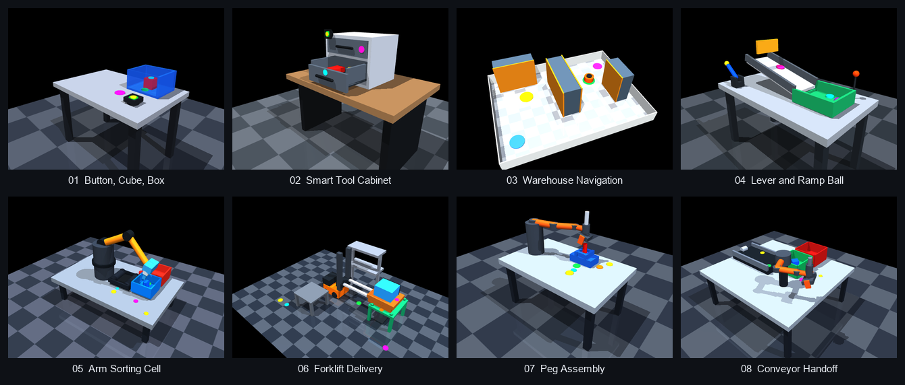
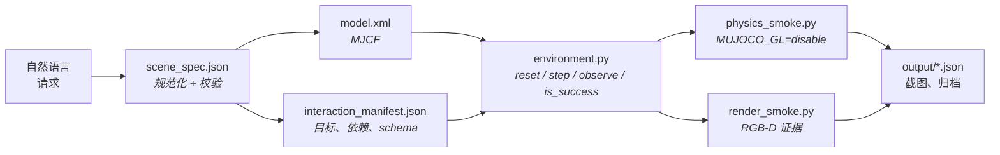
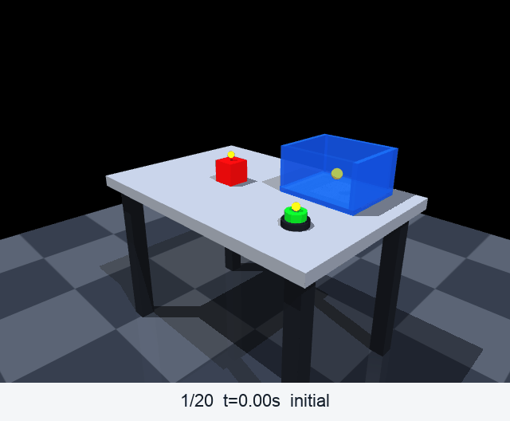
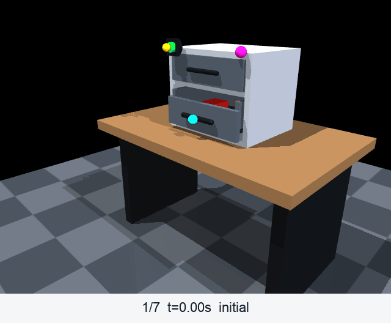
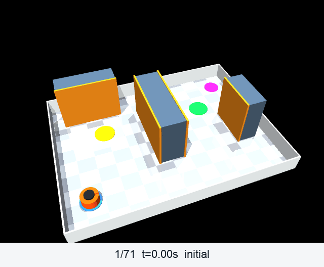
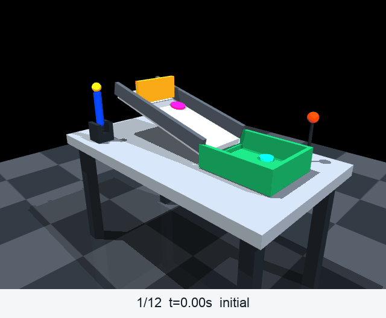
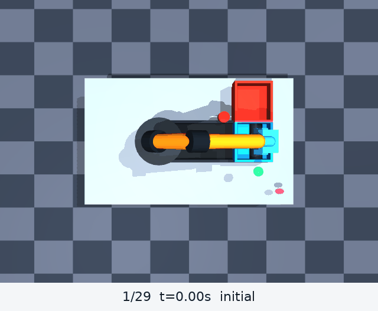
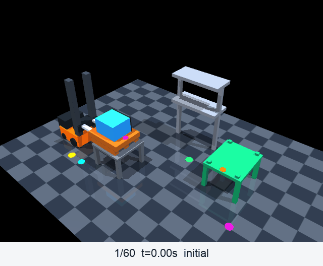
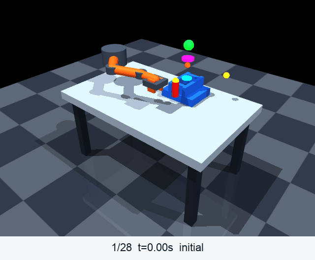
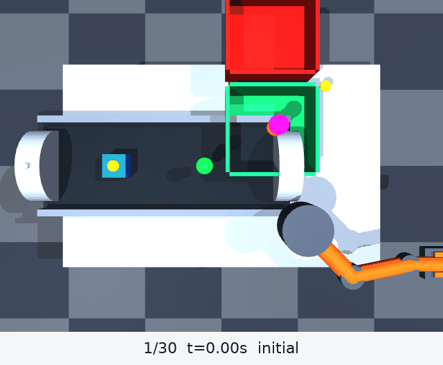

<h1 align="center">Text2MuJoCo</h1>

<p align="center">
  <strong>把一句自然语言请求变成可运行、可验证的 MuJoCo 环境。</strong><br>
  校验过的 MJCF &middot; 可执行的交互点 &middot; 真实的 RGB-D 证据
</p>

<p align="center">
  
  
  
  
  
  
  <a href="LICENSE"></a>
</p>

<p align="center">
  <a href="#展示">展示</a> &middot;
  <a href="#工作原理">工作原理</a> &middot;
  <a href="#校验层">校验</a> &middot;
  <a href="#用法">用法</a> &middot;
  <a href="text2mujoco_codex/README.md">Codex 技能</a> &middot;
  <a href="text2mujoco_claude/README.md">Claude Code 技能</a> &middot;
  <a href="README.md">English</a>
</p>

<p align="center">
  
</p>

<p align="center">
  <sub>八个展示场景各自最后一帧已验证画面，由 <a href="showcase/build_readme_figures.py">build_readme_figures.py</a> 从已提交的截图拼合而成。</sub>
</p>

---

Text2MuJoCo 是一个跑在现有编码 Agent 里的 **Agent 技能包**。它与 Codex 或 Claude Code 配合，把一段场景或任务描述转成可加载的 MuJoCo 3 包：解析物体、物理、传感器、动作顺序、成功条件和可见的交互点，然后用机器可读的报告来支撑结果。[示例请求](showcase/sample_queries.json) 展示了预期的输入格式。

## 你会得到什么

- **一段请求换来一整个包** —— `scene_spec.json`、`model.xml`、`environment.py`、`interaction_manifest.json`，以及两个可直接运行的 smoke 测试，一起生成并保持彼此一致。
- **统一的交互 API** —— 每个生成出来的环境都带 `list_interaction_points()`、`get_action_schema()`、`reset()`、`step()`、`observe()` 和 `is_success()`。每个 affordance 都是一个真实 handler，带类型化的 payload schema 和声明式依赖，乱序或格式错误的动作会被拒绝。
- **几何就按几何的方式行事** —— 公制尺寸换算成 MJCF 半尺寸，`orientation_xyzw` 换算成 `quat="w x y z"`，静止物体按半尺寸算术摆放，每个碰撞类都带 `conaffinity="7"`，机器人对自己的连杆也有边界。
- **抓取写成约束** —— 被搬运的负载由一个 `<equality><weld>` 携带，其偏移在夹爪合拢的瞬间测得，并在运行时开合，因此在空中松开它就会掉下去。
- **可测量的校验** —— 各项检查把碰撞覆盖、声明质量、伺服保持、标记贴地和接触深度都以数字写进 JSON，精度到十分之一毫米。
- **一并提交的 RGB-D 证据** —— 每个展示场景都自带自己的报告、截图、深度数组、关键帧故事板，以及一份按仿真时间每 `0.20 s` 采样的密集捕获。
- **两个适配器，一种行为** —— [`text2mujoco_codex`](text2mujoco_codex) 与 [`text2mujoco_claude`](text2mujoco_claude) 携带完全相同的校验脚本和参考文档；CI 在每次 push 时对脚本做 diff，两者不可能漂移。

## 工作原理



场景规范是唯一的输入真源，但 handler 是代码：当一个位姿、条件、目标或成功谓词发生变化时，对应的运行时 handler 会被同步修改，受影响的校验层会重跑。条件字符串绝不会被假定自动生效。

## 校验层

技能对它产出的每个包主要校验四件事：请求、场景规范和清单描述的仍然是同一个场景；模型在物理上建得起来、也在物理上诚实；既定的交互序列能一路跑到成功条件；提交的证据与旁边的报告对得上。每一项检查都是一个脚本。`physics_smoke.py` 与 `render_smoke.py` 随每个生成出来的包一起发布；其余的放在 [showcase/](showcase) 里，模型测量集中在 [`model_audit.py`](showcase/model_audit.py)：它编译场景、让每个伺服保持不动、重放序列，并把每项测量结果报成数字。

| 校验什么 | 由谁运行 | 拒绝什么 |
| --- | --- | --- |
| 规范与契约 | `validate_scene_spec.py`、`validate_manifests.py` | 通不过 schema 的场景规范；交互 ID、依赖顺序、位姿或标记站点上的规范与清单漂移 |
| 初始位姿 | `physics_smoke.py`、`model_audit.py` | 编译不通过的 MJCF；在编译得到的 `qpos0` 或 `reset()` 之后重叠超过 `0.1 mm` 的 geom |
| 碰撞覆盖 | `model_audit.py` | 不属于任何有效碰撞配对的运动 geom；只因为 `contype`/`conaffinity` 掩码把配对从求解器里过滤掉才存在的重叠 |
| 机械诚实性 | `model_audit.py` | 受关节驱动刚体上没有声明 `mass` 的 geom；停在受令位姿下方超过 `2 mm` 或 `1°` 的位置伺服；受关节驱动刚体与其最近已绘制祖先之间宽于 `5 mm` 的缝隙 |
| 序列接触 | `physics_smoke.py`、`model_audit.py`、`sequence_contact_test.py` | 既定序列首尾及其间任意一步深于 `1 mm` 的穿模 |
| 抓取诚实性 | `physics_smoke.py` | 在空中解除焊接约束后仍原地悬着的负载 —— 靠写 `qpos` 搬运留下的痕迹 |
| 标记 | `model_audit.py`、`render_smoke.py` | 高出所标注表面超过 `3 mm`、埋进另一个 geom 超过 `1 mm`、或者在渲染里一个像素都看不见的标记站点 |
| 行为 | `physics_smoke.py`、`render_smoke.py` | 非有限状态、失效的执行器、未满足的任务谓词、每次结果都不同的 reset、空白 RGB、交互前后画面无变化 |
| 证据 | `dense_archive_test.py`、`artifact_path_test.py` | GIF/TIFF 的帧数或时序与密集报告不一致；逃出包根目录的产物 |

表里贯穿着两个穿模阈值，因为接触求解器本身是近似的：静态位姿用 **0.1 mm**，此时任何可测量的重叠都是建模错误；整段序列用 **1.0 mm**，此时受载下的亚毫米穿透属于求解器有文档记载的柔度。某个场景越界时，要动的是模型或控制器，阈值保持原样。

八个展示场景合计重放 `27,437` 步，全场最深穿模为 `0.7728 mm`。完整记录见 [model_audit_report.json](showcase/output/model_audit_report.json) 与 [sequence_contact_report.json](showcase/output/sequence_contact_report.json)，每个场景自己的 `physics_smoke.py` 也带同一套测量，因此生成出来的包本身就能自检。

## 展示

由该技能生成的八个包，各自连同报告与截图一并提交。下表每一行都是从该场景 `output/` 目录里的 JSON 读出来的。

| # | 场景 | 交互点 | 密集页数 | 仿真时长 |
| --- | --- | --- | --- | --- |
| 01 | [按钮、方块与开口盒](#01--按钮方块与开口盒) | 4 | 18 | 2.660 s |
| 02 | [智能工具柜](#02--智能工具柜) | 3 | 7 | 0.716 s |
| 03 | [仓库导航](#03--仓库导航) | 3 | 71 | 13.500 s |
| 04 | [拉杆与斜坡小球](#04--拉杆与斜坡小球) | 4 | 12 | 1.519 s |
| 05 | [机械臂分拣单元](#05--机械臂分拣单元) | 5 | 62 | 11.322 s |
| 06 | [叉车托盘配送](#06--叉车托盘配送) | 6 | 60 | 10.772 s |
| 07 | [机器人定位销装配](#07--机器人定位销装配) | 6 | 41 | 6.800 s |
| 08 | [输送带到机械臂的交接](#08--输送带到机械臂的交接) | 6 | 57 | 10.156 s |

### 01 / 按钮、方块与开口盒

> Place a button, a red cube, and an open box on a table. Press the button, grasp the cube, place it in the box, and inspect the result with an RGB-D camera.

`press_start_button` → `grasp_red_cube` → `place_cube_in_box` → `inspect_rgbd`

<p align="center">
  <a href="showcase/01-button-cube-box/output/screenshots/dense_sequence.tif">
    
  </a>
</p>

[环境](showcase/01-button-cube-box) &middot; [测试报告](showcase/01-button-cube-box/TEST_REPORT.md) &middot; [物理](showcase/01-button-cube-box/output/physics_results.json) &middot; [渲染](showcase/01-button-cube-box/output/render_results.json) &middot; [密集报告](showcase/01-button-cube-box/output/dense_sequence_results.json) &middot; [密集 TIFF](showcase/01-button-cube-box/output/screenshots/dense_sequence.tif)

<details>
<summary>场景细节</summary>

- **场景** —— 桌面、带执行器的按钮、自由刚体方块、五个 geom 的开口盒、固定 RGB-D 相机；20 个命名对象，`0.002 s` 时间步长，方块 `0.2 kg`。
- **契约** —— [interaction_manifest.json](showcase/01-button-cube-box/interaction_manifest.json)
- **关键帧归档** —— [报告](showcase/01-button-cube-box/output/sequence_results.json) &middot; [GIF](showcase/01-button-cube-box/output/screenshots/sequence.gif) &middot; [TIFF](showcase/01-button-cube-box/output/screenshots/sequence.tif)

</details>

---

### 02 / 智能工具柜

> Generate a desktop tool cabinet. Press the green unlock button, pull the drawer open by 22 cm, and verify the open state with a fixed camera. Keep the unlock point, handle, and camera checkpoint visible.

`press_unlock_button` → `pull_drawer_22cm` → `inspect_open_drawer`

<p align="center">
  <a href="showcase/02-smart-drawer/output/screenshots/dense_sequence.tif">
    
  </a>
</p>

[环境](showcase/02-smart-drawer) &middot; [物理](showcase/02-smart-drawer/output/physics_results.json) &middot; [渲染](showcase/02-smart-drawer/output/render_results.json) &middot; [密集报告](showcase/02-smart-drawer/output/dense_sequence_results.json) &middot; [密集 TIFF](showcase/02-smart-drawer/output/screenshots/dense_sequence.tif)

<details>
<summary>场景细节</summary>

- **场景** —— 桌面工具柜、解锁按钮、滑动关节抽屉、三个标记站点（`unlock_point_marker`、`drawer_handle_marker`、`camera_check_marker`）、固定 RGB-D 相机。
- **契约** —— [interaction_manifest.json](showcase/02-smart-drawer/interaction_manifest.json)
- **关键帧归档** —— [报告](showcase/02-smart-drawer/output/sequence_results.json) &middot; [GIF](showcase/02-smart-drawer/output/screenshots/sequence.gif) &middot; [TIFF](showcase/02-smart-drawer/output/screenshots/sequence.tif)

</details>

---

### 03 / 仓库导航

> Generate a small warehouse where an orange robot reaches checkpoint A, navigates around the shelves to checkpoint B, and confirms completion with a top-view camera.

`reach_checkpoint_a` → `reach_checkpoint_b` → `inspect_top_camera`

<p align="center">
  <a href="showcase/03-warehouse-navigation/output/screenshots/dense_sequence.tif">
    
  </a>
</p>

[环境](showcase/03-warehouse-navigation) &middot; [物理](showcase/03-warehouse-navigation/output/physics_results.json) &middot; [渲染](showcase/03-warehouse-navigation/output/render_results.json) &middot; [密集报告](showcase/03-warehouse-navigation/output/dense_sequence_results.json) &middot; [密集 TIFF](showcase/03-warehouse-navigation/output/screenshots/dense_sequence.tif)

<details>
<summary>场景细节</summary>

- **场景** —— 仓库地面、可碰撞货架、平面移动机器人、两个检查点、倾斜俯视 RGB-D 相机；四个必经航点决定了绕行路线。
- **契约** —— [interaction_manifest.json](showcase/03-warehouse-navigation/interaction_manifest.json)
- **关键帧归档** —— [报告](showcase/03-warehouse-navigation/output/sequence_results.json) &middot; [GIF](showcase/03-warehouse-navigation/output/screenshots/sequence.gif) &middot; [TIFF](showcase/03-warehouse-navigation/output/screenshots/sequence.tif)

</details>

---

### 04 / 拉杆与斜坡小球

> Generate a workbench where a blue lever opens a gate, releases a purple ball down a ramp into a target tray, and verifies the result with a camera.

`pull_blue_lever` → `check_release_zone` → `confirm_target_tray` → `inspect_with_camera`

<p align="center">
  <a href="showcase/04-lever-ball-ramp/output/screenshots/dense_sequence.tif">
    
  </a>
</p>

[环境](showcase/04-lever-ball-ramp) &middot; [物理](showcase/04-lever-ball-ramp/output/physics_results.json) &middot; [渲染](showcase/04-lever-ball-ramp/output/render_results.json) &middot; [密集报告](showcase/04-lever-ball-ramp/output/dense_sequence_results.json) &middot; [密集 TIFF](showcase/04-lever-ball-ramp/output/screenshots/dense_sequence.tif)

<details>
<summary>场景细节</summary>

- **场景** —— 工作台、带执行器的拉杆与闸门、带护边的斜坡、自由小球、开口目标托盘、固定 RGB-D 相机。
- **契约** —— [interaction_manifest.json](showcase/04-lever-ball-ramp/interaction_manifest.json)
- **关键帧归档** —— [报告](showcase/04-lever-ball-ramp/output/sequence_results.json) &middot; [GIF](showcase/04-lever-ball-ramp/output/screenshots/sequence.gif) &middot; [TIFF](showcase/04-lever-ball-ramp/output/screenshots/sequence.tif)

</details>

---

### 05 / 机械臂分拣单元

> Create a tabletop robotic sorting cell. A three-joint arm approaches a blue part on a conveyor, closes its parallel gripper, transfers the part to a blue bin beside a red distractor bin, releases it, and verifies the result with a fixed RGB-D camera.

`approach_blue_part` → `grasp_blue_part` → `transfer_to_blue_bin` → `release_blue_part` → `inspect_sorting_result`

<p align="center">
  <a href="showcase/05-robot-arm-sorting/output/screenshots/dense_sequence.tif">
    
  </a>
</p>

[环境](showcase/05-robot-arm-sorting) &middot; [物理](showcase/05-robot-arm-sorting/output/physics_results.json) &middot; [渲染](showcase/05-robot-arm-sorting/output/render_results.json) &middot; [密集报告](showcase/05-robot-arm-sorting/output/dense_sequence_results.json) &middot; [密集 TIFF](showcase/05-robot-arm-sorting/output/screenshots/dense_sequence.tif)

<details>
<summary>场景细节</summary>

- **场景** —— 工作台、输送带、三连杆机械臂、双指夹爪、蓝色与红色零件及料箱、五个可见交互标记、固定 RGB-D 相机。
- **同步** —— 蓝色零件由 `tool_turret` 与零件之间的 `blue_part_grasp` 焊接携带，夹爪闭合时打开、张开时关闭；没有任何代码写零件的 `qpos`。
- **坐实** —— 蓝色零件停在输送带带面 `z = 0.855 m` 上，避开两个滚筒；红色零件放在工作台 `[0.43, 0.45, 0.75]` 处。模型、规范、清单以及 reset 常量四者一致。
- **契约** —— [interaction_manifest.json](showcase/05-robot-arm-sorting/interaction_manifest.json)
- **关键帧归档** —— [报告](showcase/05-robot-arm-sorting/output/sequence_results.json) &middot; [故事板](showcase/05-robot-arm-sorting/output/screenshots/sequence.png) &middot; [TIFF](showcase/05-robot-arm-sorting/output/screenshots/sequence.tif)

</details>

---

### 06 / 叉车托盘配送

> Create a warehouse forklift task. An orange mobile forklift drives to a loaded pallet, raises its powered forks, engages the pallet, carries it around a storage rack to a green delivery zone, lowers the forks to release the load, and verifies delivery with an RGB-D camera.

`drive_to_pallet` → `raise_forks` → `engage_pallet` → `carry_to_drop_zone` → `lower_forks_release` → `inspect_forklift_delivery`

<p align="center">
  <a href="showcase/06-forklift-pallet/output/screenshots/dense_sequence.tif">
    
  </a>
</p>

[环境](showcase/06-forklift-pallet) &middot; [物理](showcase/06-forklift-pallet/output/physics_results.json) &middot; [渲染](showcase/06-forklift-pallet/output/render_results.json) &middot; [密集报告](showcase/06-forklift-pallet/output/dense_sequence_results.json) &middot; [密集 TIFF](showcase/06-forklift-pallet/output/screenshots/dense_sequence.tif)

<details>
<summary>场景细节</summary>

- **场景** —— 带腿的装载台与配送台、轮子真正着地的移动叉车、双轨门架加升降滑架、三根纵梁的托盘与货箱、作为障碍的储物货架、六个标记、固定的三分之四俯视 RGB-D 相机。
- **同步** —— 托盘由 `fork_carriage` 与托盘之间的 `pallet_grasp` 焊接携带，偏移取自货叉插入到位时的实测值。叉车能做的诚实性测试是滑移：焊接时托盘保持在 `0.303 mm` 以内，释放后滑移 `73.287 mm`，下限是 `20 mm`。
- **叉道** —— 零升降时叉齿扫过 `0.715..0.785 m`，进入装载台面 `0.66 m` 与托盘底板下沿 `0.81 m` 之间真实存在的 `150 mm` 通道。纵梁是**沿着**叉齿方向布置的；如果横过来，叉齿会正面撞上近侧纵梁，而升降之所以还能"成功"只是因为托盘被钉住了。
- **顺序** —— `lower_forks_release` 先把托盘放到配送台上，**然后**才降下空货叉，并在 `0.045 m` 升降高度处退出 —— 位于通道中部，下方距台面、上方距托盘底板各有 `40 mm` 余量。配送目标是一个带定位块的平台，因为叉车必须在板面高度把叉齿倒着抽出来，而接近侧一道 `0.24 m` 的围墙是既定序列无法越过的几何。
- **契约** —— [interaction_manifest.json](showcase/06-forklift-pallet/interaction_manifest.json)
- **关键帧归档** —— [报告](showcase/06-forklift-pallet/output/sequence_results.json) &middot; [故事板](showcase/06-forklift-pallet/output/screenshots/sequence.png) &middot; [TIFF](showcase/06-forklift-pallet/output/screenshots/sequence.tif)

</details>

---

### 07 / 机器人定位销装配

> Build a robot assembly station. An orange arm moves to a red locating peg, closes its gripper to pick it up, transports it to a blue fixture, inserts it vertically, releases it, and verifies the assembly with a fixed RGB-D camera.

`move_arm_to_peg` → `grasp_peg_with_arm` → `move_arm_to_socket` → `insert_peg_into_socket` → `release_assembled_peg` → `inspect_assembly`

<p align="center">
  <a href="showcase/07-robot-assembly/output/screenshots/dense_sequence.tif">
    
  </a>
</p>

[环境](showcase/07-robot-assembly) &middot; [物理](showcase/07-robot-assembly/output/physics_results.json) &middot; [渲染](showcase/07-robot-assembly/output/render_results.json) &middot; [密集报告](showcase/07-robot-assembly/output/dense_sequence_results.json) &middot; [密集 TIFF](showcase/07-robot-assembly/output/screenshots/dense_sequence.tif)

<details>
<summary>场景细节</summary>

- **场景** —— 工作台、三连杆机械臂、被画出来的竖直工具升降轴（套筒加活塞）、腕部俯仰铰链、夹爪、自由的红色定位销、蓝色插装夹具、六个可见标记、固定 RGB-D 相机。
- **同步** —— 定位销由 `peg_grasp` 焊接携带，在夹爪闭合时接合，释放本身是一个独立的、受依赖检查的动作；插装与释放是两个分开的步骤。
- **契约** —— [interaction_manifest.json](showcase/07-robot-assembly/interaction_manifest.json)
- **关键帧归档** —— [报告](showcase/07-robot-assembly/output/sequence_results.json) &middot; [故事板](showcase/07-robot-assembly/output/screenshots/sequence.png) &middot; [TIFF](showcase/07-robot-assembly/output/screenshots/sequence.tif)

</details>

---

### 08 / 输送带到机械臂的交接

> Create a synchronized conveyor-to-arm handoff cell. A conveyor moves a blue parcel to a pickup point, a three-joint arm closes its parallel gripper around it, carries it to a green target bin, releases it, and verifies the handoff with a fixed RGB-D camera.

`start_conveyor_to_pickup` → `move_arm_to_parcel` → `grasp_parcel_with_arm` → `move_arm_to_target_bin` → `release_parcel_in_target_bin` → `inspect_handoff`

<p align="center">
  <a href="showcase/08-conveyor-arm/output/screenshots/dense_sequence.tif">
    
  </a>
</p>

[环境](showcase/08-conveyor-arm) &middot; [物理](showcase/08-conveyor-arm/output/physics_results.json) &middot; [渲染](showcase/08-conveyor-arm/output/render_results.json) &middot; [密集报告](showcase/08-conveyor-arm/output/dense_sequence_results.json) &middot; [密集 TIFF](showcase/08-conveyor-arm/output/screenshots/dense_sequence.tif)

<details>
<summary>场景细节</summary>

- **场景** —— 带动力的输送带、三连杆机械臂、被画出来的竖直工具升降轴、腕部俯仰铰链、双指夹爪、蓝色包裹、绿色与红色料箱、六个可见标记、固定 RGB-D 相机。
- **没有输送带图元也要真的"输送"** —— MuJoCo 没有输送带图元，而每步改写包裹的 `qpos` 不是输送而是传送：那样一来质量、摩擦和障碍物都无从抵抗。因此驱动是一个只向前的牵引力，它必须战胜带面自身的静摩擦 `mu*m*g = 0.76 * 0.22 * 9.81 = 1.64 N`，所以 `2.60 N` 的上限留下 `0.96 N` 净加速力。`xfrc_applied` 作用在质心上，而 `2.60 N` 作用在接触面上方 `60 mm` 处会把一个 `120 mm` 的立方体推翻 —— 倾覆力矩在 `2.16 N` 就超过了回复力矩 `m*g*0.06 = 0.130 N*m` —— 所以随力一起施加偏置力矩 `r × F`，把驱动放到摩擦反力本来所在的位置。当滑行距离 `v²/(2*mu*g)` 达到取件点时切断动力，仅靠摩擦制动；路径上有任何东西都会把包裹挡住。
- **同步** —— 包裹由 `parcel_grasp` 焊接携带，声明时不激活，接合时用夹爪闭合瞬间实测的偏移；释放时取消激活，由重力和接触把它安置在料箱里。
- **契约** —— [interaction_manifest.json](showcase/08-conveyor-arm/interaction_manifest.json)
- **关键帧归档** —— [报告](showcase/08-conveyor-arm/output/sequence_results.json) &middot; [故事板](showcase/08-conveyor-arm/output/screenshots/sequence.png) &middot; [TIFF](showcase/08-conveyor-arm/output/screenshots/sequence.tif)

</details>

---

## 用法

### Codex

用 Codex 技能安装器安装 [`text2mujoco_codex`](text2mujoco_codex) 适配器。`--name` 的取值让安装后的技能名与 `SKILL.md` front matter 保持一致：

```bash
python3 /path/to/skill-installer/scripts/install-skill-from-github.py \
  --repo ShawnJoeng/Text2Mujoco \
  --path text2mujoco_codex \
  --name text2mujoco
```

然后直接描述环境，或显式调用该技能：

```text
$text2mujoco
Generate a desktop tool cabinet, unlock it, pull the drawer open by 22 cm, and inspect it with a camera.
```

### Claude Code

把 [`text2mujoco_claude`](text2mujoco_claude) 安装到 `~/.claude/skills/text2mujoco/` 或 `.claude/skills/text2mujoco/`，然后用自然语言请求或显式调用：

```text
/text2mujoco Generate a warehouse navigation task with visible checkpoints and a top-view camera.
```

参见 [Claude Code 安装指南](text2mujoco_claude/README.md)。

### 运行一个生成出来的环境

依赖：Python `>=3.9`、MuJoCo `3.2.7`、NumPy 和 Pillow。

```bash
python -m pip install "mujoco==3.2.7" numpy pillow
cd showcase/02-smart-drawer
python3 ../../text2mujoco_codex/scripts/validate_scene_spec.py scene_spec.json --json
MUJOCO_GL=disable python3 physics_smoke.py     # 规范、静态、t=0 接触、物理
MUJOCO_GL=glfw mjpython render_smoke.py        # RGB-D 证据；无头 Linux：MUJOCO_GL=egl python3
```

### 复现这些截图与图表

在仓库根目录执行：

```bash
# 有节奏的关键帧故事板：每个已验证交互一帧
MUJOCO_GL=glfw mjpython showcase/capture_sequences.py --scene all

# 按仿真时间每 0.20 s 采样的密集序列
MUJOCO_GL=glfw mjpython showcase/capture_sequences.py --dense --scene all

# 归档与路径回归
python3 showcase/dense_archive_test.py
python3 showcase/artifact_path_test.py
python3 showcase/validate_manifests.py

# 八项检查的模型审计，全部八个场景
#（--report 在 showcase/ 内部解析，且必须留在其中）
MUJOCO_GL=disable python3 showcase/model_audit.py \
  --report output/model_audit_report.json

# 范围更窄的前身：只做碰撞几何与序列接触
MUJOCO_GL=disable python3 showcase/sequence_contact_test.py \
  --report output/sequence_contact_report.json

# 从已提交的截图重新拼合 README 的两张图
python3 showcase/build_readme_figures.py
```

传 `--dense-interval <秒>` 可以改变采样间隔。采集器只往仓库的 `showcase/` 树下写入，因此传感器和产物路径保持可移植；它的 `--output-root` 选项只接受这棵树。

关键帧 GIF 每帧停留 `1.6 s`、末态停留 `2.6 s`，其序列还保留了 RGB-D 数组；密集 GIF 只有 RGB，每帧 `200 ms`。两种 TIFF 都是全分辨率归档，而 TIFF 的播放时序取决于查看器，所以时序契约由 GIF 承担，并由 `dense_archive_test.py` 核对。

<details>
<summary>生成出来的包结构与交互 API</summary>

```text
scene_spec.json                  # 规范化后的自然语言请求
model.xml                        # 可加载的 MuJoCo MJCF
environment.py                   # 交互、观测、reset 与成功判定逻辑
interaction_manifest.json        # 目标、依赖与动作 schema
physics_smoke.py                 # 静态、t=0 接触、物理与状态机校验
render_smoke.py                  # RGB-D 与画面变化校验
output/                          # 报告、截图、深度数组、关键帧与密集归档

showcase/validate_manifests.py   # 跨场景的清单/规范一致性
showcase/model_audit.py          # 八项检查的模型审计
showcase/sequence_contact_test.py # 碰撞几何 + 全序列接触审计
showcase/dense_archive_test.py   # 0.20 s GIF/TIFF 归档回归
showcase/artifact_path_test.py   # 产物封闭性与符号链接拒绝
showcase/build_readme_figures.py # README 画廊与胶片图拼合
```

```python
list_interaction_points()
get_action_schema()              # 交互 id -> payload schema
reset(seed=None)                 # 返回初始观测
step({"id": "<interaction_id>", "payload": {}})
observe()
is_success()
```

</details>

## 许可

[MIT](LICENSE)


