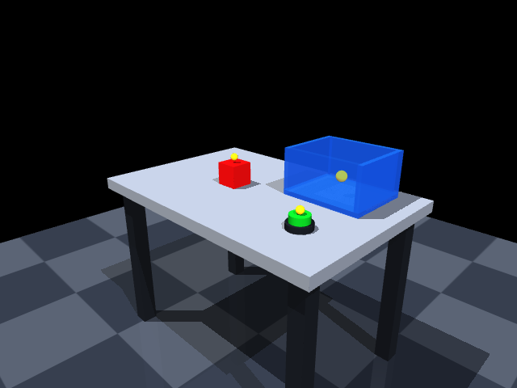
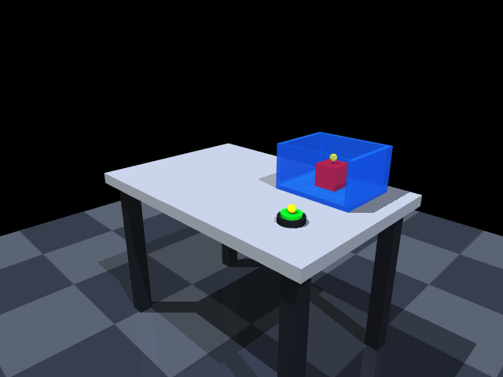
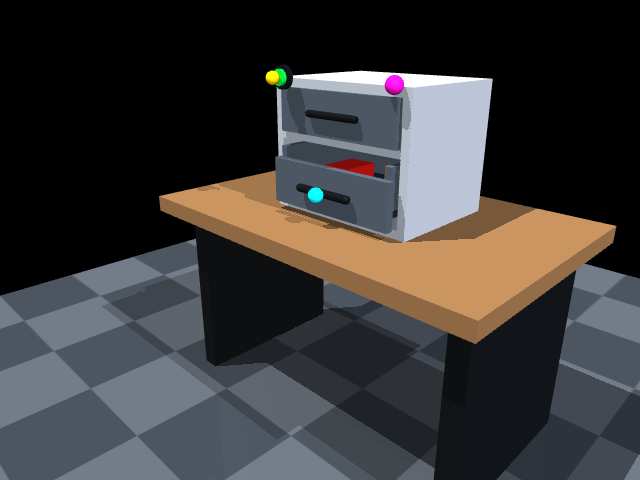
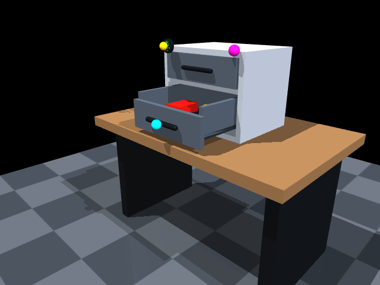
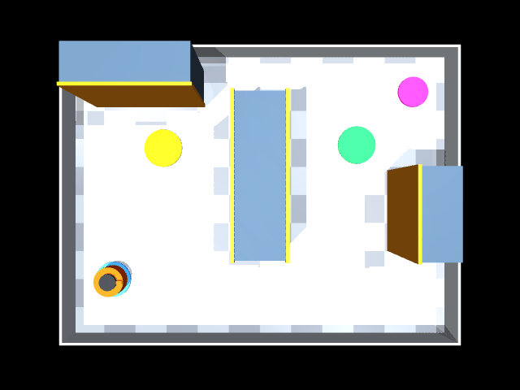
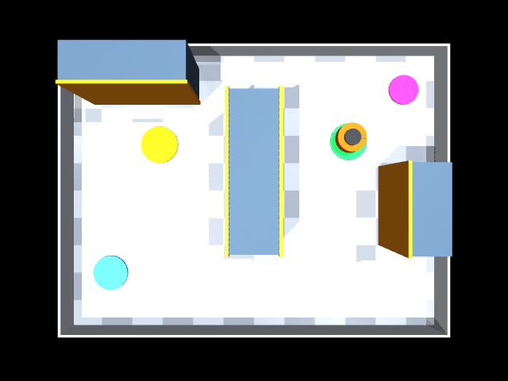

# Text2MuJoCo

`text2mujoco` is a Codex skill: users only need to describe a scene or task in one natural-language sentence, and the skill converts it into a runnable, verifiable MuJoCo environment. When a rendering backend is available, it also produces real RGB-D images and depth data.

It is responsible for:

- parsing objects, spatial relationships, dimensions, physical properties, sensors, actions, and success conditions;
- generating `scene_spec.json` and a directly loadable `model.xml` (MJCF);
- generating `environment.py` and `interaction_manifest.json`, turning interaction points into callable programmatic interfaces;
- generating physics, interaction-order, reset, RGB-D, and screenshot validation scripts;
- writing every result as auditable JSON instead of reporting only that something "looks successful".

Unified Interaction Interface:

```python
list_interaction_points()
get_action_schema()
reset(seed=None)
step({"id": "<interaction_id>", "payload": {}})
observe()
is_success()
```

## Showcase

| Query | Generated Environment | During Interaction | After Interaction | Interaction Verification | Before Screenshot | After Screenshot |
| --- | --- | --- | --- | --- | --- | --- |
| **Button, Cube, and Box**<br>Place a button, a red cube, and a box with an interior space on a table. After pressing the button, grasp the cube and place it in the box, then observe the result with an RGB-D camera. | Table, green button, red free rigid body, five-sided open blue box, and a fixed RGB-D camera.<br>[Environment Directory](01-button-cube-box) | `press_start_button` -> `grasp_red_cube` -> `place_cube_in_box` -> `inspect_rgbd`. Dependencies prevent out-of-order actions. | The button enters the pressed state; the cube settles inside the box and contacts the bottom; RGB-D is valid; the red cube moves `130.52 px` in the image. | Scene spec, MJCF, typed targets, physics, invalid actions, reset, and RGB-D: **PASS**. The rendering test for this fixture checks RGB-D and cube displacement; it does not count marker pixels separately.<br>[Test Results](01-button-cube-box/TEST_REPORT.md) | [](01-button-cube-box/output/screenshots/initial/rgb.png) | [](01-button-cube-box/output/screenshots/final/rgb.png) |
| **Smart Tool Cabinet**<br>Generate a desktop tool cabinet. First press the green unlock button, then pull the drawer open by 22 cm, and finally use a fixed camera to verify that the drawer is open. Mark the unlock point, handle, and camera inspection point as visible interaction points. | Desktop tool cabinet, green unlock button, real slide-joint drawer, and fixed RGB-D camera.<br>[Environment Directory](02-smart-drawer) | `press_unlock_button` (yellow unlock point) -> `pull_drawer_22cm` (cyan handle point) -> `inspect_open_drawer` (magenta camera point). | Unlock succeeds; the drawer measures `0.218023 m` against a `0.22 m` target with `0.002 m` tolerance; camera inspection completes. | Scene spec, visibility of all 3 marker pixels, button/drawer actuators, out-of-order rejection, reset, and RGB-D: **PASS**. The handle marker moves `54.21 px`, and depth changes by `13,700` pixels.<br>[Render Results](02-smart-drawer/output/render_results.json) | [](02-smart-drawer/output/screenshots/before.png) | [](02-smart-drawer/output/screenshots/after.png) |
| **Warehouse Navigation**<br>Generate a small warehouse navigation scene: an orange mobile robot starts from a start position, must first reach yellow checkpoint A, then go around the shelves to green checkpoint B, and finally confirm completion with a top-view camera. Both checkpoints and the camera inspection must be visible interaction points. | Warehouse floor, shelf obstacles, orange planar mobile robot, A/B waypoints, and top-view camera.<br>[Environment Directory](03-warehouse-navigation) | `reach_checkpoint_a` (yellow point) -> `reach_checkpoint_b` (green point, forced south-side bypass) -> `inspect_top_camera` (magenta point). | The robot reaches B; shelf contact count is `0`; minimum clearance is `0.270 m`; the robot moves `331.26 px` in the image; reset returns it to the start. | Scene spec, route dependencies, clearance, zero shelf contact, 3 marker pixels, RGB-D, and reset: **PASS**. Yellow/green/magenta marker pixels are `6048 / 1641 / 1118`; reset centroid error is `0 px`.<br>[Render Results](03-warehouse-navigation/output/render_results.json) | [](03-warehouse-navigation/output/screenshots/before.png) | [](03-warehouse-navigation/output/screenshots/after.png) |
| **Lever and Ramp Ball**<br>Generate a workbench: pull down a blue lever to open a gate, let a purple ball roll down a ramp into a target tray, and then inspect the result with a camera. The lever, release zone, target zone, and camera inspection point must all be visible interaction points. | Workbench, blue lever, liftable gate, ramp rails, purple ball, open target tray, and fixed camera.<br>[Environment Directory](04-lever-ball-ramp) | The contract sequence is `pull_blue_lever` -> `check_release_zone` -> `confirm_target_tray` -> `inspect_with_camera`; the first three steps ran in physics, and all four points resolve to MJCF objects and marker sites. | Lever/gate physics passes; the gate lifts `0.11656 m`; the ball enters the tray and settles at `0.000277 m/s`. | Scene spec, typed targets, 4 marker sites, dependency rejection, physics, and reset: **PASS**. The `inspect_with_camera` render check is **SKIPPED** because of `CGLError: invalid CoreGraphics connection`; no screenshot was generated.<br>[Physics Results](04-lever-ball-ramp/physics_results.json) / [Render Results](04-lever-ball-ramp/render_results.json) | Rendering not executed | Rendering not executed |


## Usage

### 1. Enter a Natural-Language Query

Describe the desired scene directly in a Codex conversation; the skill will be selected automatically. You can also invoke it explicitly:

```text
$text2mujoco
Generate a desktop tool cabinet, press the unlock button, pull the drawer open by 22 cm, and inspect the result with a camera.
```

It helps to include the objects, positions, action order, sensors, and success conditions. When critical details are missing, the skill asks only blocking questions that would change the implementation; other details are written to `assumptions`.

### 2. Inspect the Generated Environment

Each environment directory usually contains:

```text
scene_spec.json             # Normalized representation of the query
model.xml                   # MuJoCo MJCF source file
environment.py              # Interaction, observation, reset, and success logic
interaction_manifest.json   # Interaction points, targets, dependencies, and action schemas
physics_smoke.py            # Physics and state-machine validation
render_smoke.py             # RGB-D and before/after image validation
README.md                   # Environment-specific documentation and run commands
output/                     # Models, screenshots, and JSON results
```

### 3. Install and Run

Requirements: Python `>=3.9`, MuJoCo `3.2.7`, NumPy, and Pillow.

```bash
python -m pip install "mujoco==3.2.7" numpy pillow
cd "2.issac sim gen/showcase/02-smart-drawer"
python3 ../../text2mujoco/scripts/validate_scene_spec.py scene_spec.json --json
MUJOCO_GL=disable python physics_smoke.py
MUJOCO_GL=glfw python render_smoke.py
```

The physics test uses `MUJOCO_GL=disable` and does not require a graphics context. On a headless Linux server, try `MUJOCO_GL=egl` and then `MUJOCO_GL=osmesa` in separate processes. Treat an image as verified simulation output only when `render_results.json` explicitly reports `PASS`.
